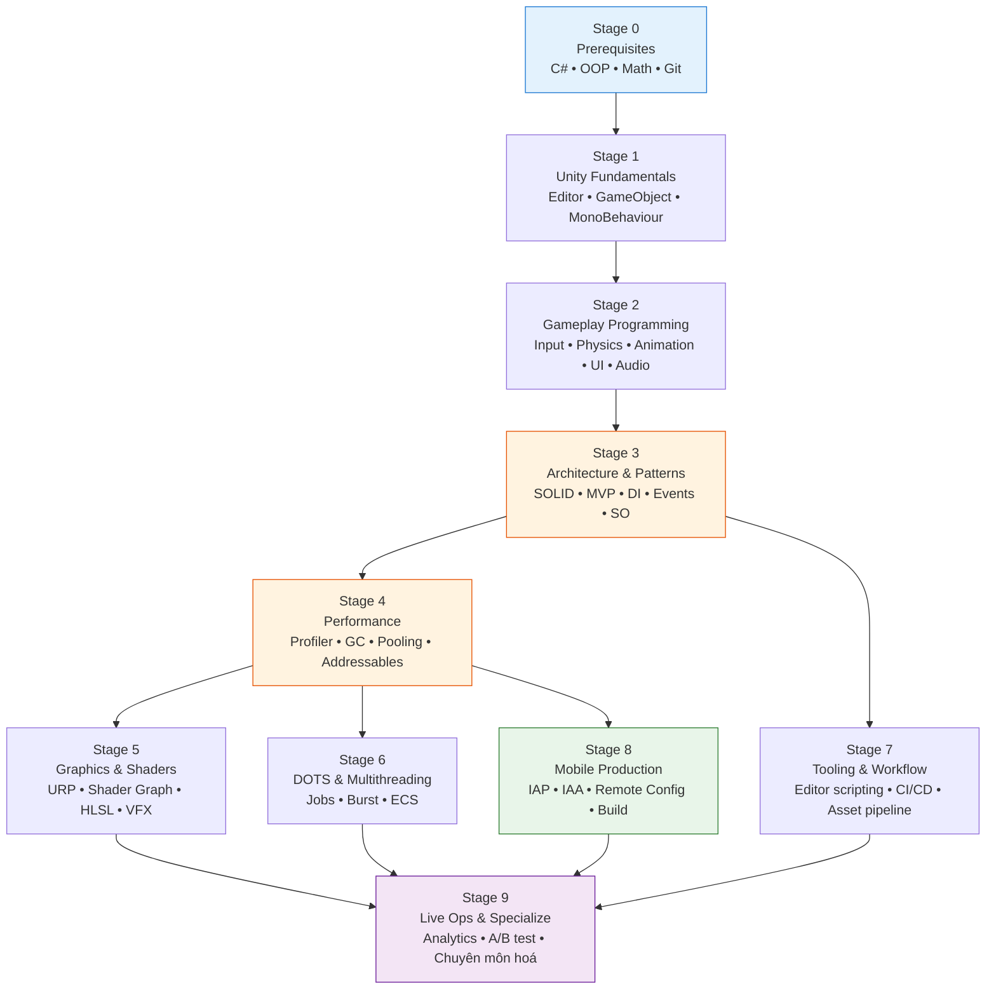
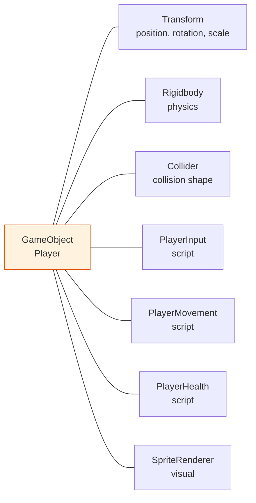
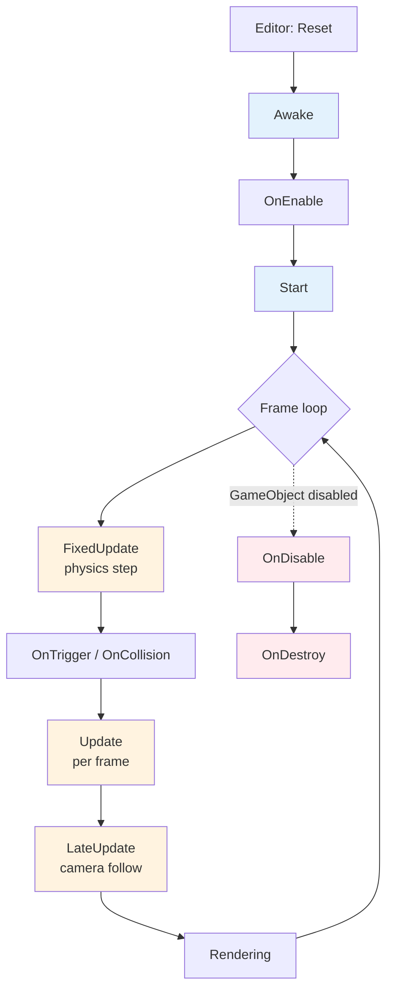
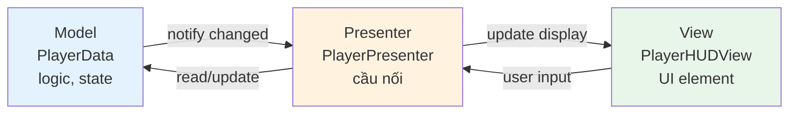
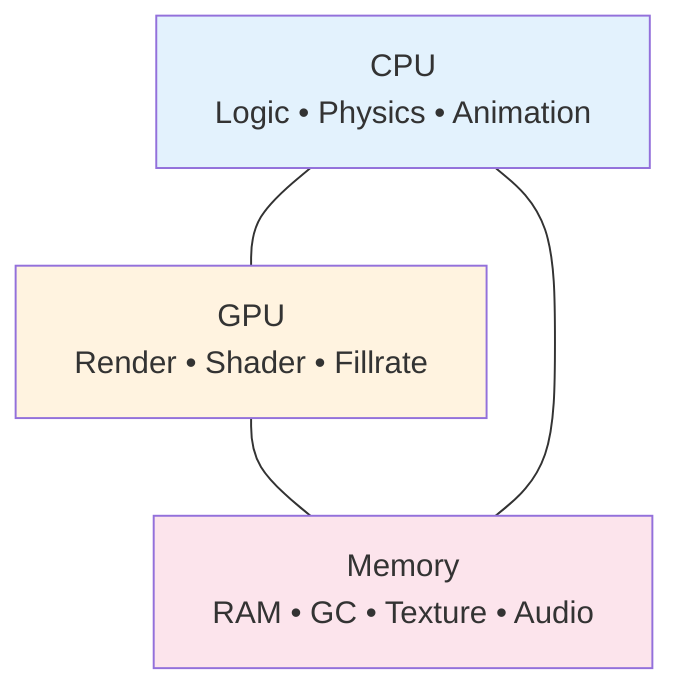
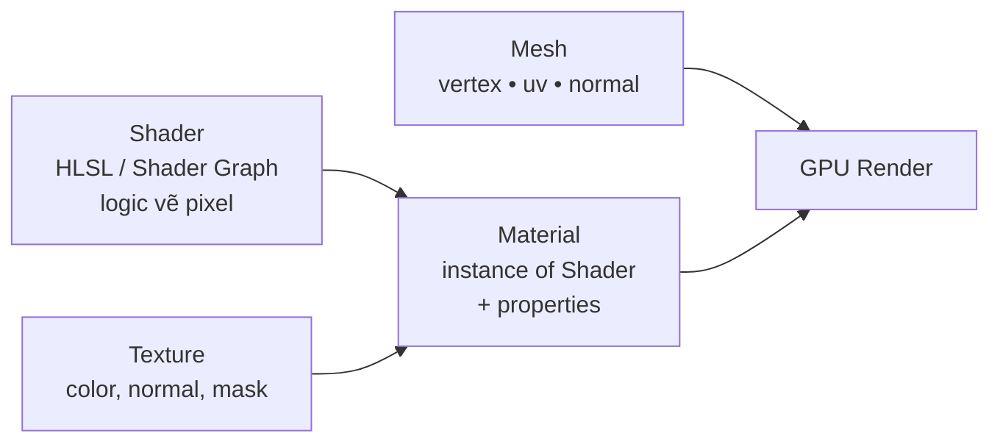
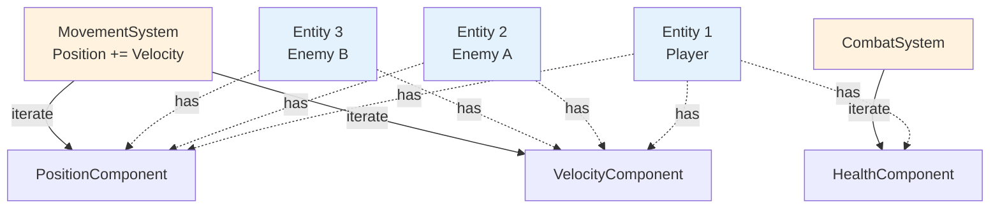
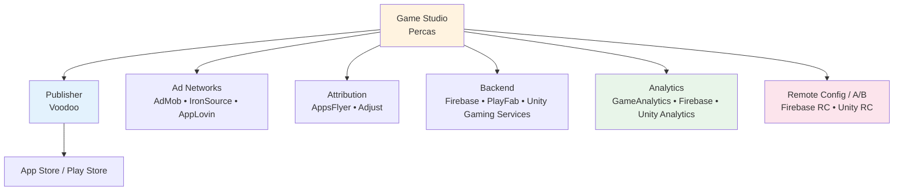
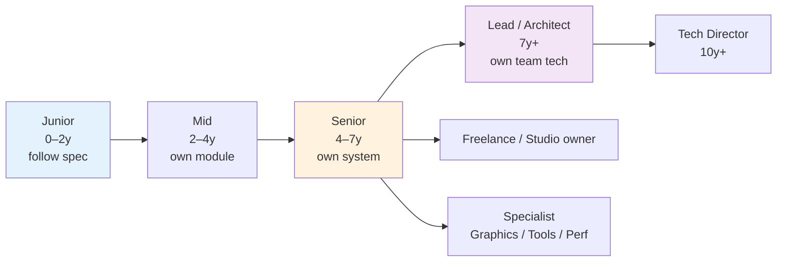

# Lộ trình trở thành Unity Developer Master

> Tài liệu tổng hợp tất cả kiến thức, kỹ năng, công cụ và tài nguyên cần thiết để đi từ người mới đến level **Senior / Master Unity Developer**, định hướng cho mobile game (super casual & hybrid puzzle) nhưng vẫn bao quát toàn ngành.

<p align="center">
  
</p>

---

## Mục lục

1. [Tổng quan & nguyên tắc học](#1-tổng-quan--nguyên-tắc-học)
2. [Roadmap tổng thể](#2-roadmap-tổng-thể)
3. [Stage 0 — Prerequisites: nền tảng trước Unity](#3-stage-0--prerequisites-nền-tảng-trước-unity)
4. [Stage 1 — Unity Fundamentals](#4-stage-1--unity-fundamentals)
5. [Stage 2 — Gameplay Programming](#5-stage-2--gameplay-programming)
6. [Stage 3 — Architecture & Design Patterns](#6-stage-3--architecture--design-patterns)
7. [Stage 4 — Performance & Optimization](#7-stage-4--performance--optimization)
8. [Stage 5 — Graphics, Rendering & Shaders](#8-stage-5--graphics-rendering--shaders)
9. [Stage 6 — Multithreading, DOTS & ECS](#9-stage-6--multithreading-dots--ecs)
10. [Stage 7 — Tooling, Editor & Workflow](#10-stage-7--tooling-editor--workflow)
11. [Stage 8 — Mobile Game Production (Hybrid Puzzle focus)](#11-stage-8--mobile-game-production-hybrid-puzzle-focus)
12. [Stage 9 — Live Ops, Analytics & Specializations](#12-stage-9--live-ops-analytics--specializations)
13. [Soft skills & sự nghiệp](#13-soft-skills--sự-nghiệp)
14. [Tài nguyên học tập tuyển chọn](#14-tài-nguyên-học-tập-tuyển-chọn)
15. [Lộ trình thời gian & tự đánh giá](#15-lộ-trình-thời-gian--tự-đánh-giá)

---

## 1. Tổng quan & nguyên tắc học

Một Unity Developer master không phải là người biết "mọi thứ trong Unity", mà là người có **nền tảng C# vững, hiểu sâu engine, có gu thiết kế kiến trúc, đo lường được performance, và ship được game ra production**. Lộ trình này tách thành 10 stage (0–9) với mục đích, tránh nhảy cóc và tránh học lan man.

**Bốn nguyên tắc xuyên suốt:**

- **Build-first, theory-second** — học khái niệm nào cũng phải có ít nhất một dự án nhỏ (prototype 1–3 ngày) áp dụng nó. Knowledge mà không có muscle memory sẽ phai trong 4–6 tuần.
- **Read other people's code** — clone 3–5 open-source Unity project mỗi stage (Brackeys, Unity Open Project, Tarodev, Unite samples, asset từ Asset Store). Đọc code của senior nhanh hơn tự khám phá.
- **Measure, don't guess** — performance, retention, funnel — luôn đo bằng Profiler / Memory Profiler / analytics. Trực giác sai nhiều hơn đúng.
- **Ship, even tiny** — mỗi 4–6 tuần publish một build playable (itch.io, Google Play internal, TestFlight). "Done is better than perfect" áp dụng cực mạnh cho Unity.

**Sai lầm phổ biến cần tránh:**

| Sai lầm | Hậu quả | Cách tránh |
|---|---|---|
| Nhảy thẳng vào Unity mà C# yếu | Code spaghetti, debug không nổi | Học C# 3–6 tuần riêng trước Stage 1 |
| Học hết tutorial nhưng không tự build | Không nhớ, không tự giải quyết bug | Mỗi tutorial xong viết lại 1 mini-project khác |
| Tối ưu sớm (premature optimization) | Mất thời gian, code khó đọc | Profile trước, optimize sau |
| Học DOTS/ECS quá sớm | Confused vì chưa hiểu MonoBehaviour | Đợi đến Stage 6 |
| Bỏ qua Editor scripting | Tool yếu, workflow chậm | Học từ Stage 7, không bỏ |
| Không dùng version control từ đầu | Mất code, không collab được | Git + LFS ngay từ project đầu tiên |

---

## 2. Roadmap tổng thể



**Cách đọc:** Stage 0→3 là tuần tự bắt buộc. Từ Stage 4 trở đi có thể đi song song theo nhu cầu công việc. Stage 8 là tối quan trọng nếu định hướng mobile (Percas Studio). Stage 9 là chuyên môn hoá — không cần master hết, chọn 1–2 hướng sâu.

**Phân loại level:**

| Level | Hoàn thành stage | Đặc trưng |
|---|---|---|
| **Junior** | Stage 0–2 | Implement được feature theo spec rõ ràng, cần senior review code |
| **Mid** | Stage 0–4 | Tự thiết kế module, debug performance, ít cần kèm cặp |
| **Senior** | Stage 0–7 + 1–2 chuyên môn từ 8–9 | Owning một mảng (gameplay/graphics/tools), mentor junior, ra quyết định kỹ thuật |
| **Master / Lead** | Toàn bộ + ship 2–3 game thật + 1 chuyên môn sâu | Định hình kiến trúc cả team, trade-off được giữa tech và business, biết khi nào KHÔNG dùng feature mới |

---

## 3. Stage 0 — Prerequisites: nền tảng trước Unity

> Thời lượng: **4–8 tuần** nếu xuất phát từ con số không. Đừng bỏ qua — 90% bug Unity của junior là bug C# / OOP, không phải bug Unity.

### 3.1 C# — ngôn ngữ chính

C# là ngôn ngữ scripting của Unity. Master nó như tiếng mẹ đẻ. Unity hiện tại (2022 LTS+) support C# 9.0, .NET Standard 2.1.

**Lộ trình C# bắt buộc:**

| Nhóm | Chủ đề cụ thể | Mức tối thiểu |
|---|---|---|
| Cú pháp cơ bản | Variables, types (`int`, `float`, `bool`, `string`, `enum`), operators, control flow (`if`, `switch`, `for`, `while`, `foreach`) | Viết được FizzBuzz, palindrome, factorial không nhìn tài liệu |
| OOP | Class, struct, interface, abstract class, inheritance, polymorphism, encapsulation | Thiết kế hệ phân cấp `Enemy → Goblin → Boss` không lúng túng |
| Collections | `List<T>`, `Dictionary<K,V>`, `HashSet<T>`, `Queue<T>`, `Stack<T>`, array | Biết khi nào dùng `List` vs `Dictionary` (O(n) vs O(1) lookup) |
| Generics | `class Pool<T>`, `where T : class` constraints | Tự viết được generic object pool |
| Delegates & events | `Action`, `Func`, `event`, lambda `() => {}`, closure | Hiểu memory leak từ event không unsubscribe |
| LINQ | `Where`, `Select`, `OrderBy`, `GroupBy`, `Any`, `First` | Biết LINQ tạo garbage — tránh trong Update loop |
| Async / await | `Task`, `async`, `await`, cancellation token | Hiểu vì sao Unity dùng `UniTask` thay `Task` (xem Stage 2) |
| Properties & indexers | `get/set`, auto-property, expression-bodied | Phân biệt field vs property và khi nào dùng cái nào |
| Nullable & pattern matching | `int?`, `is`, `switch expression`, null-conditional `?.` | Code defensive được, tránh NRE |
| Exception handling | `try/catch/finally`, custom exception | Không nuốt exception bằng `catch (Exception) {}` rỗng |
| Attributes & reflection | `[Serializable]`, `[SerializeField]`, custom attribute, `typeof`, `GetType()` | Đọc hiểu được code dùng reflection (DI container, editor tool) |

**Tài liệu chính (chỉ chọn 1 trong mỗi nhóm, đừng học chồng chéo):**

- **Sách:** *C# in Depth* (Jon Skeet) hoặc *C# 10 and .NET 6* (Mark Price).
- **Online miễn phí:** Microsoft Learn C# path, learncs.org.
- **Video tiếng Việt:** F8 (Sơn Đặng) — phần C# căn bản. Sau đó chuyển sang tiếng Anh.
- **Practice:** exercism.io track C#, codewars.com.

**Tự đánh giá Stage 0 — C#:**
- [ ] Viết được generic class với constraint không cần Google
- [ ] Giải thích được sự khác biệt giữa `struct` và `class` (value vs reference, stack vs heap)
- [ ] Biết tại sao `foreach` trên `List<T>` không tạo garbage nhưng trên `Dictionary` thì có (Unity legacy mono)
- [ ] Hiểu closure capture biến như thế nào và khi nào gây bug

### 3.2 OOP & SOLID — tư duy thiết kế

OOP là **tư duy**, không phải syntax. Học không đúng sẽ dẫn đến inheritance abuse (kế thừa 5–6 tầng) — bệnh kinh điển của Unity dev junior.

**SOLID — 5 nguyên tắc cốt lõi:**

| Chữ | Nguyên tắc | Ví dụ Unity |
|---|---|---|
| **S** | Single Responsibility — 1 class 1 lý do để thay đổi | `PlayerInput`, `PlayerMovement`, `PlayerCombat` tách riêng thay vì gộp vào `Player` 2000 dòng |
| **O** | Open/Closed — mở rộng được, không sửa lại | Thêm enemy mới bằng inherit `EnemyBase`, không sửa `EnemyManager` |
| **L** | Liskov Substitution — subclass thay được superclass | `Rectangle.SetWidth()` mà `Square` override sẽ vi phạm |
| **I** | Interface Segregation — interface nhỏ, chuyên biệt | Tách `IDamageable`, `IHealable`, `IInteractable` thay vì 1 `ICharacter` to |
| **D** | Dependency Inversion — phụ thuộc abstraction, không phụ thuộc concrete | `PlayerHealth` nhận `IDamageDealer` qua constructor/inspector, không `new EnemySword()` trực tiếp |

**Composition over inheritance** — quan trọng cho Unity vì kiến trúc ECS-component sẵn có rồi. Khi muốn thêm tính năng, hỏi: "Có thể là component mới không?" trước khi "có thể là class con không?".

### 3.3 Data Structures & Algorithms

Không cần level competitive programming. Đủ để không viết code O(n²) trong Update.

**Bắt buộc biết:**

| Cấu trúc / thuật toán | Big-O quan trọng | Ứng dụng Unity |
|---|---|---|
| Array, `List<T>` | Access O(1), Insert/Remove O(n) | Lưu enemy, item |
| `Dictionary<K,V>` | Lookup O(1) avg | Lookup item bằng ID, cache reference |
| `HashSet<T>` | Contains O(1) | Tracking "đã visit", "đã unlock" |
| Queue, Stack | O(1) enqueue/dequeue | A* open list, undo stack, message queue |
| Linked List | Insert middle O(1) | Hiếm dùng — Unity thường ưu tiên contiguous memory |
| Priority Queue / Heap | O(log n) | A* pathfinding |
| Tree (binary, n-ary) | Phụ thuộc | Behavior tree, UI hierarchy, quadtree |
| Graph | DFS/BFS O(V+E) | Level dependency, dialogue tree |
| Sorting | O(n log n) | Leaderboard, render order |
| Binary search | O(log n) | Lookup trong sorted array |
| A* pathfinding | O(E log V) | NPC navigation (hoặc dùng Unity NavMesh) |

**Tự đánh giá:** Cho 10.000 entity, hỏi "tìm enemy gần nhất player" — biết viết spatial hashing / quadtree thay vì `foreach` toàn map.

### 3.4 Toán cho game

Game = toán. Bỏ qua sẽ bị giới hạn ở puzzle 2D đơn giản.

**Mức tối thiểu:**

| Mảng | Khái niệm cốt lõi | Ứng dụng |
|---|---|---|
| **Vector** | Dot product, cross product, normalize, magnitude, projection | AI vision cone, movement, reflection |
| **Trigonometry** | sin/cos/tan, atan2, radian vs degree | Aiming, orbital camera, oscillation |
| **Linear algebra** | Matrix 4x4, transformation matrix, basis vectors | Hiểu Transform component, rendering pipeline |
| **Quaternion** | Slerp, Lerp, Euler angles, gimbal lock | Rotation 3D không bug |
| **Interpolation** | Lerp, smoothstep, easing (ease-in, ease-out, bounce, elastic) | Animation, juice, camera |
| **Probability** | Random, weighted random, distribution (uniform, normal) | Loot table, level generation |
| **Calculus cơ bản** | Đạo hàm (velocity), tích phân (position) — không cần giải | Physics intuition |

**Tài nguyên:** *3Blue1Brown* (YouTube) — series "Essence of Linear Algebra" và "Essence of Calculus". *Math for Game Developers* (Jorge Rodriguez). Sách: *3D Math Primer for Graphics and Game Development*.

### 3.5 Git & version control

Không có Git = không có job. Phải dùng từ project đầu tiên.

**Bắt buộc:**

| Lệnh / khái niệm | Khi nào dùng |
|---|---|
| `clone`, `init` | Bắt đầu project |
| `add`, `commit`, `push`, `pull`, `fetch` | Daily |
| `branch`, `checkout`, `merge`, `rebase` | Feature branch workflow |
| `.gitignore` cho Unity | Bỏ `Library/`, `Temp/`, `obj/`, `*.csproj` — Unity tự sinh |
| **Git LFS** | Bắt buộc cho Unity — track `*.png`, `*.psd`, `*.fbx`, `*.wav`, `*.mp3`, `*.unity`, `*.prefab` (file binary) |
| `stash` | Tạm cất work khi cần switch branch |
| `reset`, `revert`, `cherry-pick` | Recovery |
| Merge conflict resolution | Sống còn — Unity `.unity` scene file merge cực khó, cần `YAMLMerge` (Unity SmartMerge) |
| Pull request / code review | Workflow team |

**Branching model gợi ý cho team nhỏ (như Percas):** `main` (production) → `develop` → `feature/*`, `hotfix/*`. Đơn giản, không cần GitFlow nặng.

**Lưu ý đặc thù Unity:** Bật **Asset Serialization: Force Text** trong Project Settings → Editor để file `.unity`, `.prefab`, `.asset` ở dạng YAML text — Git diff được, merge được. Mặc định trên các version mới.

---

## 4. Stage 1 — Unity Fundamentals

> Thời lượng: **4–6 tuần**. Mục tiêu: làm chủ Editor, hiểu component model, viết được prototype 2D/3D đơn giản.

### 4.1 Unity Editor — workspace của bạn

Phải dùng nhuần nhuyễn như IDE. Không lý thuyết — mở Editor lên thực hành.

**Các cửa sổ phải nắm vững:**

| Cửa sổ | Mục đích | Phím tắt nên nhớ |
|---|---|---|
| Scene view | Edit thế giới 3D/2D | F (focus), Q/W/E/R (transform tool), Alt+drag (orbit) |
| Game view | Preview gameplay | Ctrl+P (play), Ctrl+Shift+P (pause) |
| Hierarchy | Cấu trúc GameObject trong scene | Ctrl+D (duplicate) |
| Project | Asset trên disk | Trải lên từ Explorer/Finder vào đây |
| Inspector | Edit property của asset/GameObject | Lock icon để pin |
| Console | Log, warning, error | Ctrl+Shift+C |
| Profiler | Đo CPU/GPU/Memory (Stage 4) | Ctrl+7 |
| Animator / Animation | Animation state machine và clip | — |
| Timeline | Cinematic sequence | — |
| Lighting | Light setting, baking | — |

**Layout:** Tạo và lưu custom layout của riêng bạn (Window → Layouts → Save Layout). Tiết kiệm 10–15% thời gian daily.

### 4.2 GameObject — Component model

Đây là **mô hình tư duy quan trọng nhất** của Unity. Hiểu sai sẽ tạo code OOP-style chống lại engine.



**Quy tắc vàng:**
- **GameObject = container rỗng.** Không có behavior, chỉ là một entity có ID và Transform.
- **Component = data + behavior.** Mỗi component giải quyết 1 concern (rendering, physics, input, custom logic).
- **Composition > inheritance.** Muốn entity mới? Add/Remove component, không tạo subclass.

**Tránh:** một `Player.cs` 2000 dòng làm hết. Tách `PlayerInput`, `PlayerMovement`, `PlayerCombat`, `PlayerHealth`, `PlayerAnimation` — mỗi cái <200 dòng.

### 4.3 Transform & Hierarchy

`Transform` là component duy nhất bắt buộc trên mọi GameObject. Quản lý vị trí, xoay, scale, và parent–child.

| Khái niệm | Chú ý |
|---|---|
| `position` (world) vs `localPosition` (relative parent) | Bug rất hay xảy ra khi nhầm 2 cái này |
| `eulerAngles` vs `rotation` (Quaternion) | Set Euler chỉ dùng cho input của designer, runtime dùng Quaternion |
| `lossyScale` vs `localScale` | Scale non-uniform của parent làm `lossyScale` không chính xác — tránh non-uniform scale |
| Parent-child | Child kế thừa transform của parent — dùng để gom (group) hoặc tách thế giới UI / world |
| `transform.Find()`, `GetChild()` | Chậm, không cache — chỉ dùng setup, không Update |

### 4.4 MonoBehaviour Lifecycle

Sống còn. Sai một event là bug 2 tuần.



**Quy tắc bắt buộc:**

| Event | Khi nào chạy | Dùng để |
|---|---|---|
| `Awake` | Khi GameObject được tạo (cả lúc disabled) | Cache reference của CHÍNH GameObject này (`GetComponent`) |
| `OnEnable` | Mỗi lần GameObject active | Subscribe event |
| `Start` | Trước frame đầu, sau Awake của tất cả | Reference đến GameObject khác (đã chắc Awake xong) |
| `Update` | Mỗi frame | Input, AI quyết định, timer |
| `FixedUpdate` | Bước physics (mặc định 50Hz) | Mọi thứ liên quan `Rigidbody`, force |
| `LateUpdate` | Sau Update, trước render | Camera follow (Update có thể chưa di chuyển xong) |
| `OnDisable` | Khi inactive / bị disable | Unsubscribe event — TRÁNH MEMORY LEAK |
| `OnDestroy` | Khi destroy | Cleanup, dispose, save data |

**Trap kinh điển:** `Update` chạy time-step không cố định (phụ thuộc FPS), nên di chuyển `Rigidbody` trong Update là sai — phải `FixedUpdate`. Input ngược lại: poll trong Update (Input liên kết với frame).

### 4.5 Prefab

Prefab = template GameObject. Hiểu sai là disaster vì khi project lớn lên prefab thành xương sống.

| Khái niệm | Ý nghĩa |
|---|---|
| **Prefab Asset** | File trên disk (.prefab) |
| **Prefab Instance** | Bản trong scene, kế thừa từ Asset |
| **Prefab Variant** | Subclass của prefab — kế thừa có override |
| **Nested Prefab** | Prefab chứa prefab khác — sạch hơn, hỗ trợ từ 2018.3 |
| **Override** | Instance khác Asset — hiển thị "+" trong Inspector |
| **Apply / Revert** | Đẩy override lên Asset / hoàn instance về như Asset |

**Best practice:**
- Mọi thứ tái sử dụng > 1 lần → Prefab.
- Tránh override quá nhiều — nếu cần khác nhiều → Prefab Variant.
- Tránh script reference cross-prefab — dùng event hoặc ScriptableObject (Stage 3) làm trung gian.

### 4.6 Scene & SceneManagement

| Khái niệm | Ý nghĩa |
|---|---|
| Scene | Tập hợp GameObject — thường là 1 level / 1 menu / 1 màn hình |
| `SceneManager.LoadScene` | Load đồng bộ — freeze game ngắn |
| `LoadSceneAsync` | Load nền — preload screen, splash |
| Single vs Additive | Replace toàn bộ vs cộng thêm vào scene hiện tại |
| DontDestroyOnLoad | Giữ object sống qua scene transition — dùng cho persistent manager |

**Anti-pattern:** Lạm dụng `DontDestroyOnLoad` cho mọi manager → singleton hell. Có giải pháp tốt hơn ở Stage 3 (Service Locator, DI).

### 4.7 Asset & Import

Mỗi loại asset có settings riêng — sai là performance / memory bug.

| Asset | Setting quan trọng | Ghi chú |
|---|---|---|
| Texture | Max Size, Compression (ASTC cho mobile), Mipmap | Mipmap giảm bandwidth khi xa camera |
| Audio | Load Type (Decompress on Load / Compressed in Memory / Streaming), Compression (Vorbis / AAC / PCM) | SFX ngắn: Decompress on Load. BGM dài: Streaming |
| Model (FBX) | Read/Write Enabled, Optimize Mesh, Import Materials | Tắt Read/Write nếu không cần CPU access → tiết kiệm RAM một nửa |
| Sprite | Pixels Per Unit, Sprite Mode (Single/Multiple), Pack to atlas | Dùng Sprite Atlas (2D feature) gom sprite → giảm draw call |
| Animation Clip | Compression, Anim. Compression | Mặc định nhiều noise — giảm size 30–60% |

### 4.8 Build & Player

| Platform | Build trên | Notes |
|---|---|---|
| Windows | Windows | EXE standalone |
| macOS | macOS | App bundle, code signing |
| iOS | macOS bắt buộc (Xcode) | Apple Developer account, provisioning |
| Android | Cross-platform | APK / AAB (Play Store yêu cầu AAB), keystore |
| WebGL | Bất kỳ | HTML5 build, không socket TCP, không System.IO standard |

**Build Settings:** Cần biết Scenes In Build, Development Build (cho profiling), Script Backend (IL2CPP cho release).

### 4.9 Tự đánh giá Stage 1

- [ ] Build được một mini-game (Pong, Flappy Bird, Breakout) trong 1 ngày, không nhìn tutorial
- [ ] Giải thích được sự khác biệt Awake vs Start, Update vs FixedUpdate
- [ ] Tạo prefab có nested prefab, override property, áp dụng/revert
- [ ] Setup Git LFS cho Unity project, làm scene merge conflict
- [ ] Build được APK install được trên điện thoại

---

## 5. Stage 2 — Gameplay Programming

> Thời lượng: **8–12 tuần**. Phần thực sự "làm game" — input, physics, animation, UI, audio, AI. Mỗi mục là một deep dive.

### 5.1 Input System

Unity có **2 hệ input**: legacy `Input.GetKey` và Input System package (mới, mặc định từ 2022.2). Học cả 2, dùng cái mới cho project mới.

**Legacy:**
```csharp
if (Input.GetKeyDown(KeyCode.Space)) Jump();
float h = Input.GetAxis("Horizontal");
```
Đơn giản, đủ cho prototype và mobile game đơn giản.

**Input System (new):**
- Action-based: định nghĩa "Jump", "Move" trong Input Action Asset → bind nhiều device.
- Hỗ trợ touch, gamepad, gyroscope, multi-player local.
- Có rebinding UI runtime.

**Touch input cho mobile:**
- `Input.touchCount`, `Input.GetTouch(i)` (legacy).
- `Touchscreen.current` (new system).
- Phải handle multi-touch, gesture: tap, double-tap, long-press, swipe, pinch.
- Library hữu ích: **Lean Touch** (Asset Store, có free version).

### 5.2 Physics 2D & 3D

Hai engine tách biệt: **Box2D** (Unity wrap thành Physics2D) và **PhysX** (Physics 3D).

**Core component:**

| Component | 2D | 3D | Mục đích |
|---|---|---|---|
| Rigidbody | Rigidbody2D | Rigidbody | Mass, velocity, drag |
| Collider | BoxCollider2D, CircleCollider2D, PolygonCollider2D | BoxCollider, SphereCollider, CapsuleCollider, MeshCollider | Shape va chạm |
| Joint | DistanceJoint2D, HingeJoint2D... | FixedJoint, SpringJoint, HingeJoint... | Liên kết 2 vật |
| Effector | AreaEffector2D, PointEffector2D | — | Force field 2D |

**Body types:**
- **Static** — không di chuyển, world geometry, optimization tốt nhất.
- **Kinematic** — di chuyển bằng `transform`/`MovePosition`, không bị physics tác động — dùng cho platform di chuyển, custom controller.
- **Dynamic** — physics-driven, dùng force/velocity.

**Raycast & query:**
- `Physics.Raycast(origin, dir, out hit, distance, layerMask)` — bắn tia, lấy hit info.
- `OverlapSphere/Box/Capsule` — query vùng.
- `SphereCast`, `BoxCast` — raycast có hình khối.

**Performance:**
- LayerMask filter ngay từ đầu, không filter sau bằng `if`.
- Tránh `MeshCollider` non-convex cho dynamic body.
- Tăng Fixed Timestep nếu game không cần physics precise — tiết kiệm CPU mobile.

**Collision callbacks:**

| Callback | Khi nào |
|---|---|
| `OnCollisionEnter/Stay/Exit` | 2 collider va chạm, ít nhất 1 có Rigidbody, không phải trigger |
| `OnTriggerEnter/Stay/Exit` | Ít nhất 1 collider là trigger (Is Trigger = true) |

### 5.3 Character Controller & Movement

3 cách di chuyển nhân vật, không có cách nào "đúng nhất":

| Cách | Ưu | Nhược | Phù hợp |
|---|---|---|---|
| `transform.Translate` | Đơn giản | Không va chạm physics | Prototype, UI |
| `CharacterController.Move` | Tự xử lý slope, step | Cứng, không dùng được physics force tự nhiên | FPS, third-person |
| `Rigidbody.velocity` / `AddForce` | Physics chuẩn | Cần tinh chỉnh để "feel" tốt | Platformer, vehicle |

**Feel matters:** Movement không "feel good" là vấn đề số 1 của game junior. Đọc *Game Feel* (Steve Swink). Concept: coyote time, jump buffer, acceleration curve, animation blending.

### 5.4 Animation

3 hệ thống:

| Hệ | Mục đích | Khi dùng |
|---|---|---|
| **Animation Clip** (.anim) | Lưu key frame của property | Mọi animation |
| **Animator** (Mecanim) | State machine + blend tree | Character animation phức tạp |
| **Animation legacy** | Cũ, đơn giản | Tránh — chỉ legacy project |
| **Timeline** | Cinematic sequence | Cutscene, sequence |

**Animator quan trọng:**
- **States** — idle, run, jump, attack.
- **Transitions** — điều kiện chuyển (parameter: Bool, Trigger, Float, Int).
- **Blend Tree** — pha trộn nhiều clip theo parameter (run trái/giữa/phải).
- **Layers** — animation chồng (full body + upper body).
- **Avatar Mask** — chọn xương nào của layer chạy.

**DOTween / LeanTween / PrimeTween — tween library:**
- 90% UI animation và juice không cần Animator — dùng tween.
- **DOTween** miễn phí, mature, syntax fluent: `transform.DOMoveX(5, 1f).SetEase(Ease.OutBack)`.
- **PrimeTween** — mới, zero-allocation, performance tốt hơn.

### 5.5 UI System

Unity có **3 hệ UI**:

| Hệ | Trạng thái | Khi dùng |
|---|---|---|
| **IMGUI** | Legacy, immediate-mode | Editor tool, debug overlay |
| **uGUI** (Canvas) | Mature, mặc định | 95% game hiện tại |
| **UI Toolkit** | Mới, web-style (USS/UXML) | Editor tool, runtime cho game mới (chưa hoàn thiện cho mobile) |

**uGUI core concepts:**

| Component | Mục đích |
|---|---|
| `Canvas` | Root của UI tree — Screen Space Overlay / Camera / World Space |
| `CanvasScaler` | Scale UI theo resolution — **Match Width or Height = 0.5** cho mobile |
| `RectTransform` | Transform chuyên cho UI — anchor, pivot |
| `LayoutGroup` (Horizontal/Vertical/Grid) | Auto layout |
| `ContentSizeFitter` | Auto-resize theo content |
| `Image`, `RawImage`, `Text`, `TextMeshPro`, `Button` | Element |
| `TextMeshPro` (TMP) | Text tốt hơn `Text` cũ — luôn dùng TMP |

**Anchor & Pivot — concept khó nhất uGUI:**

- **Anchor** = điểm neo so với parent. Nếu anchor cùng 1 điểm → RectTransform dùng Pos+Width+Height. Nếu anchor 2 điểm khác nhau → dùng Left/Right/Top/Bottom (stretch).
- **Pivot** = tâm xoay/scale của chính RectTransform.
- **Quy tắc multi-resolution:** Đặt anchor theo logic của UI element (button ở góc dưới phải → anchor góc dưới phải; thanh máu kéo dài đầu trên → anchor stretch ngang trên).

**Performance UI:**
- Mỗi `Canvas` rebatch riêng → tách Canvas tĩnh và Canvas động.
- Bật **Pixel Perfect** chỉ cho UI cần.
- Tắt **Raycast Target** trên Image/Text không cần nhận input.
- `TextMeshPro` outline / shadow trong shader → đắt — cẩn thận dùng nhiều.

### 5.6 Audio

| Khái niệm | Ghi chú |
|---|---|
| `AudioSource` | Phát audio — gắn trên GameObject |
| `AudioListener` | Nghe — mặc định trên Main Camera, chỉ 1 active |
| `AudioClip` | File âm thanh asset |
| **AudioMixer** | Routing, ducking, snapshot, expose parameter cho volume slider |
| Spatial Blend | 0 = 2D (UI, BGM), 1 = 3D (positional) |

**Best practice:**
- 1 `AudioSource` cho music (loop, 2D, AudioMixer group "Music").
- Pool `AudioSource` cho SFX — tránh tạo mỗi lần phát.
- 3 mixer group: Master → Music + SFX + UI.
- Expose `Volume` parameter để Settings menu điều chỉnh.

### 5.7 AI cho game

| Kỹ thuật | Phù hợp với |
|---|---|
| FSM (Finite State Machine) | Enemy đơn giản: Patrol → Chase → Attack |
| Behavior Tree | NPC phức tạp, tái sử dụng node |
| Utility AI | Multiple goal, decision dựa trên score |
| GOAP (Goal-Oriented Action Planning) | AI có planning |
| Steering Behaviors | Movement: seek, flee, wander, flocking |
| NavMesh | Pathfinding 3D, built-in Unity |
| A* | Pathfinding 2D grid, custom |

**Cho mobile hybrid puzzle:** Hiếm khi cần AI phức tạp. FSM đơn giản hoặc data-driven script là đủ.

### 5.8 Save / Load

| Cách | Phù hợp | Notes |
|---|---|---|
| `PlayerPrefs` | Setting đơn giản, score | Encrypted nhẹ, **không** dùng cho data quan trọng — user dễ chỉnh |
| JSON (`JsonUtility`, Newtonsoft) | Save game | `JsonUtility` builtin nhưng giới hạn (không support Dictionary, polymorphism) |
| Binary | Save game | Cần custom serializer |
| `ScriptableObject` save | Data design-time | Không save runtime data (build read-only) |
| Cloud save (Unity Cloud Save, Firebase, PlayFab) | Multi-device | Cần backend, conflict resolution |

**Best practice:**
- Tách `SaveData` plain C# class — serialize/deserialize dễ.
- Wrap trong `SaveService` — đổi backend không sửa code logic.
- Versioning save data — game update thay schema, đừng crash save cũ.

### 5.9 Coroutine & async

| Kỹ thuật | Pros | Cons |
|---|---|---|
| `Coroutine` (IEnumerator + yield) | Đơn giản, Unity-native | Không await được, khó chain, garbage |
| `Task` / `async-await` (.NET) | Standard, exception handling tốt | Thread pool, không sync với frame Unity |
| **UniTask** (Cysharp) | Zero-allocation, await PlayerLoop events, hỗ trợ cancellation | Cần import package — **bắt buộc cho Percas Architecture Template** |

**Khi nào dùng gì:**
- Coroutine cho code legacy hoặc effect đơn giản (fade).
- UniTask cho mọi async mới — load asset, network, animation sequence, delay.
- Task chỉ cho code multithread thực sự (parse JSON lớn off main thread).

### 5.10 Tự đánh giá Stage 2

- [ ] Làm được character controller "feel good" với coyote time, jump buffer
- [ ] Setup được Animator với Blend Tree run/walk/idle, transition mượt
- [ ] UI tự co dãn ổn từ iPhone SE (3:2) đến iPad (4:3)
- [ ] Phát SFX qua AudioMixer pool, không spike CPU
- [ ] Save/load JSON với versioning, không crash save cũ
- [ ] Replace coroutine bằng UniTask trong 1 module legacy

---

## 6. Stage 3 — Architecture & Design Patterns

> Thời lượng: **6–10 tuần**. Stage quan trọng nhất phân biệt junior với senior. Bỏ qua là code thành "đống bùn" sau 3 tháng.

### 6.1 Vì sao Unity đặc biệt khó kiến trúc

Unity ép buộc model `MonoBehaviour` — class kế thừa, gắn lên GameObject, được Engine quản lý lifecycle. Điều này:
- Khó test (cần Unity playmode).
- Khó DI (không control được constructor).
- Khó tách view khỏi logic.
- Khó dùng standard patterns vì lifecycle khác C# bình thường.

→ Cần học các pattern **đặc thù Unity**, không apply mù pattern Web/Enterprise.

### 6.2 Design Patterns thiết yếu

| Pattern | Mô tả | Unity use case |
|---|---|---|
| **Singleton** | 1 instance toàn cục | Manager — nhưng đừng lạm dụng (xem 6.3) |
| **Observer / Event** | Subscribe → notify | Event bus, GameEvent (SO-based) |
| **State** | Object thay đổi behavior theo state | FSM cho enemy, game state |
| **Command** | Đóng gói action thành object | Undo/redo, input replay |
| **Strategy** | Algorithm thay đổi runtime | Pluggable AI behavior, formula |
| **Object Pool** | Tái sử dụng object | Bullet, particle, enemy spawn |
| **Factory** | Tạo object qua method | `EnemyFactory.Create(type)` |
| **Decorator** | Wrap thêm behavior | Power-up, buff stack |
| **Service Locator** | Lookup service qua locator | Thay thế singleton (xem 6.4) |
| **MVP / MVVM** | Tách view–logic–data | UI architecture |
| **Mediator** | Communication qua trung gian | UI screen ↔ game logic |

### 6.3 Singleton — dùng đúng cách

Singleton bị ghét vì lạm dụng, không phải vì sai. Đúng case: **AudioManager, GameManager** (một instance trong scene là logical).

**Implementation đúng:**

```csharp
public class AudioManager : MonoBehaviour
{
    public static AudioManager Instance { get; private set; }

    void Awake()
    {
        if (Instance != null && Instance != this) { Destroy(gameObject); return; }
        Instance = this;
        DontDestroyOnLoad(gameObject);
    }
}
```

**Anti-pattern:**
- 15+ singleton — code thành global state hell.
- Singleton gọi singleton — coupling dây chuyền.
- Test phải mock toàn bộ — không khả thi.

→ Khi vượt 3–5 singleton, chuyển sang **Service Locator** hoặc **DI**.

### 6.4 Service Locator

Trung tâm cung cấp service, dependency-free từ phía consumer.

```csharp
public static class Services
{
    static Dictionary<Type, object> _map = new();
    public static void Register<T>(T service) => _map[typeof(T)] = service;
    public static T Get<T>() => (T)_map[typeof(T)];
    public static void Clear() => _map.Clear();
}

// Đăng ký:
Services.Register<IAudioService>(new AudioService());

// Dùng:
var audio = Services.Get<IAudioService>();
```

**Pros:** Đơn giản, không cần DI framework, test dễ (register mock).
**Cons:** Hidden dependency — nhìn class không biết nó cần gì.

→ **Percas Architecture Template dùng pattern này** (`ServiceLocator`).

### 6.5 Dependency Injection (DI)

Inject dependency qua constructor / property. Trong Unity không có constructor → cần framework.

| Framework | Notes |
|---|---|
| **Zenject / Extenject** | Mature, feature đầy đủ, học cong dốc |
| **VContainer** | Mới, performance tốt, syntax sạch |
| **Reflex** | Lightweight |

**Khi nào dùng DI:** Project > 30k LoC, > 3 developer. Project nhỏ → Service Locator đủ.

### 6.6 Event System

3 cách phổ biến:

| Cách | Code | Ưu | Nhược |
|---|---|---|---|
| **C# event** | `event Action<int> OnScoreChanged;` | Native, fast | Phải có reference đến publisher |
| **Static event** | `public static event...` | Truy cập toàn cục | Memory leak (subscribe không unsubscribe) |
| **GameEvent ScriptableObject** | `[CreateAssetMenu] OnScoreChanged.asset` | Decoupled, designer-friendly | Học cong, debug khó nếu nhiều |
| **MessagePipe / Cysharp pub-sub** | Library | Type-safe, async, filter | Cần import package |

**Quy tắc vàng:** mọi event subscribe trong `OnEnable` phải unsubscribe trong `OnDisable`. Không là memory leak.

### 6.7 ScriptableObject (SO) — vũ khí siêu mạnh

SO = class kế thừa `ScriptableObject` → tạo asset (.asset). Data sống độc lập với scene/GameObject.

**Use case:**

| Use case | Mô tả |
|---|---|
| **Data config** | `WeaponDataSO`, `LevelConfigSO`, `EnemyStatsSO` — designer edit không cần code |
| **Event channel** | `GameEvent` SO — publisher/subscriber gọi qua asset reference |
| **Runtime set** | `RuntimePlayerSetSO` — list player active trong scene, đăng ký/huỷ khi spawn |
| **Variable** | `IntVariableSO`, `FloatVariableSO` — share state giữa systems không singleton |
| **Strategy** | `AIBehaviorSO` base class, các subclass khác nhau cho aggressive/defensive |

**Tài liệu kinh điển:** Ryan Hipple "Game Architecture with ScriptableObjects" (Unite 2017). Bắt buộc xem.

**Trap:** SO không tự reset giữa Play mode → nếu lưu runtime state vào SO, restart game vẫn giữ state. Hoặc clone SO khi cần, hoặc dùng SO cho config only.

### 6.8 MVP cho UI

**MVP (Model–View–Presenter)** phù hợp Unity vì View (Unity scene) bị Engine quản lý, View thuần passive.



**Vai trò:**
- **Model**: data + business logic, không biết View tồn tại.
- **View**: chỉ display + raise event input — không có logic gameplay.
- **Presenter**: nhận input từ View → gọi Model → update View. Test được vì không phụ thuộc Unity.

→ **Percas Architecture Template enforce MVP pattern cho UI.**

### 6.9 Object Pooling

Tạo/Destroy GameObject là **đắt** — alloc memory, trigger GC, init component. Mobile cực nhạy.

**Cách dùng:**
- Bullet, particle effect, enemy, popup → pool.
- Init n object lúc loading, lúc dùng lấy ra (`SetActive(true)`), lúc xong trả về (`SetActive(false)`).
- Unity 2021+ có `UnityEngine.Pool` — `ObjectPool<T>` built-in.

```csharp
var pool = new ObjectPool<Bullet>(
    createFunc: () => Instantiate(bulletPrefab),
    actionOnGet: b => b.gameObject.SetActive(true),
    actionOnRelease: b => b.gameObject.SetActive(false),
    actionOnDestroy: b => Destroy(b.gameObject),
    defaultCapacity: 50, maxSize: 200);
```

### 6.10 Folder & code organization

| Folder | Chứa |
|---|---|
| `_Project/` | Code của project (tách khỏi asset từ store) |
| `_Project/Scripts/Core/` | Service, framework, không phụ thuộc gameplay |
| `_Project/Scripts/Game/` | Gameplay logic |
| `_Project/Scripts/UI/` | UI presenter, view |
| `_Project/Scripts/Editor/` | Editor tool (compile separate) |
| `_Project/Art/` | Sprite, model, texture |
| `_Project/Audio/` | SFX, BGM |
| `_Project/Prefabs/` | Prefab |
| `_Project/ScriptableObjects/` | Data SO instance |
| `_Project/Scenes/` | Scene |
| `_ThirdParty/` | Plugin, package từ Asset Store |

**Assembly Definition (asmdef):** Tách code thành module → compile incremental nhanh. Mỗi folder con của Scripts một asmdef.

→ **Percas Architecture Template** chia rõ Core và Game module, mỗi cái asmdef riêng.

### 6.11 Tự đánh giá Stage 3

- [ ] Refactor 1 project cũ từ "code spaghetti" sang MVP cho UI
- [ ] Thay 5 singleton bằng Service Locator
- [ ] Setup ScriptableObject GameEvent cho 1 event quan trọng (gameOver, scoreChanged)
- [ ] Implement object pool cho hệ thống bullet — đo bằng Profiler thấy GC giảm
- [ ] Vẽ được sơ đồ kiến trúc 1 feature của project mình

---

## 7. Stage 4 — Performance & Optimization

> Thời lượng: **6–8 tuần**. Tinh thần: **đo trước, sửa sau**. Không bao giờ tối ưu mà không có số.

### 7.1 Tam giác performance



Mobile game phần lớn bottleneck là **GPU + Memory** trên low-end Android, **CPU** trên iOS cũ. Profile từng platform riêng.

### 7.2 Unity Profiler

| Module | Đo gì | Tìm cái gì |
|---|---|---|
| **CPU Usage** | Frame time, breakdown theo system | Spike (>33ms = drop dưới 30fps) |
| **Memory** | Total allocated, GC allocation per frame | GC alloc > 0 trong gameplay loop = bug |
| **Rendering** | Draw call, batches, triangles, vertex | > 100 draw call mobile = nghi |
| **GPU** | GPU time per pass | Cần device thật để chính xác |
| **Audio** | Voice playing | Quá nhiều voice = stutter |
| **Physics** | Active body, collider | Tối ưu dynamic body |
| **UI** | Canvas rebuild | Rebuild lớn mỗi frame = lag |

**Quy trình profile chuẩn:**
1. Build Development Build có Profiler.
2. Connect device thật (USB/Wi-Fi).
3. Reproduce scenario lag (level 50, combat, transition).
4. Capture 5–10 frame có drop.
5. Drill down theo "Self Time" cao nhất.
6. Fix → re-measure → so sánh delta.

### 7.3 Memory Profiler

Khác với CPU Profiler — đo snapshot heap.
- Cài qua Package Manager: **Memory Profiler**.
- Capture snapshot trước/sau scenario.
- So sánh: cái gì alloc, cái gì leak.

**Common leak:**
- Event không unsubscribe → publisher giữ subscriber sống mãi.
- Static `List` add hoài không clear.
- `DontDestroyOnLoad` chồng chồng (load scene nhiều lần).
- Texture/Mesh tạo runtime (`new Texture2D()`) không `Destroy()`.

### 7.4 Garbage Collection

Unity dùng **Boehm GC** (đến gần đây) — non-generational, stop-the-world. 1KB alloc trên main thread → spike lớn trên mobile.

**Mục tiêu:** 0 byte allocation per frame trong gameplay loop.

**Nguồn alloc phổ biến:**

| Nguồn | Cách tránh |
|---|---|
| `new` trong Update | Cache, pool |
| `foreach` trên `Dictionary`, custom collection | Dùng `for` với index, hoặc cache iterator |
| LINQ (`Where`, `Select`...) | Viết loop tay |
| `string + string` | `StringBuilder` |
| `string.Format`, interpolation `$"..."` | StringBuilder + Append, hoặc cache string |
| `GetComponent<T>()` trong Update | Cache reference trong Awake/Start |
| `GameObject.Find`, `FindObjectsOfType` | Cache, dùng event/registry pattern |
| `Camera.main` trong Update | Cache (Unity 2020+ đã optimize nhưng vẫn nên cache) |
| Closure capture biến local | Truyền qua state object, hoặc dùng generic |
| Boxing (struct → object) | Generic constraint, tránh `object` parameter |

**Incremental GC** (bật trong Player Settings) chia GC work ra nhiều frame → giảm spike nhưng tổng cost tăng. Nên bật cho mobile.

### 7.5 Draw Call & Batching

1 draw call = 1 lần CPU yêu cầu GPU vẽ. Mobile low-end giới hạn ~100–200 draw call ở 60fps.

**Batching:**

| Loại | Khi áp dụng | Lưu ý |
|---|---|---|
| **Static Batching** | Object không di chuyển, share material | Mark "Static" trong Inspector |
| **Dynamic Batching** | Object nhỏ (<300 vert) di chuyển, share material | Auto, nhưng CPU cost — đo trước khi tin |
| **GPU Instancing** | Cùng mesh + cùng material, nhiều instance | Bật trong material, dùng `MaterialPropertyBlock` đổi property mà không break batch |
| **SRP Batcher** | URP/HDRP, shader compatible | Mặc định bật, giảm CPU draw call |
| **Sprite Atlas** | 2D — gom sprite vào 1 texture | 1 atlas = 1 draw call cho mọi sprite trong đó |

**Quy tắc:**
- 1 material = nguyên 1 draw call group → share material giữa object.
- Không thay đổi material property qua `renderer.material` — break batching, tạo instance. Dùng `MaterialPropertyBlock`.

### 7.6 Asset optimization

**Texture:**
- Compression: **ASTC 6x6 hoặc 4x4** cho mobile (Android + iOS). ETC2 fallback cho Android cũ.
- Max Size: dùng đúng size cần. UI 1024 chỉ vì "đẹp" → lãng phí 4MB.
- Mipmap: bật cho 3D, tắt cho UI.
- Read/Write Enabled: tắt nếu không sample qua C# → tiết kiệm RAM 50%.
- Crunch Compression: ép thêm — chất lượng giảm chút, file build giảm 30%.

**Audio:**
- SFX < 5s: **Decompress on Load**, PCM.
- BGM dài: **Streaming**, Vorbis quality 50–70.
- Force Mono cho SFX không cần stereo → file size /2.

**Model:**
- Tắt Read/Write nếu không edit mesh runtime.
- Optimize Mesh bật.
- Animation Compression: Keyframe Reduction.
- Tách rig nếu nhiều skin share skeleton — tránh duplicate.

**Build size:**
- **AAB** (Android App Bundle) cho Play Store — chỉ ship asset cần cho device → giảm 30–50% size cài đặt.
- **Asset Bundle / Addressables** (Stage 8) — download content sau khi cài.

### 7.7 Addressables

Hệ thống asset hiện đại của Unity, thay thế `Resources.Load`.

**Pros:**
- Load async, không block main thread.
- Reference count tự động.
- Remote (CDN) hay local đều dùng cùng API.
- Update content không build lại app.

**Concepts:**

| Khái niệm | Mô tả |
|---|---|
| **Address** | String key đại diện asset |
| **AssetReference** | Serialized field trong Inspector — drag asset vào |
| **Group** | Build target group (cùng remote/local, cùng bundle) |
| **Label** | Tag để load batch |
| **Catalog** | File JSON map address → bundle |
| **CCD / Custom server** | Host bundle remote |

**Pattern dùng:**
```csharp
var handle = Addressables.LoadAssetAsync<GameObject>("Enemy_Goblin");
var prefab = await handle.Task;
var instance = Instantiate(prefab);
// Khi xong:
Addressables.Release(handle);
```

**Trap:** Quên `Release` → memory leak. Dùng `LoadAssetAsync` + `InstantiateAsync` cẩn thận với cancellation token.

### 7.8 Mobile-specific optimization

| Vấn đề | Giải pháp |
|---|---|
| **Thermal throttling** | CPU/GPU bị hạ tốc sau 5–10 phút nóng → cap FPS 30 thay 60, giảm shader complexity, tắt feature non-essential |
| **Battery** | Disable Update trên object không cần (script disable, GameObject inactive) |
| **Low-end Android (Adreno 3xx, Mali 4xx)** | Test bắt buộc trên device thật — emulator sai số rất nhiều |
| **iOS Metal vs Android Vulkan/GLES** | Performance khác nhau, không assume |
| **Shader compilation hitches** | Warm-up shader trong loading screen (`ShaderVariantCollection`) |
| **Texture streaming** | Bật Mipmap Streaming cho 3D game nặng texture |

### 7.9 Tự đánh giá Stage 4

- [ ] Profile project, tìm và fix 3 nguồn GC allocation > 100 byte/frame
- [ ] Giảm draw call của 1 scene từ X xuống X/2 bằng batching + atlas
- [ ] Setup Addressables cho ít nhất 1 group (UI hoặc level data)
- [ ] Build APK chạy 60fps trên device low-end (RAM 3GB, Snapdragon 4xx)
- [ ] Bật Incremental GC, đo delta frame time spike

---

## 8. Stage 5 — Graphics, Rendering & Shaders

> Thời lượng: **6–12 tuần**. Hướng chuyên môn — không phải Unity dev nào cũng cần master. Mobile super casual cần "đủ đẹp + nhanh", không cần PBR phức tạp.

### 8.1 Rendering Pipeline tổng quan

Unity có **3 pipeline**:

| Pipeline | Phù hợp | Notes |
|---|---|---|
| **Built-in (legacy)** | Project cũ | Đang phasing out, không nên dùng cho project mới |
| **URP (Universal RP)** | Mobile, console mid, 2D | **Mặc định cho Percas, mobile game** |
| **HDRP (High Definition RP)** | PC/console AAA | Mobile không support |

**Render Pipeline Asset:** Config tổng cho project — bật shadow, MSAA, post-processing.

**Renderer Feature:** Plug-in render pass — full-screen effect (outline, blur).

### 8.2 Mesh, Material, Shader



**Shader output:**
- Vertex shader: tính position từng vertex.
- Fragment (pixel) shader: tính màu từng pixel.

### 8.3 Shader Graph

GUI để viết shader — không cần code HLSL.

**Khái niệm:**
- **Node** — operation (sample texture, multiply, lerp).
- **Property** — biến exposed cho material.
- **Sub Graph** — tái sử dụng cụm node.
- **Custom Function** — embed HLSL trong graph.

**Effect phổ biến học qua Shader Graph:**

| Effect | Concept |
|---|---|
| Dissolve | Sample noise → step → discard pixel |
| Outline | Render lần 1 (lớn, đen), lần 2 (bình thường) — hoặc post-process |
| Hologram | Fresnel + scanline + transparency |
| Water | UV scroll noise + normal map + reflection |
| Toon shading | Step ngắt độ sáng → block màu |
| Vertex displacement | Move vertex theo sin wave / noise |
| UV distortion | Sample distortion texture → offset UV chính |

### 8.4 HLSL shader

Khi Shader Graph không đủ → viết code.

**Cấu trúc shader URP:**
```hlsl
Shader "Custom/MyShader" {
    Properties { _MainTex ("Texture", 2D) = "white" {} }
    SubShader {
        Tags { "RenderType"="Opaque" "RenderPipeline"="UniversalPipeline" }
        Pass {
            HLSLPROGRAM
            #pragma vertex vert
            #pragma fragment frag
            #include "Packages/com.unity.render-pipelines.universal/ShaderLibrary/Core.hlsl"

            struct Attributes { float4 positionOS : POSITION; float2 uv : TEXCOORD0; };
            struct Varyings { float4 positionHCS : SV_POSITION; float2 uv : TEXCOORD0; };

            TEXTURE2D(_MainTex); SAMPLER(sampler_MainTex);

            Varyings vert(Attributes IN) {
                Varyings OUT;
                OUT.positionHCS = TransformObjectToHClip(IN.positionOS.xyz);
                OUT.uv = IN.uv;
                return OUT;
            }

            half4 frag(Varyings IN) : SV_Target {
                return SAMPLE_TEXTURE2D(_MainTex, sampler_MainTex, IN.uv);
            }
            ENDHLSL
        }
    }
}
```

**Học cong:** Lập trình GPU khác CPU — parallel, không có loop branch hiệu quả, precision khác. Reference: *The Book of Shaders* (thebookofshaders.com), *Catlike Coding* (Jasper Flick) — series tốt nhất.

### 8.5 Lighting

| Loại light | Mục đích | Cost |
|---|---|---|
| Directional | Mặt trời, ánh sáng vô tận | Rẻ |
| Point | Bóng đèn, không hướng | Vừa |
| Spot | Đèn pin, có hướng và góc | Vừa |
| Area | Panel đèn lớn (chỉ baked) | Đắt runtime → bake |

**Realtime vs Baked vs Mixed:**

| Mode | Cách hoạt động | Use case |
|---|---|---|
| **Realtime** | Tính mỗi frame | Light di chuyển, dynamic object |
| **Baked** | Tính trước, lưu vào lightmap | Static scene, light cố định |
| **Mixed** | Bake bóng tĩnh, realtime cho dynamic | Cân bằng đẹp/perf |

Mobile super casual: ưu tiên **baked + unlit shader** cho 90% scene → nhanh, ổn định.

### 8.6 Post-processing

Volume system (URP):
- **Bloom** — sáng nở.
- **Color Adjustments / Color Lookup (LUT)** — chỉnh màu.
- **Vignette** — viền tối.
- **Chromatic Aberration** — viền lệch màu (juicy nhưng đắt mobile).
- **Depth of Field** — blur xa/gần.
- **Motion Blur** — đắt mobile, tránh.

→ Mobile: dùng có chọn lọc. Bloom + Color Adjustments thường đủ.

### 8.7 VFX

| Hệ | Use case |
|---|---|
| **Particle System (legacy)** | Mọi platform, mobile-friendly |
| **VFX Graph** | Hàng triệu particle GPU — không hỗ trợ mobile tier thấp |

Particle System: Emission, Shape, Velocity, Color over Lifetime, Size over Lifetime, Texture Sheet Animation. Học gộp module với nhau làm explosion, magic, smoke.

### 8.8 Tự đánh giá Stage 5

- [ ] Tự viết được shader dissolve effect qua Shader Graph
- [ ] Bake lightmap một scene 3D, kết quả nhìn ổn
- [ ] Setup URP với Bloom + Color Adjustments, performance vẫn 60fps mobile mid-end
- [ ] Đọc hiểu được shader HLSL của asset Asset Store và chỉnh sửa được

---

## 9. Stage 6 — Multithreading, DOTS & ECS

> Thời lượng: **8–16 tuần**. Stage chuyên sâu — chỉ cần khi project có **hàng nghìn entity simulation** hoặc làm engine programmer. Mobile hybrid puzzle hiếm khi cần ECS.

### 9.1 C# multithreading

| API | Use case |
|---|---|
| `Thread` | Low-level, hiếm dùng |
| `Task` / `async-await` | I/O bound (network, file) |
| `ThreadPool` | Background work nhỏ |
| `Parallel.For` | Loop song song CPU-bound |

**Quy tắc Unity:** Hầu hết API Unity (`Transform`, `GameObject`, `Component`) **không thread-safe** — chỉ gọi từ main thread. Off-thread chỉ dùng cho:
- Parse JSON / XML lớn.
- Network call.
- Pathfinding.
- Procedural generation.

Kết quả phải dispatch về main thread (UniTask `SwitchToMainThread` hoặc `MainThreadDispatcher`).

### 9.2 Unity Job System

Job System ≠ Thread API thông thường. Tạo job → schedule → worker thread chạy. An toàn nhờ:
- Chỉ work với **blittable type** (struct, primitive — không class).
- Compiler check race condition tĩnh.

```csharp
struct AddJob : IJob {
    public NativeArray<float> data;
    public float value;
    public void Execute() { for (int i = 0; i < data.Length; i++) data[i] += value; }
}

var job = new AddJob { data = arr, value = 1.0f };
JobHandle handle = job.Schedule();
handle.Complete();
```

**Variants:**
- `IJob` — 1 job, 1 thread.
- `IJobParallelFor` — chia work, nhiều thread.
- `IJobParallelForTransform` — work với Transform off-thread.

### 9.3 Burst Compiler

Compile job sang native code (LLVM). Tốc độ ngang C++. Bật bằng `[BurstCompile]` attribute.

**Yêu cầu:**
- Struct chỉ chứa blittable.
- Không alloc managed memory.
- Không gọi API Unity managed.

→ Pair Burst + Jobs cho heavy computation: pathfinding hàng trăm agent, simulation particle, procedural mesh.

### 9.4 ECS (Entity Component System)

Paradigm khác với MonoBehaviour. **Entity = ID, Component = data, System = behavior.**



**Ưu điểm:**
- **Cache-friendly** — data layout contiguous trong memory → CPU prefetch hiệu quả.
- **Data-oriented** — tách data và logic → optimize, multithread tự nhiên.
- **Scale** — chạy được 100k–1M entity ở 60fps.

**Nhược điểm:**
- Học cong dốc, paradigm shift.
- Tooling chưa mature như MonoBehaviour.
- Ecosystem (asset, plugin) còn ít.
- Workflow designer khác — không drag-drop trực quan.

**Khi nào dùng ECS:**
- Simulation lớn (RTS, city builder, swarm).
- VFX / projectile cực nhiều.
- Game engine programmer.

**Khi không cần:** Super casual, hybrid puzzle, story game, RPG mid-scale → MonoBehaviour vẫn hơn về productivity.

### 9.5 Tự đánh giá Stage 6

- [ ] Viết job + Burst tính simulation 10k particle, perf gấp 5–10× MonoBehaviour
- [ ] Hiểu được khi nào NÊN dùng và khi nào KHÔNG dùng ECS
- [ ] Có project demo ECS với 1 mechanic (boids, swarm)

---

## 10. Stage 7 — Tooling, Editor & Workflow

> Thời lượng: **4–8 tuần**. Senior viết tool cho team. Tăng năng suất 2–5× cho designer/artist.

### 10.1 Editor Scripting

| API | Mục đích |
|---|---|
| `[CustomEditor(typeof(MyClass))]` | Tuỳ biến Inspector |
| `[CustomPropertyDrawer]` | Tuỳ biến cách render 1 field/struct |
| `EditorGUILayout` / `GUILayout` | Vẽ UI Editor (immediate mode) |
| `EditorWindow` | Cửa sổ tool riêng |
| `SceneView.duringSceneGui` | Vẽ overlay trong Scene view |
| `[MenuItem("Tools/...")]` | Thêm menu |
| **UI Toolkit Editor** | Modern UI cho editor — UXML/USS |
| `AssetPostprocessor` | Hook khi asset import |
| `ScriptableWizard` | Wizard form |

**Pattern phổ biến:**
- **Level editor**: vẽ grid trong Scene view, click chuột để đặt block.
- **Data bulk editor**: list 100 enemy SO, edit hàng loạt.
- **Build menu**: 1 nút build APK + upload Firebase Distribution.
- **Asset validator**: check naming convention, missing reference, save → fail.

### 10.2 Custom attribute & property drawer

```csharp
public class RequiredAttribute : PropertyAttribute {}

[CustomPropertyDrawer(typeof(RequiredAttribute))]
public class RequiredDrawer : PropertyDrawer {
    public override void OnGUI(Rect rect, SerializedProperty prop, GUIContent label) {
        EditorGUI.PropertyField(rect, prop, label);
        if (prop.objectReferenceValue == null) {
            EditorGUI.HelpBox(/* ... */, "Required!", MessageType.Error);
        }
    }
}
```

Library hữu ích:
- **Odin Inspector** ($) — siêu mạnh, attribute để tạo Inspector phức tạp không code editor.
- **NaughtyAttributes** (free) — alternative nhẹ.

### 10.3 Asset pipeline

| Tool | Mục đích |
|---|---|
| **AssetPostprocessor** | Hook khi import — auto set texture compression, sprite atlas |
| **Presets** | Lưu setting import → áp dụng nhiều asset |
| **AssetImporter API** | Đọc/sửa setting bằng code |
| **AssetDatabase API** | Find, create, move, delete asset |

**Use case:** Designer drag PNG vào folder `UI/` → auto set: Sprite, ASTC compression, Max Size 512, gắn vào Atlas đúng tên.

### 10.4 CI/CD

| Tool | Notes |
|---|---|
| **Unity Cloud Build** | Built-in, dễ — limited free tier |
| **GitHub Actions** + game-ci/unity-builder | Phổ biến, free cho public repo |
| **Jenkins** | Self-host, flexible |
| **GitLab CI** | Tích hợp tốt với GitLab |
| **Fastlane** | iOS/Android upload TestFlight / Play Console |

**Pipeline điển hình:**
1. Push lên branch `develop`.
2. CI checkout, restore Library cache.
3. Build APK / IPA.
4. Run automated test.
5. Upload Firebase App Distribution / TestFlight.
6. Notify Slack.

### 10.5 Test

Unity Test Framework — NUnit-based.

| Loại test | Mục đích |
|---|---|
| **Edit Mode test** | Test pure C# logic, không cần Play |
| **Play Mode test** | Test có Unity runtime (physics, animation) |
| **Performance test** | Benchmark, regression |

**Strategy thực tế:** Test logic Model (data, formula) — Presenter/Service có cover. View (Unity component) khó test, prioritize lower.

### 10.6 Tự đánh giá Stage 7

- [ ] Viết 1 Editor Window tool team thực sự dùng hàng tuần
- [ ] Setup CI/CD build APK + upload Firebase Distribution
- [ ] Viết 10+ unit test cho 1 module logic, đạt > 70% coverage

---

## 11. Stage 8 — Mobile Game Production (Hybrid Puzzle focus)

> Thời lượng: **liên tục** — học khi làm thật. Đây là stage **bắt buộc cho Percas Studio** vì gắn liền với genre Super Casual: Hybrid Puzzle và publisher Voodoo.

### 11.1 Bản đồ tổng — mobile game ecosystem



### 11.2 Genre profile — Super Casual & Hybrid Puzzle

| Đặc trưng | Super Casual | Hybrid Casual | Hybrid Puzzle (Percas) |
|---|---|---|---|
| **Session length** | 1–3 phút | 3–10 phút | 5–15 phút |
| **Core loop** | 1 hành động đơn giản | 1 core + meta nhẹ | Puzzle core + collection/progression meta |
| **Monetization** | 99% IAA | 70% IAA + 30% IAP | 50% IAA + 50% IAP |
| **Tutorial** | < 30s | < 60s | < 90s, multi-step |
| **Retention D1** | 30–40% | 35–45% | 40–55% |
| **Retention D7** | 8–12% | 12–18% | 15–25% |
| **CPI mục tiêu** | < $0.30 | $0.30–0.70 | $0.50–1.50 |
| **LTV / CPI ratio** | 1.2× | 1.5× | 2.0× trở lên |

(*Số chỉ tham khảo, biến động theo geo và năm.*)

### 11.3 Funnel & APS — metric trung tâm

**APS (Attempts Per Success)** = số lần thử trung bình mỗi level trước khi pass.

- APS = 1.0 → quá dễ, player chán, không có cảm giác thắng.
- APS = 1.5–3.0 → sweet spot cho hybrid puzzle.
- APS > 5.0 → quá khó, churn cao → **choke point**.

**Level funnel:**

| Bước | Định nghĩa |
|---|---|
| Reach level N | % player từng vào level N |
| Complete level N | % player hoàn thành level N (trong số reach) |
| Churn at level N | 1 − retention sang level N+1 |
| APS level N | Tổng attempt / tổng success ở level N |

**Choke point detection:** Vẽ chart APS theo level. Level nào APS lệch > 2× median local → choke point, cần re-tune hoặc reorder.

**Funnel reorder** — quy trình Percas: dùng Funnel Reorder Simulator để re-sequence level, dập choke point mà không cần re-design level.

### 11.4 Monetization

**IAP (In-App Purchase):**

| Loại | Ví dụ | Notes |
|---|---|---|
| Consumable | 100 gem, coin pack | Mua lại được |
| Non-consumable | Remove ads, premium unlock | Mua 1 lần |
| Subscription | VIP pass tháng | Doanh thu ổn định |

Unity package: **Unity IAP** (free). Tích hợp tay với Google Billing / StoreKit cũng được nhưng tốn công.

**IAA (In-App Advertising):**

| Loại ad | UX | Revenue |
|---|---|---|
| Banner | Nhẹ, không gián đoạn | $0.1–0.5 eCPM |
| Interstitial | Full-screen, sau level | $5–15 eCPM |
| Rewarded | User chọn xem để nhận reward | $10–40 eCPM — cao nhất |
| Native | Embed trong UI | $2–8 eCPM |
| Offerwall | Multi-offer | Niche |

**Mediation:** 1 SDK gọi nhiều network, đấu giá → eCPM cao nhất thắng.

| Mediation | Notes |
|---|---|
| **AppLovin MAX** | Phổ biến, free |
| **IronSource LevelPlay** | Sáp nhập với Unity Ads |
| **AdMob** (Google) | Tích hợp tốt Android, mới có mediation v2 |

**Ad placement strategy (hybrid puzzle):**

- Interstitial: sau N level (3–5), tránh sau win frame đầu tiên (UX bực).
- Rewarded: "Double reward", "Extra life", "Skip level", "Free booster".
- Frequency cap: ≤ 1 interstitial / 90s.
- Cool-down sau IAP (user trả tiền thì ít ad hơn).

### 11.5 Attribution & UA

| Tool | Mục đích |
|---|---|
| **AppsFlyer** | Attribution leader, $$ |
| **Adjust** | Đối thủ, $$ |
| **Singular** | Newer |
| **SKAdNetwork (Apple)** | Privacy-friendly, mặc định iOS 14.5+ |
| **Google Play Install Referrer** | Android |

**Concept cốt lõi:**
- **CPI** (Cost Per Install) — chi phí quảng cáo / install.
- **LTV** (Lifetime Value) — doanh thu trung bình / user trọn đời.
- **ROAS** (Return On Ad Spend) — LTV / CPI.
- **Cohort** — nhóm user có cùng install date / geo / network.

Game profitable khi **LTV > CPI** trong khung thời gian payback (60–180 ngày).

### 11.6 Remote Config & A/B Test

Đổi giá trị runtime không cần update build → cực quan trọng cho live ops.

| Tool | Notes |
|---|---|
| **Firebase Remote Config** | Free, mature |
| **Unity Remote Config** | Tích hợp Unity Gaming Services |
| **GameAnalytics A/B** | Đơn giản, có analytics gắn |

**A/B test workflow:**
1. Hypothesis: "Giảm coin reward 30% → tăng IAP coin pack 15%".
2. Tạo 2 variant: control (giữ nguyên), test (giảm 30%).
3. Split traffic 50/50 (theo user ID hash).
4. Chạy đủ sample size (thường 5k–10k user / variant).
5. Đo metric: ARPDAU, retention, IAP conversion.
6. Significance test (chi-square, t-test) → ship thắng, kill thua.

**Trap:** Test quá nhiều biến cùng lúc, sample size không đủ, kết luận trên trend ngắn ngày.

### 11.7 Cheat detection

Mobile = sandbox tệ → user mod APK, edit save, spoof time.

| Cheat | Detection |
|---|---|
| Time travel (chỉnh device time để skip cooldown) | So sánh device time vs server time / last seen timestamp |
| Memory edit (GameGuardian) | Obfuscate value (Encrypted int wrapper), checksum |
| Save edit | Hash + signature save file, validate server side |
| Modded APK | Integrity check (Play Integrity API, App Attest iOS) |
| Rooted / Jailbroken | Detect và tuỳ chính sách (block / log) |

Percas cheat detection (theo Architecture Template): check time travel qua timestamp epoch UTC, encrypted currency wrapper, server-side validation cho leaderboard.

### 11.8 Build & release pipeline

> **Lưu ý:** Tại Percas, Director **trực tiếp** xử lý build và release. Phần này để developer hiểu workflow, không tự ý thay đổi quy trình.

| Bước | Tool / phương pháp |
|---|---|
| Versioning | Semantic: `1.2.3` + build number |
| Code signing | Android keystore (giữ an toàn!), iOS provisioning profile |
| Build flavor | Dev / Staging / Production — config khác nhau (analytics key, ads test mode) |
| Crash reporting | Firebase Crashlytics, Unity Cloud Diagnostics |
| Beta distribution | Firebase App Distribution, TestFlight |
| Phased rollout | Google Play 1% → 10% → 50% → 100% |
| Hotfix | Remote Config flag để disable feature mà không cần build lại |

### 11.9 Tự đánh giá Stage 8

- [ ] Tích hợp IAP với 2–3 product, test sandbox xong production
- [ ] Tích hợp ads mediation (AppLovin MAX) với 3 placement
- [ ] Setup Firebase Analytics với 20+ custom event quan trọng (level_start, level_complete, iap_purchase, ad_show, ad_click)
- [ ] Chạy 1 A/B test đầu-cuối, ra quyết định ship / kill
- [ ] Build AAB và upload Internal Testing track

---

## 12. Stage 9 — Live Ops, Analytics & Specializations

> Thời lượng: **liên tục, suốt sự nghiệp**. Đây là nơi chuyển từ "ship game" sang "vận hành game". Chọn 1–2 chuyên môn để đi sâu.

### 12.1 Live Ops mindset

Game ship xong KHÔNG xong. Bắt đầu mới:

| Phase | Mục tiêu | Metric chính |
|---|---|---|
| **Soft launch** (3–6 tuần, geo nhỏ: PH, ID, TR) | Validate metric vs benchmark | D1, D7, CPI, LTV early |
| **Global launch** | Scale UA | DAU, ROAS |
| **Live ops** | Giữ retention, tăng LTV | D30, ARPDAU, content release cadence |
| **Maturity / sunset** | Tối đa hoá margin | Profit, dev cost cost-down |

### 12.2 Analytics — event design

**Quy tắc đặt event:**
- Naming: `snake_case`, prefix theo domain (`level_*`, `iap_*`, `ad_*`, `ui_*`).
- Param mọi event nên có: `session_id`, `user_id`, `app_version`, `level_id`, `platform`.
- Không log PII (personal info).
- Không log spam (mỗi tap log riêng).

**Event chuẩn cho hybrid puzzle:**

| Event | Param |
|---|---|
| `level_start` | level_id, attempt_count |
| `level_complete` | level_id, time_spent, attempt_count, stars, deaths |
| `level_fail` | level_id, time_spent, reason |
| `level_quit` | level_id, progress_percent |
| `iap_initiated` | product_id, source |
| `iap_completed` | product_id, price_local, currency, source |
| `ad_request` | placement, ad_type |
| `ad_shown` | placement, ad_type, ecpm |
| `ad_rewarded_complete` | placement, reward_type, reward_amount |
| `currency_earned` | type, amount, source |
| `currency_spent` | type, amount, sink |

### 12.3 Tools

| Mục đích | Tool |
|---|---|
| Analytics tổng quan | **GameAnalytics** (free, designed cho game), **Firebase Analytics** |
| Custom query | **BigQuery** (export từ Firebase), **Amplitude** |
| Dashboard | **Looker Studio** (free, kết nối BigQuery / Firebase) |
| Funnel & retention | **Mixpanel**, **Amplitude** |
| Crash | **Firebase Crashlytics** |
| Logs runtime | **Logcat** (Android), **Console.app** (iOS), **Bugfender** |

### 12.4 Chuyên môn hoá — chọn hướng

Sau khi vững Stage 0–8, chọn **1–2 hướng** đi sâu:

| Hướng | Mô tả | Phù hợp ai |
|---|---|---|
| **Gameplay Programmer** | Core mechanic, feel, polish | Người yêu game, design có gu |
| **Graphics / Shader Programmer** | Render pipeline, shader, VFX | Yêu visual, toán mạnh |
| **Tools / Editor Programmer** | Pipeline, tool nội bộ | Productivity-driven, tỉ mỉ |
| **Performance Engineer** | Profile, optimize toàn project | Bốc đầu vào số, kiên nhẫn |
| **Backend / Server Programmer** | Multiplayer, save, anti-cheat | C# server-side, networking |
| **Multiplayer / Networking** | Netcode, sync, lag compensation | Real-time challenge |
| **Tech Lead / Architect** | Định hình toàn kiến trúc, mentor | Kinh nghiệm 5–8 năm + giao tiếp |
| **Game Tech Director** | Vision tech, hire, tooling | Senior+ với business sense |

### 12.5 Theo dõi industry

| Nguồn | Tần suất |
|---|---|
| **Unity Blog & roadmap** | Hàng tháng — biết feature mới |
| **GDC Vault** | YouTube talks, slide deck — vàng |
| **Game Developer (gamedeveloper.com)** | Daily news |
| **Mobile-specific: deconstructor of fun, GameRefinery, Sensor Tower** | Theo dõi market |
| **Twitter/X tech**: @karl_jobst, @JorenJoestar, @TarodevTV, @CodeMonkeyUnity | Daily |
| **Reddit r/Unity3D, r/gamedev** | Daily — đọc bug + insight cộng đồng |

### 12.6 Tự đánh giá Stage 9

- [ ] Setup 20+ event, query được retention cohort từ BigQuery
- [ ] Đã đi sâu 1–2 chuyên môn (ship feature thật, không chỉ theory)
- [ ] Mentor được 1 junior qua 1 dự án end-to-end
- [ ] Đánh giá được tech trade-off với business context (cost vs benefit)

---

## 13. Soft skills & sự nghiệp

Kỹ thuật chỉ là 50%. Phần còn lại quyết định ai lên Senior, ai mắc kẹt Mid.

### 13.1 Kỹ năng phi kỹ thuật cốt lõi

| Kỹ năng | Tại sao |
|---|---|
| **Đọc & viết English** | 95% tài liệu, video, talk là tiếng Anh — không có alternative |
| **Communication** | Viết PRD, GDD, comment PR, async với designer/PM — viết tệ = bị bỏ qua ý hay |
| **Trade-off thinking** | "Đẹp nhưng tốn 2 tuần vs đủ tốt trong 3 ngày" — luôn có context |
| **Time estimation** | Estimate dở = miss deadline = mất tín nhiệm. Practice: ước thời gian trước khi làm, ghi lại, so sánh, calibrate |
| **Code review** | Cho lẫn nhận — review chỉ format / style là vô dụng, review design / logic |
| **Documentation** | README, ADR (Architecture Decision Record), inline comment "tại sao" không "cái gì" |
| **Learning velocity** | Tự học là kỹ năng — system hoá note, spaced repetition (Anki), build-to-learn |
| **Bug investigation discipline** | Reproduce → isolate → hypothesis → test → fix → verify → prevent recurrence (process, không trực giác) |

### 13.2 Career path



### 13.3 Portfolio

Không có cái gì thuyết phục bằng game ship được.

**Portfolio minimum để xin Senior:**
- 2–3 game published (itch.io / Play Store / App Store), playable.
- 1 open-source repo Unity sạch trên GitHub (architecture rõ, README đầy đủ).
- Blog / Youtube / Twitter tech (optional nhưng signal mạnh).
- LinkedIn updated, project có metric (DAU, retention, downloads).

---

## 14. Tài nguyên học tập tuyển chọn

> **Quy tắc:** chọn 1 tài nguyên cho mỗi mục, học cho xong rồi mới mở cái khác. Tránh hoarding.

### 14.1 Sách kinh điển

| Sách | Cho stage |
|---|---|
| *Game Programming Patterns* — Robert Nystrom (free online) | Stage 3 |
| *Code Complete* — Steve McConnell | Stage 3 |
| *Clean Code* — Robert Martin | Stage 3 |
| *The Pragmatic Programmer* — Hunt & Thomas | Stage 0–3 |
| *Game Engine Architecture* — Jason Gregory | Stage 5–6 |
| *Real-Time Rendering* — Akenine-Möller | Stage 5 |
| *Game Feel* — Steve Swink | Stage 2 |
| *3D Math Primer for Graphics and Game Development* — Dunn & Parberry | Stage 0–5 |
| *Designing Games* — Tynan Sylvester | Stage 8 |
| *Hooked* — Nir Eyal | Stage 8 |

### 14.2 Khoá học online

| Khoá | Platform | Stage |
|---|---|---|
| Unity Learn (chính chủ, free) | learn.unity.com | 1–4 |
| Brackeys (YouTube, free, ngừng update nhưng vẫn vàng) | YouTube | 1–3 |
| Code Monkey (YouTube) | YouTube | 1–6 |
| Tarodev (YouTube) | YouTube | 2–7 |
| Catlike Coding | catlikecoding.com | 5 (shader, render) |
| GameDev.tv (Udemy) | Udemy | 1–4 |
| Jason Weimann | YouTube | 3–4 |
| Sebastian Lague | YouTube | 5–6 (procedural, AI) |
| Freya Holmér (math, shader) | YouTube | 5 |
| Unity Open Project (free repo) | github.com/UnityTechnologies | All |

### 14.3 Conference & talk

| Conference | Notes |
|---|---|
| **GDC** (Game Developers Conference) | Vault gdcvault.com — talk vàng |
| **Unite** (Unity riêng) | Unity-specific |
| **Digital Dragons**, **Devcom**, **Reboot Develop** | Châu Âu |
| **Pocket Gamer Connects** | Mobile chuyên |

### 14.4 Community

| Cộng đồng | Notes |
|---|---|
| Unity Discord (Unity-Editor channel) | Q&A real-time |
| r/Unity3D, r/Unity2D | Reddit |
| r/gamedev | Reddit chung |
| Unity Forum | Official |
| Stack Overflow | Cho C# / Unity bug cụ thể |
| Cộng đồng GameDev VN (Facebook), Vietnam Game Developer Network | Local |

---

## 15. Lộ trình thời gian & tự đánh giá

### 15.1 Roadmap thời gian thực tế

Giả định: học part-time (10–15h/tuần) hoặc full-time (40h/tuần). Số dưới là **part-time**.

| Stage | Thời lượng | Mốc cuối |
|---|---|---|
| 0. Prerequisites | 4–8 tuần | Viết được console app C# 500 LoC clean |
| 1. Unity Fundamentals | 4–6 tuần | Ship được clone Flappy Bird / Breakout lên Play Store |
| 2. Gameplay Programming | 8–12 tuần | Ship được 1 game vertical slice 10–20 level |
| 3. Architecture | 6–10 tuần | Refactor project Stage 2 sang MVP + Service Locator |
| 4. Performance | 6–8 tuần | Project chạy 60fps mid-end Android, GC = 0 trong gameplay |
| 5. Graphics & Shaders | 6–12 tuần | Tự viết 3–5 shader effect, hiểu pipeline |
| 6. DOTS / Multithreading | 8–16 tuần | Project demo 10k entity với Jobs + Burst |
| 7. Tooling | 4–8 tuần | Viết 2–3 editor tool team dùng thật |
| 8. Mobile Production | 12–24 tuần (gắn với job) | Ship 1 mobile game có IAP + IAA + analytics đầy đủ |
| 9. Live Ops + Specialize | Liên tục | Chuyên môn 1–2 hướng, có metric thực tế |

**Tổng đến level Senior**: 18–30 tháng full-time, 30–48 tháng part-time có kỷ luật.
**Tổng đến level Master / Lead**: 5–8 năm + ship ít nhất 2–3 game thật.

### 15.2 Bảng tự đánh giá tổng

| Năng lực | Junior | Mid | Senior | Master |
|---|---|---|---|---|
| C# | Cú pháp, OOP cơ bản | Generic, delegate, LINQ | Async, expression tree, perf-aware | Compiler-aware, low-level |
| Unity Editor | Dùng đủ | Custom Inspector, tool nhỏ | Editor Window, asset pipeline | Toolchain ship cho team |
| Architecture | Theo template | Áp dụng pattern | Thiết kế kiến trúc module | Định hình kiến trúc product |
| Performance | Không gây bug | Profile được, fix lag rõ rệt | Optimize toàn project | Tradeoff vs feature, mentor |
| Graphics | Dùng được URP default | Shader Graph effect | HLSL custom, debug GPU | Custom render feature, pipeline |
| Multithread / DOTS | Biết Coroutine | UniTask, async pattern | Jobs + Burst | ECS production-level |
| Mobile | Build được APK | IAP/IAA cơ bản | Analytics, A/B, optimize CPI/LTV | Live ops chiến lược, mentor PM/Designer |
| Mentor | — | Pair junior 1–1 | Code review chất lượng, tech doc | Onboard cả team, hiring |

### 15.3 Bài tập "stress test" định kỳ

Mỗi 3–6 tháng, làm 1 bài để test bản thân:

| Bài | Mức |
|---|---|
| Clone 1 game phổ biến (Flappy, 2048, Crossy Road) trong 1 cuối tuần | Mid |
| Build 1 game jam 48h, submit | Mid+ |
| Đọc và refactor 1 open-source Unity project, gửi PR | Senior |
| Tech talk nội bộ 30 phút về 1 chủ đề (1 tuần chuẩn bị) | Senior |
| Mentor 1 junior qua 1 feature end-to-end | Senior |
| Viết blog post / video deep-dive 1 vấn đề bạn fix | Senior+ |
| Conference talk / Unite submission | Master |

---

## Kết — nguyên tắc đơn giản hơn lộ trình

Lộ trình này dài. Đừng cố làm cùng lúc. Quy tắc đơn giản hơn nhiều thứ trên:

1. **Code mỗi ngày.** 30 phút > 8 tiếng cuối tuần.
2. **Ship cái gì đó mỗi 4–6 tuần.** Tiny game, tiny tool, tiny blog post.
3. **Đo trước khi sửa.** Profiler, analytics — không trực giác.
4. **Đọc code người khác** nhiều bằng code mình viết.
5. **Học một paradigm sâu** trước khi nhảy sang paradigm mới (MonoBehaviour vững rồi mới DOTS).
6. **Không tự học mãi.** Có mentor / community / job thật — luôn nhanh hơn solo 3–5×.

> "The expert in anything was once a beginner who refused to quit." — áp dụng đúng cho Unity.

---

*Tài liệu này là khung tham khảo, không phải khuôn cứng. Cá nhân hoá theo dự án bạn đang làm — context của Percas Studio (Sand Loop, super casual hybrid puzzle, Voodoo publisher) đã được tích hợp xuyên suốt Stage 8–9.*
