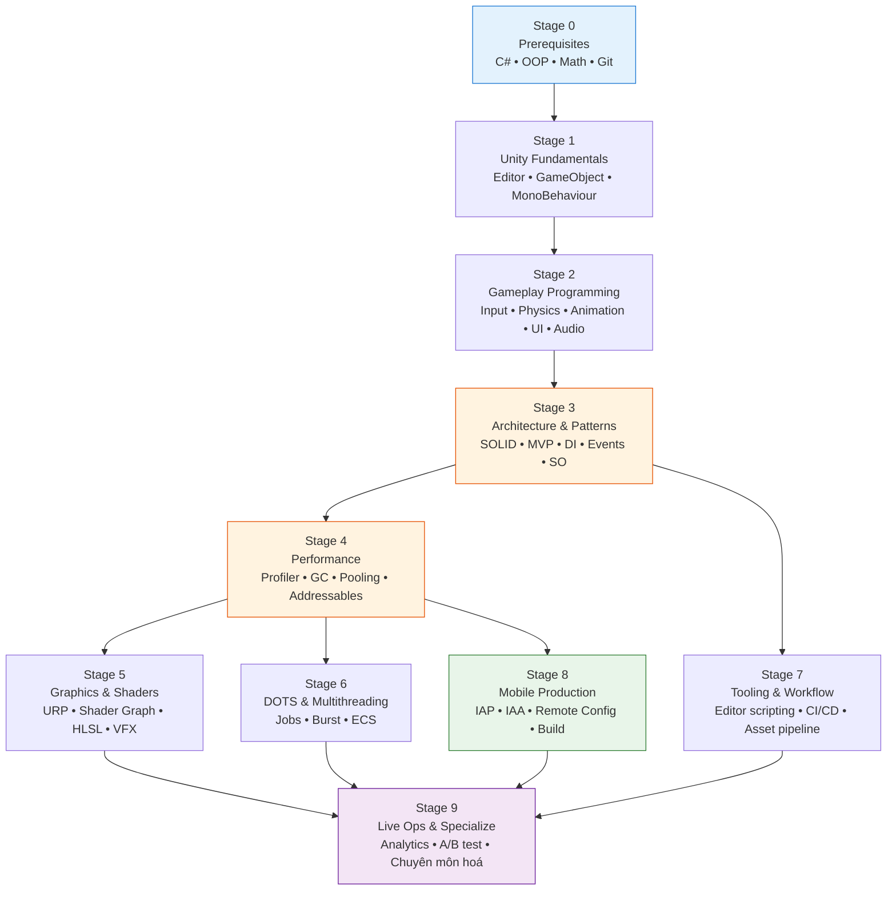
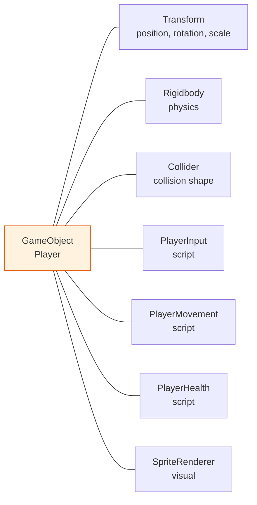
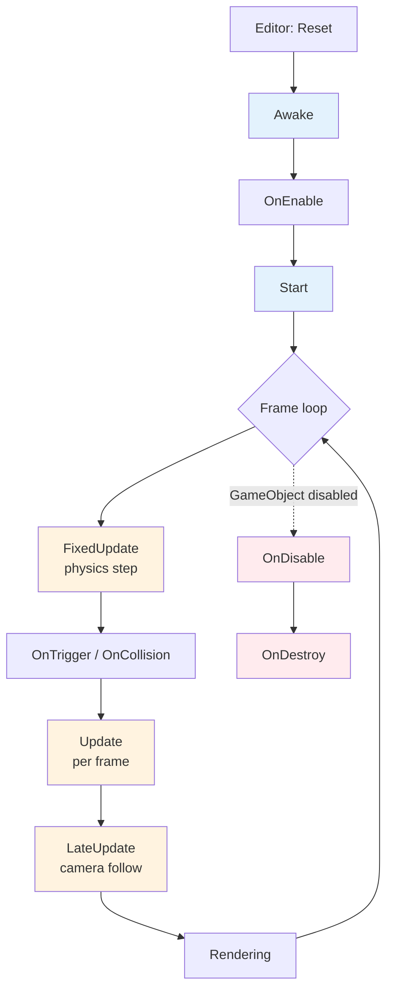
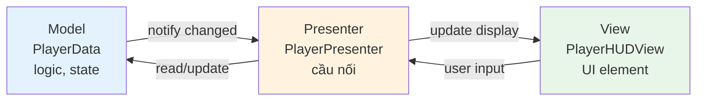
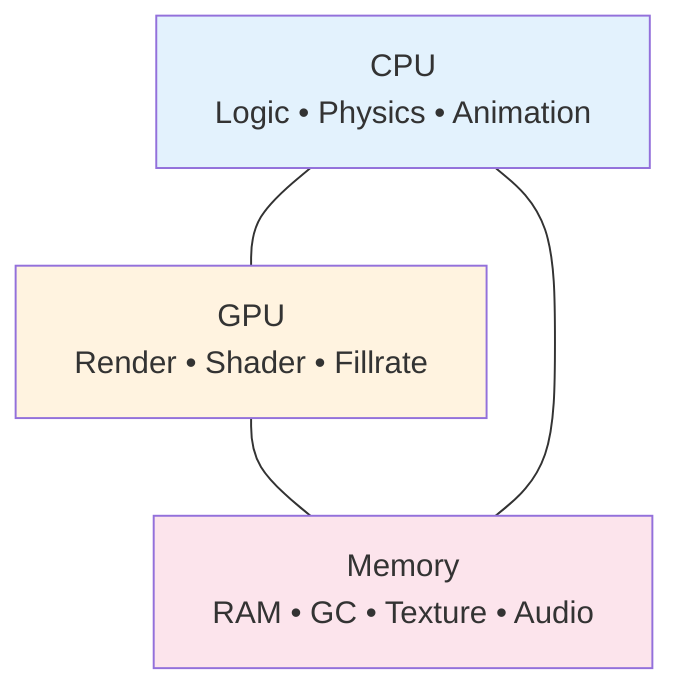
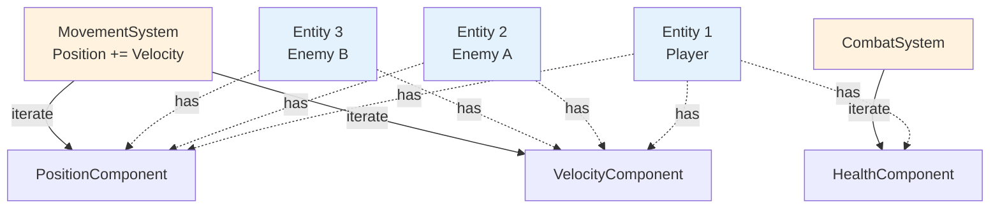
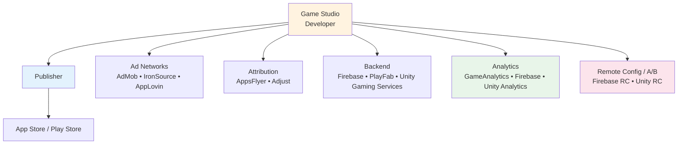
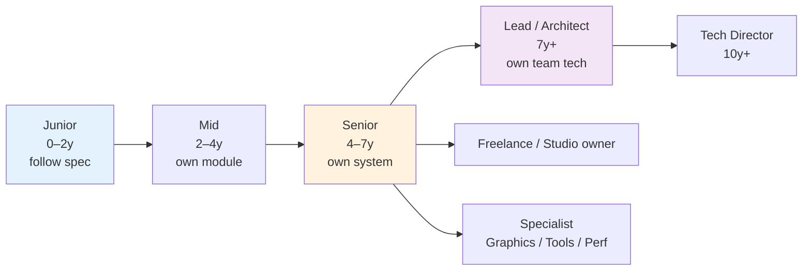

# Lộ trình trở thành Unity Developer Master

> Tài liệu tổng hợp toàn bộ kiến thức, kỹ năng, công cụ và tài nguyên cần thiết để đi từ người mới đến level **Senior / Master Unity Developer**. Mang định hướng mobile (super casual / hybrid puzzle / hybrid casual) nhưng vẫn bao quát mọi nhánh của ngành.

<p align="center">
  
  &nbsp;&nbsp;&nbsp;
  
  &nbsp;&nbsp;&nbsp;
  
  &nbsp;&nbsp;&nbsp;
  
  &nbsp;&nbsp;&nbsp;
  
  &nbsp;&nbsp;&nbsp;
  
</p>

<p align="center">
  
  
  
  
  
</p>

---

## Mục lục

1. [Tổng quan & nguyên tắc học](#1-tổng-quan--nguyên-tắc-học)
2. [Roadmap tổng thể](#2-roadmap-tổng-thể)
3. [Stage 0 — Prerequisites: nền tảng trước Unity](#3-stage-0--prerequisites-nền-tảng-trước-unity)
4. [Stage 1 — Unity Fundamentals](#4-stage-1--unity-fundamentals)
5. [Stage 2 — Gameplay Programming](#5-stage-2--gameplay-programming)
6. [Stage 3 — Architecture & Design Patterns](#6-stage-3--architecture--design-patterns)
7. [Stage 4 — Performance & Optimization](#7-stage-4--performance--optimization)
8. [Stage 5 — Graphics, Rendering & Shaders](#8-stage-5--graphics-rendering--shaders)
9. [Stage 6 — Multithreading, DOTS & ECS](#9-stage-6--multithreading-dots--ecs)
10. [Stage 7 — Tooling, Editor & Workflow](#10-stage-7--tooling-editor--workflow)
11. [Stage 8 — Mobile Game Production](#11-stage-8--mobile-game-production)
12. [Stage 9 — Live Ops, Analytics & Specializations](#12-stage-9--live-ops-analytics--specializations)
13. [Soft skills & sự nghiệp](#13-soft-skills--sự-nghiệp)
14. [Tài nguyên học tập tuyển chọn](#14-tài-nguyên-học-tập-tuyển-chọn)
15. [Lộ trình thời gian & tự đánh giá](#15-lộ-trình-thời-gian--tự-đánh-giá)

---

## 1. Tổng quan & nguyên tắc học

Một Unity Developer master không phải là người biết "mọi thứ trong Unity", mà là người có **nền tảng C# vững, hiểu sâu engine, có gu thiết kế kiến trúc, đo lường được performance, và ship được game ra production**. Lộ trình này tách thành 10 stage (0–9) với mục đích tránh nhảy cóc và tránh học lan man.

**Bốn nguyên tắc xuyên suốt:**

- **Build-first, theory-second** — học khái niệm nào cũng phải có ít nhất một dự án nhỏ (prototype 1–3 ngày) áp dụng nó. Knowledge mà không có muscle memory sẽ phai trong 4–6 tuần.
- **Read other people's code** — clone 3–5 open-source Unity project mỗi stage (Brackeys, Unity Open Project, Tarodev, Unite samples, asset từ Asset Store). Đọc code của senior nhanh hơn tự khám phá.
- **Measure, don't guess** — performance, retention, funnel — luôn đo bằng Profiler / Memory Profiler / analytics. Trực giác sai nhiều hơn đúng.
- **Ship, even tiny** — mỗi 4–6 tuần publish một build playable (itch.io, Google Play internal, TestFlight). "Done is better than perfect" áp dụng cực mạnh cho Unity.

**Sai lầm phổ biến cần tránh:**

| Sai lầm | Hậu quả | Cách tránh |
|---|---|---|
| Nhảy thẳng vào Unity mà C# yếu | Code spaghetti, debug không nổi | Học C# 3–6 tuần riêng trước Stage 1 |
| Học hết tutorial nhưng không tự build | Không nhớ, không tự giải quyết bug | Mỗi tutorial xong viết lại 1 mini-project khác |
| Tối ưu sớm (premature optimization) | Mất thời gian, code khó đọc | Profile trước, optimize sau |
| Học DOTS/ECS quá sớm | Confused vì chưa hiểu MonoBehaviour | Đợi đến Stage 6 |
| Bỏ qua Editor scripting | Tool yếu, workflow chậm | Học từ Stage 7, không bỏ |
| Không dùng version control từ đầu | Mất code, không collab được | Git + LFS ngay từ project đầu tiên |
| Học framework mới hoài, không deep | Master của không gì cả | Stick 1 paradigm/asset cho đến khi ship |

---

## 2. Roadmap tổng thể



**Cách đọc:** Stage 0→3 là tuần tự bắt buộc. Từ Stage 4 trở đi có thể đi song song theo nhu cầu công việc. Stage 8 quan trọng cho mọi ai làm mobile. Stage 9 là chuyên môn hoá — không cần master hết, chọn 1–2 hướng sâu.

**Phân loại level:**

| Level | Hoàn thành stage | Đặc trưng |
|---|---|---|
| **Junior** | Stage 0–2 | Implement được feature theo spec rõ ràng, cần senior review code |
| **Mid** | Stage 0–4 | Tự thiết kế module, debug performance, ít cần kèm cặp |
| **Senior** | Stage 0–7 + 1–2 chuyên môn từ 8–9 | Owning một mảng (gameplay/graphics/tools), mentor junior, ra quyết định kỹ thuật |
| **Master / Lead** | Toàn bộ + ship 2–3 game thật + 1 chuyên môn sâu | Định hình kiến trúc cả team, trade-off được giữa tech và business, biết khi nào KHÔNG dùng feature mới |

---

## 3. Stage 0 — Prerequisites: nền tảng trước Unity

<p align="center">
  
  &nbsp;&nbsp;
  
  &nbsp;&nbsp;
  
  &nbsp;&nbsp;
  
  &nbsp;&nbsp;
  
</p>

> Thời lượng: **4–8 tuần** nếu xuất phát từ con số không. Đừng bỏ qua — 90% bug Unity của junior là bug C# / OOP, không phải bug Unity.

### 3.1 C# — ngôn ngữ chính

C# là ngôn ngữ scripting của Unity. Master nó như tiếng mẹ đẻ. Unity hiện tại (2022 LTS+) support C# 9.0, .NET Standard 2.1.

**Lộ trình C# bắt buộc:**

| Nhóm | Chủ đề cụ thể | Mức tối thiểu |
|---|---|---|
| Cú pháp cơ bản | Variables, types (`int`, `float`, `bool`, `string`, `enum`), operators, control flow (`if`, `switch`, `for`, `while`, `foreach`) | Viết được FizzBuzz, palindrome, factorial không nhìn tài liệu |
| OOP | Class, struct, interface, abstract class, inheritance, polymorphism, encapsulation | Thiết kế hệ phân cấp `Enemy → Goblin → Boss` không lúng túng |
| Collections | `List<T>`, `Dictionary<K,V>`, `HashSet<T>`, `Queue<T>`, `Stack<T>`, array | Biết khi nào dùng `List` vs `Dictionary` (O(n) vs O(1) lookup) |
| Generics | `class Pool<T>`, `where T : class` constraints | Tự viết được generic object pool |
| Delegates & events | `Action`, `Func`, `event`, lambda `() => {}`, closure | Hiểu memory leak từ event không unsubscribe |
| LINQ | `Where`, `Select`, `OrderBy`, `GroupBy`, `Any`, `First` | Biết LINQ tạo garbage — tránh trong Update loop |
| Async / await | `Task`, `async`, `await`, cancellation token | Hiểu vì sao Unity dùng `UniTask` thay `Task` (xem Stage 2) |
| Properties & indexers | `get/set`, auto-property, expression-bodied | Phân biệt field vs property và khi nào dùng cái nào |
| Nullable & pattern matching | `int?`, `is`, `switch expression`, null-conditional `?.` | Code defensive được, tránh NullReferenceException |
| Exception handling | `try/catch/finally`, custom exception | Không nuốt exception bằng `catch (Exception) {}` rỗng |
| Attributes & reflection | `[Serializable]`, `[SerializeField]`, custom attribute, `typeof`, `GetType()` | Đọc hiểu được code dùng reflection (DI container, editor tool) |

**Tài liệu chính (chỉ chọn 1 trong mỗi nhóm, đừng học chồng chéo):**

- **Sách:** *C# in Depth* (Jon Skeet) hoặc *C# 10 and .NET 6* (Mark Price).
- **Online miễn phí:** Microsoft Learn C# path, learncs.org.
- **Practice:** exercism.io track C#, codewars.com.

**Tự đánh giá Stage 0 — C#:**
- [ ] Viết được generic class với constraint không cần Google
- [ ] Giải thích được sự khác biệt giữa `struct` và `class` (value vs reference, stack vs heap)
- [ ] Biết tại sao `foreach` trên `List<T>` không tạo garbage nhưng trên `Dictionary` thì có (trên Unity mono legacy)
- [ ] Hiểu closure capture biến như thế nào và khi nào gây bug

### 3.2 OOP & SOLID — tư duy thiết kế

OOP là **tư duy**, không phải syntax. Học không đúng sẽ dẫn đến inheritance abuse (kế thừa 5–6 tầng) — bệnh kinh điển của Unity dev junior.

SOLID gồm 5 nguyên tắc đặt tên theo chữ cái đầu. Phần dưới đây giải thích từng nguyên tắc kèm **code BAD** (vi phạm) và **code GOOD** (tuân thủ) — đọc xong tự refactor được.

---

#### S — Single Responsibility Principle (SRP)

> Mỗi class chỉ nên có **một lý do duy nhất để thay đổi**.

**BAD — `Player.cs` 2000 dòng làm tất cả:**

```csharp
public class Player : MonoBehaviour
{
    public float health = 100;
    public int score;
    public AudioClip jumpSfx;

    void Update()
    {
        // Input
        float h = Input.GetAxis("Horizontal");
        if (Input.GetKeyDown(KeyCode.Space)) Jump();

        // Movement
        transform.Translate(Vector3.right * h * 5f * Time.deltaTime);

        // Combat
        if (Input.GetMouseButtonDown(0)) Attack();

        // UI update
        GameObject.Find("HealthText").GetComponent<Text>().text = $"HP: {health}";

        // Save
        PlayerPrefs.SetInt("Score", score);
    }

    void Jump() { /* ... */ AudioSource.PlayClipAtPoint(jumpSfx, transform.position); }
    void Attack() { /* ... */ }
    public void TakeDamage(float dmg) { health -= dmg; if (health <= 0) Die(); }
    void Die() { /* ... */ SceneManager.LoadScene("GameOver"); }
}
```

Có **5+ lý do** để class này thay đổi: input đổi, movement tinh chỉnh, combat thêm skill, UI redesign, save format đổi. Mỗi thay đổi đều risk breaking thứ khác.

**GOOD — tách trách nhiệm:**

```csharp
public class PlayerInput : MonoBehaviour
{
    public event Action<Vector2> OnMove;
    public event Action OnJump;
    public event Action OnAttack;

    void Update()
    {
        var move = new Vector2(Input.GetAxis("Horizontal"), Input.GetAxis("Vertical"));
        if (move.sqrMagnitude > 0.01f) OnMove?.Invoke(move);
        if (Input.GetKeyDown(KeyCode.Space)) OnJump?.Invoke();
        if (Input.GetMouseButtonDown(0)) OnAttack?.Invoke();
    }
}

public class PlayerMovement : MonoBehaviour
{
    [SerializeField] float speed = 5f;
    [SerializeField] PlayerInput input;
    void OnEnable()  => input.OnMove += HandleMove;
    void OnDisable() => input.OnMove -= HandleMove;
    void HandleMove(Vector2 dir) => transform.Translate(dir * speed * Time.deltaTime);
}

public class PlayerHealth : MonoBehaviour
{
    [SerializeField] float maxHealth = 100;
    public float Current { get; private set; }
    public event Action<float> OnHealthChanged;
    public event Action OnDied;

    void Awake() => Current = maxHealth;
    public void TakeDamage(float dmg)
    {
        Current = Mathf.Max(0, Current - dmg);
        OnHealthChanged?.Invoke(Current);
        if (Current <= 0) OnDied?.Invoke();
    }
}
```

Bây giờ mỗi class **<50 dòng**, mỗi class một lý do thay đổi. Sửa input không động đến health. Test riêng được.

---

#### O — Open/Closed Principle (OCP)

> Class phải **mở để mở rộng (extension), đóng để sửa (modification)**.

**BAD — thêm enemy mới phải sửa `EnemyManager`:**

```csharp
public class EnemyManager : MonoBehaviour
{
    public void AttackPlayer(string enemyType, Player player)
    {
        if (enemyType == "Goblin")       player.TakeDamage(10);
        else if (enemyType == "Orc")     player.TakeDamage(25);
        else if (enemyType == "Dragon")  player.TakeDamage(80);
        // Thêm enemy mới → sửa file này → risk break các enemy cũ
    }
}
```

**GOOD — abstraction, mở rộng qua subclass:**

```csharp
public abstract class Enemy : MonoBehaviour
{
    public abstract int Damage { get; }
    public virtual void AttackPlayer(PlayerHealth player) => player.TakeDamage(Damage);
}

public class Goblin : Enemy { public override int Damage => 10; }
public class Orc    : Enemy { public override int Damage => 25; }
public class Dragon : Enemy
{
    public override int Damage => 80;
    public override void AttackPlayer(PlayerHealth p)
    {
        base.AttackPlayer(p);
        // Dragon thêm burn effect — không sửa code Goblin/Orc
        p.GetComponent<BurnEffect>()?.Apply(seconds: 3);
    }
}
```

Thêm `Skeleton` mới? Tạo class mới, không sửa Goblin/Orc/Dragon hay manager.

---

#### L — Liskov Substitution Principle (LSP)

> Subclass phải **thay thế được superclass** mà code không broken.

**BAD — vi phạm semantic của parent:**

```csharp
public class Bird
{
    public virtual void Fly() => Debug.Log("Flying...");
}

public class Penguin : Bird
{
    public override void Fly() => throw new NotSupportedException("Penguin không bay!");
}

// Caller bị surprise:
void MakeAllFly(List<Bird> birds) { foreach (var b in birds) b.Fly(); }  // Crash khi gặp Penguin
```

**GOOD — model lại hierarchy đúng:**

```csharp
public abstract class Bird { public abstract void Move(); }

public interface IFlyingBird { void Fly(); }
public interface ISwimmingBird { void Swim(); }

public class Sparrow : Bird, IFlyingBird
{
    public override void Move() => Fly();
    public void Fly() => Debug.Log("Flying");
}

public class Penguin : Bird, ISwimmingBird
{
    public override void Move() => Swim();
    public void Swim() => Debug.Log("Swimming");
}

void MakeAllFly(List<IFlyingBird> birds) { foreach (var b in birds) b.Fly(); }  // An toàn
```

---

#### I — Interface Segregation Principle (ISP)

> **Interface nhỏ, chuyên biệt** thay vì một interface to bao trùm mọi thứ.

**BAD — interface "God":**

```csharp
public interface ICharacter
{
    void Move();
    void Attack();
    void TakeDamage(int dmg);
    void Heal(int amount);
    void OpenInventory();
    void Talk();
    void Trade();
}

// Một con goblin phải implement OpenInventory, Trade, Heal — nhưng nó không có những thứ đó!
public class Goblin : ICharacter
{
    public void OpenInventory() => throw new NotImplementedException();
    public void Trade()         => throw new NotImplementedException();
    public void Heal(int x)     => throw new NotImplementedException();
    // ... fake hết
}
```

**GOOD — interface nhỏ, compose:**

```csharp
public interface IMovable     { void Move(Vector3 dir); }
public interface IAttacker    { void Attack(IDamageable target); }
public interface IDamageable  { void TakeDamage(int dmg); }
public interface IHealable    { void Heal(int amount); }
public interface IInteractable { void Interact(); }

public class Goblin : MonoBehaviour, IMovable, IAttacker, IDamageable
{
    public void Move(Vector3 dir) { /* ... */ }
    public void Attack(IDamageable t) => t.TakeDamage(10);
    public void TakeDamage(int dmg) { /* ... */ }
}

public class Merchant : MonoBehaviour, IInteractable
{
    public void Interact() => Debug.Log("Mở shop...");
}
```

Goblin chỉ implement cái nó cần. Merchant không phải pretend biết đánh nhau.

---

#### D — Dependency Inversion Principle (DIP)

> **Phụ thuộc vào abstraction**, không phụ thuộc vào concrete. High-level module không phụ thuộc low-level.

**BAD — coupling cứng:**

```csharp
public class GameLogger : MonoBehaviour
{
    FileLogger _logger = new FileLogger();  // Hardcoded concrete

    public void LogEvent(string msg) => _logger.Write(msg);
}

public class FileLogger { public void Write(string s) => File.AppendAllText("log.txt", s); }
```

Muốn log lên cloud thay vì file? Sửa `GameLogger`. Muốn test? Không mock được.

**GOOD — depend on interface:**

```csharp
public interface ILogger { void Log(string message); }

public class FileLogger    : ILogger { public void Log(string m) => File.AppendAllText("log.txt", m); }
public class ConsoleLogger : ILogger { public void Log(string m) => Debug.Log(m); }
public class FirebaseLogger: ILogger { public void Log(string m) => FirebaseAnalytics.LogEvent(m); }

public class GameLogger : MonoBehaviour
{
    ILogger _logger;
    public void Init(ILogger logger) => _logger = logger;   // Injected
    public void LogEvent(string msg) => _logger?.Log(msg);
}

// Production:
gameLogger.Init(new FirebaseLogger());
// Test:
gameLogger.Init(new ConsoleLogger());
```

DIP là nền tảng của DI, Service Locator, và mọi pattern test-friendly (xem Stage 3).

---

**Composition over inheritance** — quan trọng cho Unity vì kiến trúc component sẵn có rồi. Khi muốn thêm tính năng, hỏi: "Có thể là component mới không?" trước khi "có thể là class con không?".

### 3.3 Data Structures & Algorithms

Không cần level competitive programming. Đủ để không viết code O(n²) trong Update.

**Bắt buộc biết:**

| Cấu trúc / thuật toán | Big-O quan trọng | Ứng dụng Unity |
|---|---|---|
| Array, `List<T>` | Access O(1), Insert/Remove O(n) | Lưu enemy, item |
| `Dictionary<K,V>` | Lookup O(1) avg | Lookup item bằng ID, cache reference |
| `HashSet<T>` | Contains O(1) | Tracking "đã visit", "đã unlock" |
| Queue, Stack | O(1) enqueue/dequeue | A* open list, undo stack, message queue |
| Linked List | Insert middle O(1) | Hiếm dùng — Unity thường ưu tiên contiguous memory |
| Priority Queue / Heap | O(log n) | A* pathfinding |
| Tree (binary, n-ary) | Phụ thuộc | Behavior tree, UI hierarchy, quadtree |
| Graph | DFS/BFS O(V+E) | Level dependency, dialogue tree |
| Sorting | O(n log n) | Leaderboard, render order |
| Binary search | O(log n) | Lookup trong sorted array |
| A* pathfinding | O(E log V) | NPC navigation (hoặc dùng Unity NavMesh) |
| Spatial hashing / Quadtree | O(1) lookup vùng | Tìm enemy gần player nhanh trong open world |

**Tự đánh giá:** Cho 10.000 entity, hỏi "tìm enemy gần nhất player" — biết viết spatial hashing / quadtree thay vì `foreach` toàn map.

### 3.4 Toán cho game

Game = toán. Bỏ qua sẽ bị giới hạn ở puzzle 2D đơn giản.

**Mức tối thiểu:**

| Mảng | Khái niệm cốt lõi | Ứng dụng |
|---|---|---|
| **Vector** | Dot product, cross product, normalize, magnitude, projection | AI vision cone, movement, reflection |
| **Trigonometry** | sin/cos/tan, atan2, radian vs degree | Aiming, orbital camera, oscillation |
| **Linear algebra** | Matrix 4x4, transformation matrix, basis vectors | Hiểu Transform component, rendering pipeline |
| **Quaternion** | Slerp, Lerp, Euler angles, gimbal lock | Rotation 3D không bug |
| **Interpolation** | Lerp, smoothstep, easing (ease-in, ease-out, bounce, elastic) | Animation, juice, camera |
| **Probability** | Random, weighted random, distribution (uniform, normal) | Loot table, level generation |
| **Calculus cơ bản** | Đạo hàm (velocity), tích phân (position) — không cần giải | Physics intuition |

**Tài nguyên:** *3Blue1Brown* (YouTube) — series "Essence of Linear Algebra" và "Essence of Calculus". *Math for Game Developers* (Jorge Rodriguez). Sách: *3D Math Primer for Graphics and Game Development*. Freya Holmér YouTube — math cho game cực hay.

### 3.5 Git & version control

Không có Git = không có job. Phải dùng từ project đầu tiên.

**Bắt buộc:**

| Lệnh / khái niệm | Khi nào dùng |
|---|---|
| `clone`, `init` | Bắt đầu project |
| `add`, `commit`, `push`, `pull`, `fetch` | Daily |
| `branch`, `checkout`, `merge`, `rebase` | Feature branch workflow |
| `.gitignore` cho Unity | Bỏ `Library/`, `Temp/`, `obj/`, `*.csproj` — Unity tự sinh |
| **Git LFS** | Bắt buộc cho Unity — track `*.png`, `*.psd`, `*.fbx`, `*.wav`, `*.mp3`, `*.unity`, `*.prefab` (file binary) |
| `stash` | Tạm cất work khi cần switch branch |
| `reset`, `revert`, `cherry-pick` | Recovery |
| Merge conflict resolution | Sống còn — Unity `.unity` scene file merge cực khó, cần `YAMLMerge` (Unity SmartMerge) |
| Pull request / code review | Workflow team |

**Branching model gợi ý cho team nhỏ:** `main` (production) → `develop` → `feature/*`, `hotfix/*`. Đơn giản, không cần GitFlow nặng.

**Lưu ý đặc thù Unity:** Bật **Asset Serialization: Force Text** trong Project Settings → Editor để file `.unity`, `.prefab`, `.asset` ở dạng YAML text — Git diff được, merge được. Mặc định trên các version mới.

---


## 4. Stage 1 — Unity Fundamentals

> Thời lượng: **4–6 tuần**. Mục tiêu: làm chủ Editor, hiểu component model, viết được prototype 2D/3D đơn giản.

### 4.1 Unity Editor — workspace của bạn

Phải dùng nhuần nhuyễn như IDE. Không lý thuyết — mở Editor lên thực hành.

**Các cửa sổ phải nắm vững:**

| Cửa sổ | Mục đích | Phím tắt nên nhớ |
|---|---|---|
| Scene view | Edit thế giới 3D/2D | F (focus), Q/W/E/R (transform tool), Alt+drag (orbit) |
| Game view | Preview gameplay | Ctrl+P (play), Ctrl+Shift+P (pause) |
| Hierarchy | Cấu trúc GameObject trong scene | Ctrl+D (duplicate) |
| Project | Asset trên disk | Trải lên từ Explorer/Finder vào đây |
| Inspector | Edit property của asset/GameObject | Lock icon để pin |
| Console | Log, warning, error | Ctrl+Shift+C |
| Profiler | Đo CPU/GPU/Memory (Stage 4) | Ctrl+7 |
| Animator / Animation | Animation state machine và clip | — |
| Timeline | Cinematic sequence | — |
| Lighting | Light setting, baking | — |

**Layout:** Tạo và lưu custom layout của riêng bạn (Window → Layouts → Save Layout). Tiết kiệm 10–15% thời gian daily.

### 4.2 GameObject — Component model

Đây là **mô hình tư duy quan trọng nhất** của Unity. Hiểu sai sẽ tạo code OOP-style chống lại engine.



**Quy tắc vàng:**
- **GameObject = container rỗng.** Không có behavior, chỉ là một entity có ID và Transform.
- **Component = data + behavior.** Mỗi component giải quyết 1 concern (rendering, physics, input, custom logic).
- **Composition > inheritance.** Muốn entity mới? Add/Remove component, không tạo subclass.

**Tránh:** một `Player.cs` 2000 dòng làm hết. Tách `PlayerInput`, `PlayerMovement`, `PlayerCombat`, `PlayerHealth`, `PlayerAnimation` — mỗi cái <200 dòng.

**Cache pattern cho `GetComponent` — sai lầm số 1 của junior:**

```csharp
public class PlayerHealthBad : MonoBehaviour
{
    void Update()
    {
        // SAI — GetComponent mỗi frame, ~ 50–200ns/lần × hàng nghìn frame = lag
        var rb = GetComponent<Rigidbody>();
        if (rb.velocity.magnitude < 0.1f) { /* ... */ }
    }
}

public class PlayerHealthGood : MonoBehaviour
{
    Rigidbody _rb;
    void Awake() => _rb = GetComponent<Rigidbody>();  // Cache 1 lần
    void Update()
    {
        if (_rb.velocity.magnitude < 0.1f) { /* ... */ }
    }
}
```

`[RequireComponent(typeof(Rigidbody))]` — attribute đặt trên class để Unity tự add Rigidbody khi script được attach. Vừa cache vừa enforce dependency.

### 4.3 Transform & Hierarchy

`Transform` là component duy nhất bắt buộc trên mọi GameObject. Quản lý vị trí, xoay, scale, và parent–child.

| Khái niệm | Chú ý |
|---|---|
| `position` (world) vs `localPosition` (relative parent) | Bug rất hay xảy ra khi nhầm 2 cái này |
| `eulerAngles` vs `rotation` (Quaternion) | Set Euler chỉ dùng cho input của designer, runtime dùng Quaternion |
| `lossyScale` vs `localScale` | Scale non-uniform của parent làm `lossyScale` không chính xác — tránh non-uniform scale |
| Parent-child | Child kế thừa transform của parent — dùng để gom (group) hoặc tách thế giới UI / world |
| `transform.Find()`, `GetChild()` | Chậm, không cache — chỉ dùng setup, không Update |

### 4.4 MonoBehaviour Lifecycle

Sống còn. Sai một event là bug 2 tuần.



**Quy tắc bắt buộc:**

| Event | Khi nào chạy | Dùng để |
|---|---|---|
| `Awake` | Khi GameObject được tạo (cả lúc disabled) | Cache reference của CHÍNH GameObject này (`GetComponent`) |
| `OnEnable` | Mỗi lần GameObject active | Subscribe event |
| `Start` | Trước frame đầu, sau Awake của tất cả | Reference đến GameObject khác (đã chắc Awake xong) |
| `Update` | Mỗi frame | Input, AI quyết định, timer |
| `FixedUpdate` | Bước physics (mặc định 50Hz) | Mọi thứ liên quan `Rigidbody`, force |
| `LateUpdate` | Sau Update, trước render | Camera follow (Update có thể chưa di chuyển xong) |
| `OnDisable` | Khi inactive / bị disable | Unsubscribe event — TRÁNH MEMORY LEAK |
| `OnDestroy` | Khi destroy | Cleanup, dispose, save data |

**Trap kinh điển:** `Update` chạy time-step không cố định (phụ thuộc FPS), nên di chuyển `Rigidbody` trong Update là sai — phải `FixedUpdate`. Input ngược lại: poll trong Update (Input liên kết với frame).

**Template MonoBehaviour chuẩn cho 90% script:**

```csharp
public class MyComponent : MonoBehaviour
{
    [Header("Dependencies")]
    [SerializeField] Rigidbody _rb;  // Drag trong Inspector hoặc Reset gán

    [Header("Config")]
    [SerializeField] float _speed = 5f;

    // Reset chạy khi add component / Reset trong context menu
    void Reset() => _rb = GetComponent<Rigidbody>();

    void Awake()    { /* cache thêm */ }
    void OnEnable() { EventBus.OnX += HandleX; }
    void OnDisable(){ EventBus.OnX -= HandleX; }
    void Start()    { /* dùng reference cross-object */ }
    void Update()   { /* per-frame logic */ }

    void HandleX(int x) { /* ... */ }
}
```

### 4.5 Prefab

Prefab = template GameObject. Hiểu sai là disaster vì khi project lớn lên prefab thành xương sống.

| Khái niệm | Ý nghĩa |
|---|---|
| **Prefab Asset** | File trên disk (.prefab) |
| **Prefab Instance** | Bản trong scene, kế thừa từ Asset |
| **Prefab Variant** | Subclass của prefab — kế thừa có override |
| **Nested Prefab** | Prefab chứa prefab khác — sạch hơn, hỗ trợ từ 2018.3 |
| **Override** | Instance khác Asset — hiển thị "+" trong Inspector |
| **Apply / Revert** | Đẩy override lên Asset / hoàn instance về như Asset |

**Best practice:**
- Mọi thứ tái sử dụng > 1 lần → Prefab.
- Tránh override quá nhiều — nếu cần khác nhiều → Prefab Variant.
- Tránh script reference cross-prefab — dùng event hoặc ScriptableObject (Stage 3) làm trung gian.

### 4.6 Scene & SceneManagement

| Khái niệm | Ý nghĩa |
|---|---|
| Scene | Tập hợp GameObject — thường là 1 level / 1 menu / 1 màn hình |
| `SceneManager.LoadScene` | Load đồng bộ — freeze game ngắn |
| `LoadSceneAsync` | Load nền — preload screen, splash |
| Single vs Additive | Replace toàn bộ vs cộng thêm vào scene hiện tại |
| DontDestroyOnLoad | Giữ object sống qua scene transition — dùng cho persistent manager |

**Code load scene async với progress bar:**

```csharp
public class SceneLoader : MonoBehaviour
{
    [SerializeField] Slider progressBar;

    public async UniTaskVoid LoadAsync(string sceneName)
    {
        var op = SceneManager.LoadSceneAsync(sceneName);
        op.allowSceneActivation = false;

        // 0..0.9 = load, 0.9..1.0 = activate
        while (op.progress < 0.9f)
        {
            progressBar.value = op.progress / 0.9f;
            await UniTask.Yield();
        }
        progressBar.value = 1f;
        await UniTask.Delay(200);  // Cho user thấy 100%
        op.allowSceneActivation = true;
    }
}
```

**Anti-pattern:** Lạm dụng `DontDestroyOnLoad` cho mọi manager → singleton hell. Có giải pháp tốt hơn ở Stage 3 (Service Locator, DI).

### 4.7 Asset & Import

Mỗi loại asset có settings riêng — sai là performance / memory bug.

| Asset | Setting quan trọng | Ghi chú |
|---|---|---|
| Texture | Max Size, Compression (ASTC cho mobile), Mipmap | Mipmap giảm bandwidth khi xa camera |
| Audio | Load Type (Decompress on Load / Compressed in Memory / Streaming), Compression (Vorbis / AAC / PCM) | SFX ngắn: Decompress on Load. BGM dài: Streaming |
| Model (FBX) | Read/Write Enabled, Optimize Mesh, Import Materials | Tắt Read/Write nếu không cần CPU access → tiết kiệm RAM một nửa |
| Sprite | Pixels Per Unit, Sprite Mode (Single/Multiple), Pack to atlas | Dùng Sprite Atlas (2D feature) gom sprite → giảm draw call |
| Animation Clip | Compression, Anim. Compression | Mặc định nhiều noise — giảm size 30–60% |

### 4.8 Camera — kiến thức cơ bản

Camera quyết định "user nhìn thấy gì". Phần này chỉ basics — phần deep dive (Cinemachine, render texture, camera stacking) ở Stage 5.

| Property | Ý nghĩa | Lưu ý |
|---|---|---|
| **Projection** | Perspective (mắt người) / Orthographic (2D, isometric) | 2D game = Orthographic |
| **Field of View** (perspective) | Góc nhìn dọc (degrees) | 60° standard, 90° wide. FOV cao → fish-eye, chóng mặt |
| **Size** (orthographic) | Half-height của view trong world unit | Size=5 → camera nhìn 10 unit chiều dọc |
| **Clipping Planes** (Near/Far) | Khoảng cách min/max render | Near quá nhỏ → z-fighting. Far quá lớn → giảm precision depth buffer |
| **Clear Flags** | Cách clear màn hình mỗi frame | Skybox / Solid Color / Depth Only / Don't Clear |
| **Culling Mask** | Layer nào render | Bỏ Layer "UI" cho camera 3D, render UI bằng camera riêng |
| **Depth** | Camera nào vẽ trước (thấp) / sau (cao) | UI camera depth > Main camera |
| **Viewport Rect** | Vùng màn hình camera vẽ | Split-screen: 2 camera mỗi cái 0.5 ngang |

**Pattern camera follow đơn giản nhất:**

```csharp
public class CameraFollow : MonoBehaviour
{
    [SerializeField] Transform target;
    [SerializeField] Vector3 offset = new Vector3(0, 5, -10);
    [SerializeField] float smooth = 5f;

    // LateUpdate vì target có thể được di chuyển trong Update
    void LateUpdate()
    {
        if (target == null) return;
        var desired = target.position + offset;
        transform.position = Vector3.Lerp(transform.position, desired, smooth * Time.deltaTime);
        transform.LookAt(target);
    }
}
```

Tại sao `LateUpdate`? Vì nếu camera follow trong `Update`, có thể chạy TRƯỚC khi target di chuyển → camera lag 1 frame, thấy giật.

### 4.9 Build & Player

| Platform | Build trên | Notes |
|---|---|---|
| Windows | Windows | EXE standalone |
| macOS | macOS | App bundle, code signing |
| iOS | macOS bắt buộc (Xcode) | Apple Developer account, provisioning |
| Android | Cross-platform | APK / AAB (Play Store yêu cầu AAB), keystore |
| WebGL | Bất kỳ | HTML5 build, không socket TCP, không System.IO standard |

**Build Settings:** Cần biết Scenes In Build, Development Build (cho profiling), Script Backend (IL2CPP cho release).

### 4.10 Tự đánh giá Stage 1

- [ ] Build được một mini-game (Pong, Flappy Bird, Breakout) trong 1 ngày, không nhìn tutorial
- [ ] Giải thích được sự khác biệt Awake vs Start, Update vs FixedUpdate vs LateUpdate
- [ ] Tạo prefab có nested prefab, override property, áp dụng/revert
- [ ] Setup Git LFS cho Unity project, làm scene merge conflict bằng SmartMerge
- [ ] Build được APK install được trên điện thoại
- [ ] Viết camera follow đơn giản (LateUpdate, Lerp smooth)

---

## 5. Stage 2 — Gameplay Programming

> Thời lượng: **8–12 tuần**. Phần thực sự "làm game" — input, physics, animation, UI, audio, AI. Mỗi mục là một deep dive.

### 5.1 Input System

Unity có **2 hệ input**: legacy `Input.GetKey` và Input System package (mới, mặc định từ 2022.2). Học cả 2, dùng cái mới cho project mới.

**Legacy:**
```csharp
if (Input.GetKeyDown(KeyCode.Space)) Jump();
float h = Input.GetAxis("Horizontal");
```
Đơn giản, đủ cho prototype và mobile game đơn giản.

**Input System (new) — pattern callback:**

```csharp
public class PlayerInputHandler : MonoBehaviour
{
    [SerializeField] InputActionAsset actions;
    InputAction _moveAction, _jumpAction;
    public event Action<Vector2> OnMove;
    public event Action OnJump;

    void Awake()
    {
        var gameplay = actions.FindActionMap("Gameplay");
        _moveAction = gameplay.FindAction("Move");
        _jumpAction = gameplay.FindAction("Jump");
    }

    void OnEnable()
    {
        _moveAction.performed += HandleMove;
        _moveAction.canceled  += HandleMove;
        _jumpAction.performed += _ => OnJump?.Invoke();
        _moveAction.Enable();
        _jumpAction.Enable();
    }

    void OnDisable()
    {
        _moveAction.performed -= HandleMove;
        _moveAction.canceled  -= HandleMove;
        _moveAction.Disable();
        _jumpAction.Disable();
    }

    void HandleMove(InputAction.CallbackContext ctx) => OnMove?.Invoke(ctx.ReadValue<Vector2>());
}
```

**Touch input cho mobile:**
- `Input.touchCount`, `Input.GetTouch(i)` (legacy).
- `Touchscreen.current` (new system).
- Phải handle multi-touch, gesture: tap, double-tap, long-press, swipe, pinch.
- Library hữu ích: **Lean Touch** (Asset Store, có free version).

```csharp
// Swipe detection legacy
Vector2 _start;
void Update()
{
    if (Input.touchCount == 0) return;
    var t = Input.GetTouch(0);
    if (t.phase == TouchPhase.Began) _start = t.position;
    else if (t.phase == TouchPhase.Ended)
    {
        Vector2 delta = t.position - _start;
        if (delta.magnitude < 50f) return;  // tap, không phải swipe
        if (Mathf.Abs(delta.x) > Mathf.Abs(delta.y))
            OnSwipe(delta.x > 0 ? Direction.Right : Direction.Left);
        else
            OnSwipe(delta.y > 0 ? Direction.Up : Direction.Down);
    }
}
```

### 5.2 Physics 2D & 3D

Hai engine tách biệt: **Box2D** (Unity wrap thành Physics2D) và **PhysX** (Physics 3D).

**Core component:**

| Component | 2D | 3D | Mục đích |
|---|---|---|---|
| Rigidbody | Rigidbody2D | Rigidbody | Mass, velocity, drag |
| Collider | BoxCollider2D, CircleCollider2D, PolygonCollider2D | BoxCollider, SphereCollider, CapsuleCollider, MeshCollider | Shape va chạm |
| Joint | DistanceJoint2D, HingeJoint2D... | FixedJoint, SpringJoint, HingeJoint... | Liên kết 2 vật |
| Effector | AreaEffector2D, PointEffector2D | — | Force field 2D |

**Body types:**
- **Static** — không di chuyển, world geometry, optimization tốt nhất.
- **Kinematic** — di chuyển bằng `transform`/`MovePosition`, không bị physics tác động — dùng cho platform di chuyển, custom controller.
- **Dynamic** — physics-driven, dùng force/velocity.

**Raycast & query:**
- `Physics.Raycast(origin, dir, out hit, distance, layerMask)` — bắn tia, lấy hit info.
- `OverlapSphere/Box/Capsule` — query vùng.
- `SphereCast`, `BoxCast` — raycast có hình khối.

**Performance:**
- LayerMask filter ngay từ đầu, không filter sau bằng `if`.
- Tránh `MeshCollider` non-convex cho dynamic body.
- Tăng Fixed Timestep nếu game không cần physics precise — tiết kiệm CPU mobile.

**Collision callbacks:**

| Callback | Khi nào |
|---|---|
| `OnCollisionEnter/Stay/Exit` | 2 collider va chạm, ít nhất 1 có Rigidbody, không phải trigger |
| `OnTriggerEnter/Stay/Exit` | Ít nhất 1 collider là trigger (Is Trigger = true) |

### 5.3 Character Controller & Movement

3 cách di chuyển nhân vật, không có cách nào "đúng nhất":

| Cách | Ưu | Nhược | Phù hợp |
|---|---|---|---|
| `transform.Translate` | Đơn giản | Không va chạm physics | Prototype, UI |
| `CharacterController.Move` | Tự xử lý slope, step | Cứng, không dùng được physics force tự nhiên | FPS, third-person |
| `Rigidbody.velocity` / `AddForce` | Physics chuẩn | Cần tinh chỉnh để "feel" tốt | Platformer, vehicle |

**Platformer controller "feel good" — code mẫu với coyote time + jump buffer:**

```csharp
[RequireComponent(typeof(Rigidbody2D))]
public class PlatformerController : MonoBehaviour
{
    [Header("Move")]
    [SerializeField] float moveSpeed = 8f;
    [SerializeField] float acceleration = 60f;
    [SerializeField] float deceleration = 50f;

    [Header("Jump")]
    [SerializeField] float jumpForce = 14f;
    [SerializeField] float coyoteTime = 0.12f;       // Vẫn nhảy được sau khi rời đất một xíu
    [SerializeField] float jumpBufferTime = 0.12f;   // Nhấn jump trước khi chạm đất vẫn ăn

    [Header("Ground Check")]
    [SerializeField] Transform groundCheck;
    [SerializeField] LayerMask groundLayer;

    Rigidbody2D _rb;
    float _moveInput;
    float _coyoteTimer, _jumpBufferTimer;
    bool _isGrounded;

    void Awake() => _rb = GetComponent<Rigidbody2D>();

    void Update()
    {
        _moveInput = Input.GetAxisRaw("Horizontal");
        _isGrounded = Physics2D.OverlapCircle(groundCheck.position, 0.15f, groundLayer);

        // Coyote
        _coyoteTimer = _isGrounded ? coyoteTime : _coyoteTimer - Time.deltaTime;
        // Buffer
        if (Input.GetButtonDown("Jump")) _jumpBufferTimer = jumpBufferTime;
        else _jumpBufferTimer -= Time.deltaTime;

        if (_jumpBufferTimer > 0 && _coyoteTimer > 0)
        {
            _rb.velocity = new Vector2(_rb.velocity.x, jumpForce);
            _jumpBufferTimer = 0;
            _coyoteTimer = 0;
        }

        // Cut jump khi thả sớm → nhảy ngắn
        if (Input.GetButtonUp("Jump") && _rb.velocity.y > 0)
            _rb.velocity = new Vector2(_rb.velocity.x, _rb.velocity.y * 0.5f);
    }

    void FixedUpdate()
    {
        float target = _moveInput * moveSpeed;
        float accel = Mathf.Abs(target) > 0.01f ? acceleration : deceleration;
        float newX = Mathf.MoveTowards(_rb.velocity.x, target, accel * Time.fixedDeltaTime);
        _rb.velocity = new Vector2(newX, _rb.velocity.y);
    }
}
```

**Feel matters:** Movement không "feel good" là vấn đề số 1 của game junior. Đọc *Game Feel* (Steve Swink). Concept: coyote time, jump buffer, acceleration curve, animation blending.

### 5.4 Animation

3 hệ thống:

| Hệ | Mục đích | Khi dùng |
|---|---|---|
| **Animation Clip** (.anim) | Lưu key frame của property | Mọi animation |
| **Animator** (Mecanim) | State machine + blend tree | Character animation phức tạp |
| **Animation legacy** | Cũ, đơn giản | Tránh — chỉ legacy project |
| **Timeline** | Cinematic sequence | Cutscene, sequence |

**Animator quan trọng:**
- **States** — idle, run, jump, attack.
- **Transitions** — điều kiện chuyển (parameter: Bool, Trigger, Float, Int).
- **Blend Tree** — pha trộn nhiều clip theo parameter (run trái/giữa/phải).
- **Layers** — animation chồng (full body + upper body).
- **Avatar Mask** — chọn xương nào của layer chạy.

**Code điều khiển Animator — cache parameter hash:**

```csharp
public class PlayerAnimator : MonoBehaviour
{
    [SerializeField] Animator _animator;

    // Hash parameter 1 lần — tránh string compare mỗi frame
    static readonly int Speed   = Animator.StringToHash("Speed");
    static readonly int IsGround= Animator.StringToHash("IsGrounded");
    static readonly int Jump    = Animator.StringToHash("Jump");

    public void SetSpeed(float v)       => _animator.SetFloat(Speed, v);
    public void SetGrounded(bool g)     => _animator.SetBool(IsGround, g);
    public void TriggerJump()           => _animator.SetTrigger(Jump);
}
```

**DOTween / LeanTween / PrimeTween — tween library:**
- 90% UI animation và juice không cần Animator — dùng tween.
- **DOTween** miễn phí, mature, syntax fluent: `transform.DOMoveX(5, 1f).SetEase(Ease.OutBack)`.
- **PrimeTween** — mới, zero-allocation, performance tốt hơn.

```csharp
// Juice: bounce-in popup
panel.localScale = Vector3.zero;
panel.DOScale(1f, 0.4f).SetEase(Ease.OutBack);

// Sequence: bay lên, đợi, fade
Sequence seq = DOTween.Sequence()
    .Append(coin.DOMoveY(coin.position.y + 2f, 0.3f))
    .AppendInterval(0.1f)
    .Append(coin.GetComponent<SpriteRenderer>().DOFade(0f, 0.2f))
    .OnComplete(() => coinPool.Release(coin));
```

### 5.5 UI System

Unity có **3 hệ UI**:

| Hệ | Trạng thái | Khi dùng |
|---|---|---|
| **IMGUI** | Legacy, immediate-mode | Editor tool, debug overlay |
| **uGUI** (Canvas) | Mature, mặc định | 95% game hiện tại |
| **UI Toolkit** | Mới, web-style (USS/UXML) | Editor tool, runtime cho game mới (chưa hoàn thiện cho mobile) |

**uGUI core concepts:**

| Component | Mục đích |
|---|---|
| `Canvas` | Root của UI tree — Screen Space Overlay / Camera / World Space |
| `CanvasScaler` | Scale UI theo resolution — **Match Width or Height = 0.5** cho mobile |
| `RectTransform` | Transform chuyên cho UI — anchor, pivot |
| `LayoutGroup` (Horizontal/Vertical/Grid) | Auto layout |
| `ContentSizeFitter` | Auto-resize theo content |
| `Image`, `RawImage`, `Text`, `TextMeshPro`, `Button` | Element |
| `TextMeshPro` (TMP) | Text tốt hơn `Text` cũ — luôn dùng TMP |

**Anchor & Pivot — concept khó nhất uGUI:**

- **Anchor** = điểm neo so với parent. Nếu anchor cùng 1 điểm → RectTransform dùng Pos+Width+Height. Nếu anchor 2 điểm khác nhau → dùng Left/Right/Top/Bottom (stretch).
- **Pivot** = tâm xoay/scale của chính RectTransform.
- **Quy tắc multi-resolution:** Đặt anchor theo logic của UI element (button ở góc dưới phải → anchor góc dưới phải; thanh máu kéo dài đầu trên → anchor stretch ngang trên).

**Performance UI:**
- Mỗi `Canvas` rebatch riêng → tách Canvas tĩnh và Canvas động.
- Bật **Pixel Perfect** chỉ cho UI cần.
- Tắt **Raycast Target** trên Image/Text không cần nhận input.
- `TextMeshPro` outline / shadow trong shader → đắt — cẩn thận dùng nhiều.

### 5.6 Audio

| Khái niệm | Ghi chú |
|---|---|
| `AudioSource` | Phát audio — gắn trên GameObject |
| `AudioListener` | Nghe — mặc định trên Main Camera, chỉ 1 active |
| `AudioClip` | File âm thanh asset |
| **AudioMixer** | Routing, ducking, snapshot, expose parameter cho volume slider |
| Spatial Blend | 0 = 2D (UI, BGM), 1 = 3D (positional) |

**Best practice:**
- 1 `AudioSource` cho music (loop, 2D, AudioMixer group "Music").
- Pool `AudioSource` cho SFX — tránh tạo mỗi lần phát.
- 3 mixer group: Master → Music + SFX + UI.
- Expose `Volume` parameter để Settings menu điều chỉnh.

**Volume slider chuyển sang dB (audio là log scale):**

```csharp
public class VolumeSlider : MonoBehaviour
{
    [SerializeField] AudioMixer mixer;
    [SerializeField] string exposedParam = "MusicVolume";

    public void SetVolume(float linear01)
    {
        // 0..1 linear → -80..0 dB log
        float db = linear01 > 0.0001f ? Mathf.Log10(linear01) * 20f : -80f;
        mixer.SetFloat(exposedParam, db);
    }
}
```

### 5.7 AI cho game — Finite State Machine có code

| Kỹ thuật | Phù hợp với |
|---|---|
| FSM (Finite State Machine) | Enemy đơn giản: Patrol → Chase → Attack |
| Behavior Tree | NPC phức tạp, tái sử dụng node |
| Utility AI | Multiple goal, decision dựa trên score |
| GOAP (Goal-Oriented Action Planning) | AI có planning |
| Steering Behaviors | Movement: seek, flee, wander, flocking |
| NavMesh | Pathfinding 3D, built-in Unity |
| A* | Pathfinding 2D grid, custom |

**Cách 1 — Enum FSM (đơn giản, nhanh, đủ cho 80% case):**

```csharp
public class EnemyEnumFSM : MonoBehaviour
{
    enum State { Idle, Patrol, Chase, Attack, Dead }
    State _state = State.Idle;
    [SerializeField] Transform player;
    [SerializeField] float sightRange = 8f, attackRange = 1.5f;

    void Update()
    {
        float dist = Vector3.Distance(transform.position, player.position);
        switch (_state)
        {
            case State.Idle:
                if (dist < sightRange) Enter(State.Chase);
                break;
            case State.Chase:
                MoveTowardsPlayer();
                if (dist < attackRange) Enter(State.Attack);
                else if (dist > sightRange * 1.5f) Enter(State.Idle);  // hysteresis
                break;
            case State.Attack:
                DoAttack();
                if (dist > attackRange) Enter(State.Chase);
                break;
        }
    }

    void Enter(State s) { Debug.Log($"Enter {s}"); _state = s; }
    void MoveTowardsPlayer() { /* ... */ }
    void DoAttack()          { /* ... */ }
}
```

**Cách 2 — Classic State pattern (mở rộng dễ hơn, mỗi state 1 class):**

```csharp
public interface IState
{
    void Enter();
    void Tick();
    void Exit();
}

public class StateMachine
{
    IState _current;
    public void ChangeTo(IState next)
    {
        _current?.Exit();
        _current = next;
        _current.Enter();
    }
    public void Tick() => _current?.Tick();
}

// Cụ thể:
public class IdleState : IState
{
    readonly EnemyBrain brain;
    public IdleState(EnemyBrain b) { brain = b; }
    public void Enter() => brain.Animator.Play("Idle");
    public void Tick()
    {
        if (brain.SeesPlayer()) brain.Machine.ChangeTo(brain.ChaseState);
    }
    public void Exit() {}
}

public class ChaseState : IState
{
    readonly EnemyBrain brain;
    public ChaseState(EnemyBrain b) { brain = b; }
    public void Enter() => brain.Animator.Play("Run");
    public void Tick()
    {
        brain.MoveTowards(brain.Player.position);
        if (brain.InAttackRange()) brain.Machine.ChangeTo(brain.AttackState);
        else if (!brain.SeesPlayer()) brain.Machine.ChangeTo(brain.IdleState);
    }
    public void Exit() {}
}

public class EnemyBrain : MonoBehaviour
{
    public Transform Player;
    public Animator Animator;
    public StateMachine Machine { get; private set; }
    public IdleState IdleState   { get; private set; }
    public ChaseState ChaseState { get; private set; }
    public AttackState AttackState;

    void Awake()
    {
        Machine = new StateMachine();
        IdleState   = new IdleState(this);
        ChaseState  = new ChaseState(this);
        AttackState = new AttackState(this);
        Machine.ChangeTo(IdleState);
    }

    void Update() => Machine.Tick();

    public bool SeesPlayer()       => Vector3.Distance(transform.position, Player.position) < 8f;
    public bool InAttackRange()    => Vector3.Distance(transform.position, Player.position) < 1.5f;
    public void MoveTowards(Vector3 p) { /* ... */ }
}
```

**Khi nào enum FSM, khi nào State pattern?**
- ≤ 5 state, mỗi state ≤ 30 dòng → enum FSM, đỡ boilerplate.
- ≥ 6 state hoặc state có logic phức tạp / tái sử dụng → State pattern (mỗi class < 100 dòng, test riêng được).
- Project lớn → cân nhắc Behavior Tree library (NodeCanvas, Behavior Designer) hoặc visual graph.

**Cho mobile super casual / hybrid puzzle:** Hiếm khi cần AI phức tạp. FSM đơn giản hoặc data-driven script là đủ.

### 5.8 Save / Load

| Cách | Phù hợp | Notes |
|---|---|---|
| `PlayerPrefs` | Setting đơn giản, score | Encrypted nhẹ, **không** dùng cho data quan trọng — user dễ chỉnh |
| JSON (`JsonUtility`, Newtonsoft) | Save game | `JsonUtility` builtin nhưng giới hạn (không support Dictionary, polymorphism) |
| Binary | Save game | Cần custom serializer |
| `ScriptableObject` save | Data design-time | Không save runtime data (build read-only) |
| Cloud save (Unity Cloud Save, Firebase, PlayFab) | Multi-device | Cần backend, conflict resolution |

**Pattern Save Service — versioning + abstraction:**

```csharp
[Serializable]
public class SaveData
{
    public int version = 1;
    public int level;
    public int coins;
    public List<string> unlockedSkins = new();
    public long lastSaveEpochUtc;
}

public interface ISaveService
{
    void Save(SaveData data);
    SaveData Load();
    void Delete();
}

public class JsonFileSaveService : ISaveService
{
    readonly string _path = Path.Combine(Application.persistentDataPath, "save.json");

    public void Save(SaveData data)
    {
        data.lastSaveEpochUtc = DateTimeOffset.UtcNow.ToUnixTimeSeconds();
        string json = JsonUtility.ToJson(data);
        File.WriteAllText(_path, json);
    }

    public SaveData Load()
    {
        if (!File.Exists(_path)) return new SaveData();
        var data = JsonUtility.FromJson<SaveData>(File.ReadAllText(_path));
        return Migrate(data);
    }

    public void Delete() { if (File.Exists(_path)) File.Delete(_path); }

    SaveData Migrate(SaveData old)
    {
        // Schema migration — game update nhưng giữ save cũ
        if (old.version < 1) old.unlockedSkins ??= new();
        old.version = 1;
        return old;
    }
}
```

**Best practice:**
- Tách `SaveData` plain C# class — serialize/deserialize dễ.
- Wrap trong `ISaveService` — đổi backend không sửa code logic.
- Versioning save data — game update thay schema, đừng crash save cũ.
- Timestamp UTC, không local — user đổi timezone không break.

### 5.9 Coroutine, Task & UniTask

| Kỹ thuật | Pros | Cons |
|---|---|---|
| `Coroutine` (IEnumerator + yield) | Đơn giản, Unity-native | Không await được, khó chain, garbage |
| `Task` / `async-await` (.NET) | Standard, exception handling tốt | Thread pool, không sync với frame Unity |
| **UniTask** (Cysharp) | Zero-allocation, await PlayerLoop events, hỗ trợ cancellation | Cần import package |

**So sánh trực tiếp 3 cách cùng task: load asset → đợi 1s → fade in:**

```csharp
// Cách 1 — Coroutine
IEnumerator LoadAndShowCoroutine()
{
    var req = Resources.LoadAsync<GameObject>("Popup");
    yield return req;
    var go = Instantiate((GameObject)req.asset);
    yield return new WaitForSeconds(1f);
    yield return FadeInCoroutine(go.GetComponent<CanvasGroup>());
}

IEnumerator FadeInCoroutine(CanvasGroup cg)
{
    float t = 0;
    while (t < 0.5f)
    {
        t += Time.deltaTime;
        cg.alpha = t / 0.5f;
        yield return null;
    }
}

// Cách 2 — Task (KHÔNG nên dùng trong Unity, đây để so sánh)
async Task LoadAndShowTask()
{
    // ResourcesAsync không có Task-based API → vẫn phải wrap
    var req = Resources.LoadAsync<GameObject>("Popup");
    while (!req.isDone) await Task.Yield();
    // Task.Delay chạy ở thread pool, KHÔNG sync với Unity frame
    await Task.Delay(1000);
    // Quay lại main thread bằng cách nào? Phải tự dispatch — lằng nhằng.
}

// Cách 3 — UniTask (recommended)
async UniTask LoadAndShowUniTask(CancellationToken ct)
{
    var prefab = await Resources.LoadAsync<GameObject>("Popup").WithCancellation(ct);
    var go = Instantiate((GameObject)prefab);
    await UniTask.Delay(1000, cancellationToken: ct);
    var cg = go.GetComponent<CanvasGroup>();
    await cg.DOFade(1f, 0.5f).WithCancellation(ct);
}
```

**Khi nào dùng gì:**
- Coroutine cho code legacy hoặc effect đơn giản (fade).
- UniTask cho mọi async mới — load asset, network, animation sequence, delay.
- Task chỉ cho code multithread thực sự (parse JSON lớn off main thread).

### 5.10 Tự đánh giá Stage 2

- [ ] Làm được character controller "feel good" với coyote time, jump buffer
- [ ] Setup được Animator với Blend Tree run/walk/idle, transition mượt
- [ ] UI tự co dãn ổn từ iPhone SE (3:2) đến iPad (4:3)
- [ ] Phát SFX qua AudioMixer pool, không spike CPU
- [ ] Save/load JSON với versioning, không crash save cũ
- [ ] Implement enemy FSM cả enum và State pattern, hiểu khi nào dùng cách nào
- [ ] Replace coroutine bằng UniTask trong 1 module legacy

---

## 6. Stage 3 — Architecture & Design Patterns

> Thời lượng: **6–10 tuần**. Stage quan trọng nhất phân biệt junior với senior. Bỏ qua là code thành "đống bùn" sau 3 tháng.

### 6.1 Vì sao Unity đặc biệt khó kiến trúc

Unity ép buộc model `MonoBehaviour` — class kế thừa, gắn lên GameObject, được Engine quản lý lifecycle. Điều này:
- Khó test (cần Unity playmode).
- Khó DI (không control được constructor).
- Khó tách view khỏi logic.
- Khó dùng standard patterns vì lifecycle khác C# bình thường.

→ Cần học các pattern **đặc thù Unity**, không apply mù pattern Web/Enterprise.

### 6.2 Design Patterns thiết yếu

| Pattern | Mô tả | Unity use case |
|---|---|---|
| **Singleton** | 1 instance toàn cục | Manager — nhưng đừng lạm dụng (xem 6.3) |
| **Observer / Event** | Subscribe → notify | Event bus, GameEvent (SO-based) |
| **State** | Object thay đổi behavior theo state | FSM cho enemy, game state |
| **Command** | Đóng gói action thành object | Undo/redo, input replay |
| **Strategy** | Algorithm thay đổi runtime | Pluggable AI behavior, formula |
| **Object Pool** | Tái sử dụng object | Bullet, particle, enemy spawn |
| **Factory** | Tạo object qua method | `EnemyFactory.Create(type)` |
| **Decorator** | Wrap thêm behavior | Power-up, buff stack |
| **Service Locator** | Lookup service qua locator | Thay thế singleton (xem 6.4) |
| **MVP / MVVM** | Tách view–logic–data | UI architecture |
| **Mediator** | Communication qua trung gian | UI screen ↔ game logic |

### 6.3 Singleton — dùng đúng cách

Singleton bị ghét vì lạm dụng, không phải vì sai. Đúng case: **AudioManager, GameManager** (một instance trong scene là logical).

**Generic implementation an toàn:**

```csharp
public abstract class Singleton<T> : MonoBehaviour where T : MonoBehaviour
{
    static T _instance;
    static readonly object _lock = new();
    static bool _quitting;

    public static T Instance
    {
        get
        {
            if (_quitting) return null;
            if (_instance != null) return _instance;
            lock (_lock)
            {
                if (_instance != null) return _instance;
                _instance = FindObjectOfType<T>();
                if (_instance == null)
                {
                    var go = new GameObject($"[Singleton] {typeof(T).Name}");
                    _instance = go.AddComponent<T>();
                    DontDestroyOnLoad(go);
                }
                return _instance;
            }
        }
    }

    protected virtual void Awake()
    {
        if (_instance != null && _instance != this) { Destroy(gameObject); return; }
        _instance = this as T;
        DontDestroyOnLoad(gameObject);
    }

    void OnApplicationQuit() => _quitting = true;
}

// Dùng:
public class AudioManager : Singleton<AudioManager>
{
    public void PlaySfx(AudioClip clip) { /* ... */ }
}

AudioManager.Instance.PlaySfx(clip);
```

**Anti-pattern:**
- 15+ singleton — code thành global state hell.
- Singleton gọi singleton — coupling dây chuyền.
- Test phải mock toàn bộ — không khả thi.

→ Khi vượt 3–5 singleton, chuyển sang **Service Locator** hoặc **DI**.

### 6.4 Service Locator

Trung tâm cung cấp service, dependency-free từ phía consumer.

```csharp
public static class Services
{
    static readonly Dictionary<Type, object> _map = new();

    public static void Register<T>(T service) where T : class
    {
        if (service == null) throw new ArgumentNullException(nameof(service));
        _map[typeof(T)] = service;
    }

    public static T Get<T>() where T : class
    {
        if (_map.TryGetValue(typeof(T), out var s)) return (T)s;
        throw new InvalidOperationException($"Service {typeof(T).Name} chưa được register");
    }

    public static bool TryGet<T>(out T service) where T : class
    {
        if (_map.TryGetValue(typeof(T), out var s)) { service = (T)s; return true; }
        service = null; return false;
    }

    public static void Unregister<T>() where T : class => _map.Remove(typeof(T));
    public static void Clear() => _map.Clear();
}

// Đăng ký 1 lần ở composition root (bootstrap scene)
public class GameBootstrap : MonoBehaviour
{
    void Awake()
    {
        Services.Register<IAudioService>(new AudioService());
        Services.Register<ISaveService>(new JsonFileSaveService());
        Services.Register<IAnalyticsService>(new FirebaseAnalyticsService());
    }
}

// Dùng:
var audio = Services.Get<IAudioService>();
audio.PlaySfx("click");
```

**Pros:** Đơn giản, không cần DI framework, test dễ (register mock).
**Cons:** Hidden dependency — nhìn class không biết nó cần gì. Khắc phục bằng cách inject service qua method `Init(...)` thay vì gọi `Services.Get<>` rải rác.

### 6.5 Dependency Injection (DI)

Inject dependency qua constructor / property. Trong Unity không có constructor → cần framework.

| Framework | Notes |
|---|---|
| **Zenject / Extenject** | Mature, feature đầy đủ, học cong dốc |
| **VContainer** | Mới, performance tốt, syntax sạch — khuyến nghị 2024+ |
| **Reflex** | Lightweight |

**Khi nào dùng DI:** Project > 30k LoC, > 3 developer. Project nhỏ → Service Locator đủ.

### 6.6 Event System

3 cách phổ biến:

| Cách | Code | Ưu | Nhược |
|---|---|---|---|
| **C# event** | `event Action<int> OnScoreChanged;` | Native, fast | Phải có reference đến publisher |
| **Static event** | `public static event...` | Truy cập toàn cục | Memory leak (subscribe không unsubscribe) |
| **GameEvent ScriptableObject** | `[CreateAssetMenu] OnScoreChanged.asset` | Decoupled, designer-friendly | Học cong, debug khó nếu nhiều |
| **MessagePipe / Cysharp pub-sub** | Library | Type-safe, async, filter | Cần import package |

**Pattern Event Bus đơn giản (static, type-safe):**

```csharp
public static class EventBus
{
    static readonly Dictionary<Type, Delegate> _handlers = new();

    public static void Subscribe<T>(Action<T> handler) where T : struct
    {
        if (_handlers.TryGetValue(typeof(T), out var d))
            _handlers[typeof(T)] = Delegate.Combine(d, handler);
        else
            _handlers[typeof(T)] = handler;
    }

    public static void Unsubscribe<T>(Action<T> handler) where T : struct
    {
        if (_handlers.TryGetValue(typeof(T), out var d))
        {
            var newD = Delegate.Remove(d, handler);
            if (newD == null) _handlers.Remove(typeof(T));
            else _handlers[typeof(T)] = newD;
        }
    }

    public static void Raise<T>(T evt) where T : struct
    {
        if (_handlers.TryGetValue(typeof(T), out var d))
            ((Action<T>)d)?.Invoke(evt);
    }
}

// Dùng — event là struct (zero allocation):
public readonly struct LevelCompleteEvent
{
    public readonly int LevelId;
    public readonly int Stars;
    public LevelCompleteEvent(int id, int stars) { LevelId = id; Stars = stars; }
}

public class AnalyticsListener : MonoBehaviour
{
    void OnEnable()  => EventBus.Subscribe<LevelCompleteEvent>(OnLevelComplete);
    void OnDisable() => EventBus.Unsubscribe<LevelCompleteEvent>(OnLevelComplete);
    void OnLevelComplete(LevelCompleteEvent e) => Debug.Log($"Level {e.LevelId} done with {e.Stars}*");
}

// Publisher:
EventBus.Raise(new LevelCompleteEvent(levelId: 12, stars: 3));
```

**Quy tắc vàng:** mọi event subscribe trong `OnEnable` phải unsubscribe trong `OnDisable`. Không là memory leak.

### 6.7 State Pattern & FSM — deep dive

(Đã có code mẫu ở 5.7 — phần này nâng cao thêm.)

**FSM dạng hierarchical (sub-state machine) — pattern dùng khi có "super-state" chia nhỏ:**

Ví dụ enemy có super-state `Alive` chứa sub-state `Idle`, `Patrol`, `Chase`, `Attack`. Khi nhận damage chết → chuyển sang super-state `Dead`. Logic chung của `Alive` (e.g. take damage, animation rig) viết một lần.

```csharp
public abstract class State
{
    protected StateMachine Machine;
    protected State Parent;

    public virtual void Enter() {}
    public virtual void Tick() {}
    public virtual void Exit() {}
    public virtual State HandleEvent(string evt) => null;  // null = không handle
}

public class AliveState : State
{
    State _current;
    public override void Enter() { _current = new IdleSubState(); _current.Enter(); }
    public override void Tick() => _current.Tick();
    public override State HandleEvent(string evt)
    {
        if (evt == "damageFatal") return new DeadState();
        return _current.HandleEvent(evt) ?? null;
    }
}
```

**SO-based State — designer-friendly, mỗi state là asset:**

```csharp
public abstract class EnemyStateSO : ScriptableObject
{
    public abstract void OnEnter(EnemyBrain brain);
    public abstract void OnTick(EnemyBrain brain);
    public abstract void OnExit(EnemyBrain brain);
}

[CreateAssetMenu(menuName = "AI/State/Patrol")]
public class PatrolStateSO : EnemyStateSO
{
    public float speed = 2f;
    public Vector2[] waypoints;

    public override void OnEnter(EnemyBrain b) => b.Animator.Play("Walk");
    public override void OnTick(EnemyBrain b)
    {
        // Patrol logic...
        if (b.SeesPlayer()) b.ChangeState(b.ChaseState);
    }
    public override void OnExit(EnemyBrain b) {}
}
```

Designer drag-drop `PatrolStateSO.asset` vào field trên enemy prefab → cấu hình behavior không cần code.

### 6.8 ScriptableObject — vũ khí siêu mạnh (DEEP DIVE)

SO = class kế thừa `ScriptableObject` → tạo asset (.asset). Data sống độc lập với scene/GameObject. Đây là một trong những feature **bị underuse nhất** của Unity bởi junior, và là **dấu hiệu nhận biết senior** vì nó dẫn đến kiến trúc data-driven, designer-friendly, test-friendly.

**Tài liệu kinh điển:** Ryan Hipple — "Game Architecture with ScriptableObjects" (Unite Austin 2017) trên YouTube. Bắt buộc xem.

#### 6.8.1 Pattern 1: Data Config SO

Use case nền tảng — designer config gameplay trong Inspector, không cần code.

```csharp
[CreateAssetMenu(menuName = "Game/Weapon Data", fileName = "Weapon_")]
public class WeaponDataSO : ScriptableObject
{
    [Header("Identity")]
    public string id;
    public string displayName;
    public Sprite icon;

    [Header("Stats")]
    [Min(0)] public int damage = 10;
    [Range(0.1f, 5f)] public float fireRate = 1f;
    [Min(0)] public int magazineSize = 30;
    public float range = 50f;

    [Header("FX")]
    public GameObject muzzleFlashPrefab;
    public AudioClip fireSfx;
}
```

Code dùng nó:

```csharp
public class Weapon : MonoBehaviour
{
    [SerializeField] WeaponDataSO data;
    float _cooldown;
    int _ammo;

    void Awake() => _ammo = data.magazineSize;

    public void Fire()
    {
        if (_cooldown > 0 || _ammo <= 0) return;
        _ammo--;
        _cooldown = 1f / data.fireRate;
        AudioSource.PlayClipAtPoint(data.fireSfx, transform.position);
        Instantiate(data.muzzleFlashPrefab, transform.position, transform.rotation);
        // hit detection by data.range, data.damage...
    }

    void Update() => _cooldown -= Time.deltaTime;
}
```

**Lợi ích:**
- Designer tạo `Weapon_AK47.asset`, `Weapon_Pistol.asset`, `Weapon_Sniper.asset` — không cần code.
- Balance change = sửa asset, không rebuild.
- Reference cùng SO ở 100 enemy → memory tiết kiệm 100× (vs viết stat trực tiếp trên prefab).

#### 6.8.2 Pattern 2: Event Channel SO

Decouple sender/receiver hoàn toàn — cả 2 chỉ tham chiếu cùng asset trung gian.

```csharp
[CreateAssetMenu(menuName = "Events/Void Event Channel")]
public class VoidEventChannelSO : ScriptableObject
{
    public event Action OnRaised;
    public void Raise() => OnRaised?.Invoke();
}

[CreateAssetMenu(menuName = "Events/Int Event Channel")]
public class IntEventChannelSO : ScriptableObject
{
    public event Action<int> OnRaised;
    public void Raise(int value) => OnRaised?.Invoke(value);
}
```

Sender:

```csharp
public class LevelComplete : MonoBehaviour
{
    [SerializeField] VoidEventChannelSO onLevelCompleted;
    [SerializeField] IntEventChannelSO onScoreFinal;
    public void Finish(int score)
    {
        onScoreFinal.Raise(score);
        onLevelCompleted.Raise();
    }
}
```

Listener (anywhere):

```csharp
public class GameUI : MonoBehaviour
{
    [SerializeField] VoidEventChannelSO onLevelCompleted;
    [SerializeField] IntEventChannelSO onScoreFinal;
    [SerializeField] GameObject completionPanel;
    [SerializeField] TMP_Text scoreText;

    void OnEnable()
    {
        onLevelCompleted.OnRaised += ShowPanel;
        onScoreFinal.OnRaised += UpdateScore;
    }
    void OnDisable()
    {
        onLevelCompleted.OnRaised -= ShowPanel;
        onScoreFinal.OnRaised -= UpdateScore;
    }
    void ShowPanel() => completionPanel.SetActive(true);
    void UpdateScore(int s) => scoreText.text = $"Score: {s}";
}
```

Cả 2 class không biết nhau tồn tại — chỉ biết asset `OnLevelCompleted.asset`. Designer có thể drag thêm hệ thống khác (analytics, achievements) lắng cùng event mà không sửa code sender.

#### 6.8.3 Pattern 3: Variable SO (shared state without singleton)

Lưu state runtime trong asset → đọc/ghi từ nhiều system mà không singleton.

```csharp
[CreateAssetMenu(menuName = "Variables/Int Variable")]
public class IntVariableSO : ScriptableObject
{
    [SerializeField] int initialValue;
    [NonSerialized] int _value;
    [NonSerialized] bool _initialized;

    public event Action<int> OnChanged;

    public int Value
    {
        get { EnsureInit(); return _value; }
        set
        {
            EnsureInit();
            if (_value == value) return;
            _value = value;
            OnChanged?.Invoke(_value);
        }
    }

    public void Add(int delta) => Value += delta;
    public void Reset() { _value = initialValue; OnChanged?.Invoke(_value); }

    void EnsureInit()
    {
        if (_initialized) return;
        _value = initialValue;
        _initialized = true;
    }

    void OnEnable() => _initialized = false;  // Reset giữa playmode (xem Trap)
}
```

Dùng:

```csharp
public class CoinPickup : MonoBehaviour
{
    [SerializeField] IntVariableSO playerCoins;
    void OnTriggerEnter2D(Collider2D _) { playerCoins.Add(1); Destroy(gameObject); }
}

public class CoinHUD : MonoBehaviour
{
    [SerializeField] IntVariableSO playerCoins;
    [SerializeField] TMP_Text label;
    void OnEnable()  { playerCoins.OnChanged += Refresh; Refresh(playerCoins.Value); }
    void OnDisable() { playerCoins.OnChanged -= Refresh; }
    void Refresh(int v) => label.text = v.ToString();
}
```

`CoinPickup` và `CoinHUD` không reference lẫn nhau, không cần singleton, không cần manager. Chỉ chung `PlayerCoins.asset`.

#### 6.8.4 Pattern 4: Runtime Set SO

Tự động maintain list các object active trong scene.

```csharp
[CreateAssetMenu(menuName = "Sets/Transform Set")]
public class TransformRuntimeSetSO : ScriptableObject
{
    [NonSerialized] readonly List<Transform> _items = new();
    public IReadOnlyList<Transform> Items => _items;
    public void Add(Transform t)    { if (!_items.Contains(t)) _items.Add(t); }
    public void Remove(Transform t) { _items.Remove(t); }
    void OnDisable() => _items.Clear();
}

// Mỗi enemy tự đăng ký:
public class EnemyRegister : MonoBehaviour
{
    [SerializeField] TransformRuntimeSetSO enemySet;
    void OnEnable()  => enemySet.Add(transform);
    void OnDisable() => enemySet.Remove(transform);
}

// Player query "enemy gần nhất" không cần FindObjectsOfType:
public class PlayerTargeting : MonoBehaviour
{
    [SerializeField] TransformRuntimeSetSO enemySet;
    public Transform Nearest()
    {
        Transform best = null; float bestSqr = float.MaxValue;
        foreach (var e in enemySet.Items)
        {
            float d = (e.position - transform.position).sqrMagnitude;
            if (d < bestSqr) { bestSqr = d; best = e; }
        }
        return best;
    }
}
```

#### 6.8.5 Pattern 5: Strategy SO (pluggable algorithm)

Polymorphism qua SO — designer chọn algorithm bằng drag-drop.

```csharp
public abstract class TargetingStrategySO : ScriptableObject
{
    public abstract Transform Choose(Vector3 from, IReadOnlyList<Transform> candidates);
}

[CreateAssetMenu(menuName = "Targeting/Nearest")]
public class NearestTargetingSO : TargetingStrategySO
{
    public override Transform Choose(Vector3 from, IReadOnlyList<Transform> candidates)
    {
        Transform best = null; float bestSqr = float.MaxValue;
        foreach (var c in candidates)
        {
            float d = (c.position - from).sqrMagnitude;
            if (d < bestSqr) { bestSqr = d; best = c; }
        }
        return best;
    }
}

[CreateAssetMenu(menuName = "Targeting/Lowest HP")]
public class LowestHpTargetingSO : TargetingStrategySO
{
    public override Transform Choose(Vector3 from, IReadOnlyList<Transform> candidates)
    {
        Transform best = null; float bestHp = float.MaxValue;
        foreach (var c in candidates)
        {
            var h = c.GetComponent<Health>();
            if (h && h.Current < bestHp) { bestHp = h.Current; best = c; }
        }
        return best;
    }
}

// Tower drag-drop strategy:
public class Tower : MonoBehaviour
{
    [SerializeField] TargetingStrategySO targeting;
    [SerializeField] TransformRuntimeSetSO enemySet;
    void Update()
    {
        var t = targeting.Choose(transform.position, enemySet.Items);
        if (t != null) Aim(t);
    }
    void Aim(Transform t) { /* ... */ }
}
```

Đổi strategy = drag `LowestHpTargeting.asset` thay `NearestTargeting.asset`. Không sửa code Tower.

#### 6.8.6 Traps & best practices

| Trap | Cách tránh |
|---|---|
| **SO giữ runtime state qua play session** | Editor: SO không tự reset giữa Play mode → state cũ vẫn còn. Giải pháp: `OnEnable` reset, hoặc tách runtime data ra một class wrapper. |
| **SO save state trong build** | Build, SO read-only. Không bao giờ save data quan trọng vào SO ở runtime (dù chạy được trong Editor). |
| **SO reference cross-scene crash** | OK — SO là asset, không bị unload khi scene đổi. Nhưng nếu SO chứa reference đến scene object (Transform) → dangling reference. |
| **Tạo SO instance bằng `new`** | Sai. Dùng `ScriptableObject.CreateInstance<T>()` ở runtime, `CreateAssetMenu` ở editor. |
| **Quá nhiều SO event** | Debug khó. Đặt naming rõ ràng (`OnLevelCompleted.asset`), tổ chức folder, dùng debug window nếu nhiều > 30. |

### 6.9 MVP cho UI

**MVP (Model–View–Presenter)** phù hợp Unity vì View (Unity scene) bị Engine quản lý, View thuần passive.



**Vai trò:**
- **Model**: data + business logic, không biết View tồn tại.
- **View**: chỉ display + raise event input — không có logic gameplay.
- **Presenter**: nhận input từ View → gọi Model → update View. Test được vì không phụ thuộc Unity.

**Code mẫu đầy đủ — màn hình Shop:**

```csharp
// MODEL — pure C#, test-friendly, không phụ thuộc UnityEngine
public class ShopModel
{
    readonly IWallet _wallet;
    readonly List<ShopItem> _items;
    public IReadOnlyList<ShopItem> Items => _items;
    public event Action OnInventoryChanged;
    public event Action<ShopItem> OnPurchaseSuccess;
    public event Action<ShopItem, string> OnPurchaseFailed;

    public ShopModel(IWallet wallet, IEnumerable<ShopItem> items)
    {
        _wallet = wallet;
        _items = items.ToList();
    }

    public void TryBuy(string itemId)
    {
        var item = _items.FirstOrDefault(i => i.Id == itemId);
        if (item == null) { OnPurchaseFailed?.Invoke(null, "item not found"); return; }
        if (item.Owned)   { OnPurchaseFailed?.Invoke(item, "already owned"); return; }
        if (!_wallet.TrySpend(item.Price)) { OnPurchaseFailed?.Invoke(item, "not enough coins"); return; }
        item.Owned = true;
        OnPurchaseSuccess?.Invoke(item);
        OnInventoryChanged?.Invoke();
    }
}

public class ShopItem
{
    public string Id;
    public string DisplayName;
    public int Price;
    public bool Owned;
}

// VIEW — chỉ MonoBehaviour, không logic
public class ShopView : MonoBehaviour
{
    [SerializeField] Transform itemRoot;
    [SerializeField] ShopItemRowView rowPrefab;
    [SerializeField] TMP_Text walletLabel;
    [SerializeField] TMP_Text feedbackLabel;

    public event Action<string> OnBuyClicked;  // raise lên presenter

    public void Render(IEnumerable<ShopItem> items)
    {
        foreach (Transform c in itemRoot) Destroy(c.gameObject);
        foreach (var it in items)
        {
            var row = Instantiate(rowPrefab, itemRoot);
            row.Bind(it, () => OnBuyClicked?.Invoke(it.Id));
        }
    }
    public void SetWallet(int coins) => walletLabel.text = $"Coins: {coins}";
    public void ShowFeedback(string msg) => feedbackLabel.text = msg;
}

// PRESENTER — keo dán
public class ShopPresenter : MonoBehaviour
{
    [SerializeField] ShopView view;
    ShopModel _model;
    IWallet _wallet;

    public void Init(IWallet wallet, List<ShopItem> items)
    {
        _wallet = wallet;
        _model = new ShopModel(wallet, items);
        _model.OnInventoryChanged += () => view.Render(_model.Items);
        _model.OnPurchaseSuccess += i => view.ShowFeedback($"Đã mua {i.DisplayName}");
        _model.OnPurchaseFailed  += (i, why) => view.ShowFeedback($"Lỗi: {why}");
        _wallet.OnChanged += c => view.SetWallet(c);
        view.OnBuyClicked += id => _model.TryBuy(id);
        view.Render(_model.Items);
        view.SetWallet(_wallet.Coins);
    }
}
```

Model test được bằng NUnit thuần — không cần Unity Playmode.

### 6.10 Object Pooling

Tạo/Destroy GameObject là **đắt** — alloc memory, trigger GC, init component. Mobile cực nhạy.

**Cách dùng `UnityEngine.Pool` (built-in từ 2021):**

```csharp
public class BulletSpawner : MonoBehaviour
{
    [SerializeField] Bullet prefab;
    IObjectPool<Bullet> _pool;

    void Awake()
    {
        _pool = new ObjectPool<Bullet>(
            createFunc: () =>
            {
                var b = Instantiate(prefab);
                b.SetPool(_pool);  // bullet biết pool của mình để self-release
                return b;
            },
            actionOnGet:     b => b.gameObject.SetActive(true),
            actionOnRelease: b => b.gameObject.SetActive(false),
            actionOnDestroy: b => Destroy(b.gameObject),
            collectionCheck: true,    // Editor: warn nếu release 2 lần
            defaultCapacity: 50,
            maxSize: 200);
    }

    public void Fire(Vector3 from, Vector3 dir)
    {
        var b = _pool.Get();
        b.Launch(from, dir);
    }
}

public class Bullet : MonoBehaviour
{
    IObjectPool<Bullet> _pool;
    public void SetPool(IObjectPool<Bullet> p) => _pool = p;
    public void Launch(Vector3 from, Vector3 dir) { /* ... */ }
    void OnTriggerEnter(Collider _) => _pool.Release(this);
    void OnBecameInvisible() => _pool.Release(this);
}
```

**Generic pool cho bất kỳ MonoBehaviour:**

```csharp
public class ComponentPool<T> where T : Component
{
    readonly T _prefab;
    readonly Transform _parent;
    readonly Stack<T> _stack = new();

    public ComponentPool(T prefab, int prewarm, Transform parent = null)
    {
        _prefab = prefab;
        _parent = parent;
        for (int i = 0; i < prewarm; i++) _stack.Push(Create());
    }
    T Create()
    {
        var t = Object.Instantiate(_prefab, _parent);
        t.gameObject.SetActive(false);
        return t;
    }
    public T Get()
    {
        var t = _stack.Count > 0 ? _stack.Pop() : Create();
        t.gameObject.SetActive(true);
        return t;
    }
    public void Release(T t)
    {
        t.gameObject.SetActive(false);
        _stack.Push(t);
    }
}
```

### 6.11 Folder & code organization

| Folder | Chứa |
|---|---|
| `_Project/` | Code của project (tách khỏi asset từ store) |
| `_Project/Scripts/Core/` | Service, framework, không phụ thuộc gameplay |
| `_Project/Scripts/Game/` | Gameplay logic |
| `_Project/Scripts/UI/` | UI presenter, view |
| `_Project/Scripts/Editor/` | Editor tool (compile separate) |
| `_Project/Art/` | Sprite, model, texture |
| `_Project/Audio/` | SFX, BGM |
| `_Project/Prefabs/` | Prefab |
| `_Project/ScriptableObjects/` | Data SO instance |
| `_Project/Scenes/` | Scene |
| `_ThirdParty/` | Plugin, package từ Asset Store |

**Assembly Definition (asmdef):** Tách code thành module → compile incremental nhanh. Mỗi folder con của Scripts một asmdef. Reference qua asmdef tránh circular dependency.

### 6.12 Tự đánh giá Stage 3

- [ ] Refactor 1 project cũ từ "code spaghetti" sang MVP cho UI
- [ ] Thay 5 singleton bằng Service Locator
- [ ] Implement đủ 5 pattern ScriptableObject (Data, Event, Variable, Runtime Set, Strategy)
- [ ] Implement object pool cho hệ thống bullet — đo bằng Profiler thấy GC giảm
- [ ] Vẽ được sơ đồ kiến trúc 1 feature của project mình
- [ ] Implement State Pattern dạng class-based cho 1 enemy có ≥ 4 state

---

## 7. Stage 4 — Performance & Optimization

> Thời lượng: **6–8 tuần**. Tinh thần: **đo trước, sửa sau**. Không bao giờ tối ưu mà không có số.

### 7.1 Tam giác performance



Mobile game phần lớn bottleneck là **GPU + Memory** trên low-end Android, **CPU** trên iOS cũ. Profile từng platform riêng.

### 7.2 Unity Profiler

| Module | Đo gì | Tìm cái gì |
|---|---|---|
| **CPU Usage** | Frame time, breakdown theo system | Spike (>33ms = drop dưới 30fps) |
| **Memory** | Total allocated, GC allocation per frame | GC alloc > 0 trong gameplay loop = bug |
| **Rendering** | Draw call, batches, triangles, vertex | > 100 draw call mobile = nghi |
| **GPU** | GPU time per pass | Cần device thật để chính xác |
| **Audio** | Voice playing | Quá nhiều voice = stutter |
| **Physics** | Active body, collider | Tối ưu dynamic body |
| **UI** | Canvas rebuild | Rebuild lớn mỗi frame = lag |

**Quy trình profile chuẩn:**
1. Build Development Build có Profiler.
2. Connect device thật (USB/Wi-Fi).
3. Reproduce scenario lag (level 50, combat, transition).
4. Capture 5–10 frame có drop.
5. Drill down theo "Self Time" cao nhất.
6. Fix → re-measure → so sánh delta.

**Profile từ code (custom marker):**

```csharp
using Unity.Profiling;

public class HeavySystem : MonoBehaviour
{
    static readonly ProfilerMarker _tickMarker = new("HeavySystem.Tick");
    static readonly ProfilerMarker _aiMarker   = new("HeavySystem.AI");

    void Update()
    {
        using (_tickMarker.Auto())
        {
            using (_aiMarker.Auto()) RunAI();
            ApplyMovement();
        }
    }
}
```

Marker hiển thị trong Profiler dưới module CPU — biết chính xác phần code nào đắt.

### 7.3 Memory Profiler

Khác với CPU Profiler — đo snapshot heap.
- Cài qua Package Manager: **Memory Profiler**.
- Capture snapshot trước/sau scenario.
- So sánh: cái gì alloc, cái gì leak.

**Common leak:**
- Event không unsubscribe → publisher giữ subscriber sống mãi.
- Static `List` add hoài không clear.
- `DontDestroyOnLoad` chồng chồng (load scene nhiều lần).
- Texture/Mesh tạo runtime (`new Texture2D()`) không `Destroy()`.

### 7.4 Garbage Collection

Unity dùng **Boehm GC** (đến gần đây) — non-generational, stop-the-world. 1KB alloc trên main thread → spike lớn trên mobile.

**Mục tiêu:** 0 byte allocation per frame trong gameplay loop.

**Nguồn alloc phổ biến và cách fix:**

| Nguồn | Cách tránh |
|---|---|
| `new` trong Update | Cache, pool |
| `foreach` trên `Dictionary`, custom collection | Dùng `for` với index, hoặc cache iterator |
| LINQ (`Where`, `Select`...) | Viết loop tay |
| `string + string` | `StringBuilder` |
| `string.Format`, interpolation `$"..."` | StringBuilder + Append, hoặc cache string |
| `GetComponent<T>()` trong Update | Cache reference trong Awake/Start |
| `GameObject.Find`, `FindObjectsOfType` | Cache, dùng event/registry pattern |
| `Camera.main` trong Update | Cache (Unity 2020+ đã optimize nhưng vẫn nên cache) |
| Closure capture biến local | Truyền qua state object, hoặc dùng generic |
| Boxing (struct → object) | Generic constraint, tránh `object` parameter |

**Code mẫu — zero alloc tracking score:**

```csharp
public class ScoreHUDBad : MonoBehaviour
{
    [SerializeField] TMP_Text label;
    int _score;
    void Update()
    {
        // ALLOC mỗi frame: $"" tạo string mới, ToString cũng alloc
        label.text = $"Score: {_score}";
    }
}

public class ScoreHUDGood : MonoBehaviour
{
    [SerializeField] TMP_Text label;
    int _score, _lastDisplayed = -1;
    readonly StringBuilder _sb = new(16);

    public void SetScore(int s) => _score = s;

    void Update()
    {
        if (_score == _lastDisplayed) return;  // không đổi → bỏ qua
        _lastDisplayed = _score;
        _sb.Clear();
        _sb.Append("Score: ").Append(_score);
        label.SetText(_sb);  // TMP có overload nhận StringBuilder, zero alloc
    }
}
```

**Incremental GC** (bật trong Player Settings) chia GC work ra nhiều frame → giảm spike nhưng tổng cost tăng. Nên bật cho mobile.

### 7.5 Draw Call & Batching

1 draw call = 1 lần CPU yêu cầu GPU vẽ. Mobile low-end giới hạn ~100–200 draw call ở 60fps.

**Batching:**

| Loại | Khi áp dụng | Lưu ý |
|---|---|---|
| **Static Batching** | Object không di chuyển, share material | Mark "Static" trong Inspector |
| **Dynamic Batching** | Object nhỏ (<300 vert) di chuyển, share material | Auto, nhưng CPU cost — đo trước khi tin |
| **GPU Instancing** | Cùng mesh + cùng material, nhiều instance | Bật trong material, dùng `MaterialPropertyBlock` đổi property mà không break batch |
| **SRP Batcher** | URP/HDRP, shader compatible | Mặc định bật, giảm CPU draw call |
| **Sprite Atlas** | 2D — gom sprite vào 1 texture | 1 atlas = 1 draw call cho mọi sprite trong đó |

**MaterialPropertyBlock — đổi color không break batching:**

```csharp
public class ColorVariant : MonoBehaviour
{
    [SerializeField] Renderer rend;
    [SerializeField] Color color;
    static readonly int _colorId = Shader.PropertyToID("_BaseColor");
    static MaterialPropertyBlock _block;

    void Start()
    {
        _block ??= new MaterialPropertyBlock();
        rend.GetPropertyBlock(_block);
        _block.SetColor(_colorId, color);
        rend.SetPropertyBlock(_block);
    }
}
```

So với `rend.material.color = c;` — câu này tạo material instance riêng, **break batching**, alloc memory. PropertyBlock không.

### 7.6 Asset optimization

**Texture:**
- Compression: **ASTC 6x6 hoặc 4x4** cho mobile (Android + iOS). ETC2 fallback cho Android cũ.
- Max Size: dùng đúng size cần. UI 1024 chỉ vì "đẹp" → lãng phí 4MB.
- Mipmap: bật cho 3D, tắt cho UI.
- Read/Write Enabled: tắt nếu không sample qua C# → tiết kiệm RAM 50%.
- Crunch Compression: ép thêm — chất lượng giảm chút, file build giảm 30%.

**Audio:**
- SFX < 5s: **Decompress on Load**, PCM.
- BGM dài: **Streaming**, Vorbis quality 50–70.
- Force Mono cho SFX không cần stereo → file size /2.

**Model:**
- Tắt Read/Write nếu không edit mesh runtime.
- Optimize Mesh bật.
- Animation Compression: Keyframe Reduction.
- Tách rig nếu nhiều skin share skeleton — tránh duplicate.

**Build size:**
- **AAB** (Android App Bundle) cho Play Store — chỉ ship asset cần cho device → giảm 30–50% size cài đặt.
- **Asset Bundle / Addressables** (mục 7.7) — download content sau khi cài.

### 7.7 Addressables — DEEP DIVE

Addressables là hệ thống asset management hiện đại của Unity, thay thế hoàn toàn `Resources.Load` và Asset Bundle legacy. Đây là phần **bắt buộc thành thạo** với mọi mobile dev hiện đại, vì nó quyết định:
- App size khi cài (bao nhiêu asset go vào APK/AAB vs download sau).
- Update content không cần build app mới.
- Memory footprint runtime (chỉ load asset đang dùng).
- Loading screen / preload trải nghiệm.

#### 7.7.1 Vocabulary & concepts

| Khái niệm | Mô tả |
|---|---|
| **Address** | String key đại diện asset. Dùng để load: `Addressables.LoadAssetAsync<T>("Enemy_Goblin")` |
| **AssetReference** | Serialized field trong MonoBehaviour/SO — drag asset vào Inspector. Type-safe hơn dùng string |
| **Group** | Tập asset build cùng nhau thành 1 bundle. Có setting: local / remote, compression, schema |
| **Label** | Tag tag cho asset, dùng để load batch: `LoadAssetsAsync<T>("ui_icons", ...)` |
| **Catalog** | File JSON ánh xạ address → bundle + offset. Có version, có thể update từ remote |
| **Bundle** | File `.bundle` thực sự chứa asset binary, load qua memory-mapped IO |
| **CCD / Custom server** | Unity Cloud Content Delivery, hoặc tự host bundle (S3, Cloudflare R2, CDN) |
| **AsyncOperationHandle** | Trỏ tới operation đang load. Phải `Release()` khi xong |
| **Reference count** | Mỗi `LoadAsset` + 1, mỗi `Release` − 1. Khi về 0, bundle unload |

#### 7.7.2 Setup & group configuration

Bước 1: cài package "Addressables" qua Package Manager.

Bước 2: Window → Asset Management → Addressables → Groups → tạo group.

**Group schema quan trọng:**

| Setting | Local | Remote |
|---|---|---|
| Build Path | `[UnityEngine.AddressableAssets.Addressables.BuildPath]` (vào StreamingAssets) | `[UnityEngine.AddressableAssets.Addressables.RemoteBuildPath]` |
| Load Path | `{UnityEngine.AddressableAssets.Addressables.RuntimePath}` | URL remote (CDN) |
| Bundle Mode | Pack Together / Pack Separately / Pack Together by Label | Tùy use case |
| Compression | LZ4 (fast) / LZMA (small) / Uncompressed | Mobile: LZ4 |

**Phân chia group khuyến nghị cho mobile super casual:**

| Group | Loại | Lý do |
|---|---|---|
| `Local_Boot` | Local | UI cần ngay (loading screen, main menu) — phải có trong APK |
| `Local_Core` | Local | Asset chung mọi level (audio, common prefab) |
| `Remote_Levels` | Remote | Level data — push thêm level không cần update app |
| `Remote_Skins` | Remote | Cosmetic — content update thường xuyên |
| `Remote_LiveOps` | Remote | Event, holiday theme — temporary |

#### 7.7.3 Loading patterns

**Pattern 1 — load 1 asset rồi spawn:**

```csharp
public class EnemySpawnerAddr : MonoBehaviour
{
    [SerializeField] string enemyAddress = "Enemy_Goblin";

    public async UniTaskVoid SpawnAsync(Vector3 pos, CancellationToken ct = default)
    {
        var handle = Addressables.LoadAssetAsync<GameObject>(enemyAddress);
        try
        {
            var prefab = await handle.ToUniTask(cancellationToken: ct);
            Instantiate(prefab, pos, Quaternion.identity);
        }
        finally
        {
            // KHÔNG release ngay — instance vẫn cần asset trong memory.
            // Release khi không còn instance nào dùng (xem pattern 4).
        }
    }
}
```

**Pattern 2 — `AssetReference` thay vì string (type-safe, designer-friendly):**

```csharp
public class EnemySpawnerRef : MonoBehaviour
{
    [SerializeField] AssetReferenceGameObject enemyRef;

    public async UniTaskVoid Spawn(Vector3 pos)
    {
        // InstantiateAsync xử lý cả load + instantiate, ref count tự động
        var handle = enemyRef.InstantiateAsync(pos, Quaternion.identity);
        var go = await handle.ToUniTask();
        // Khi destroy go, addressables tự release
        go.AddComponent<AddressableReleaseOnDestroy>().Init(handle);
    }
}

public class AddressableReleaseOnDestroy : MonoBehaviour
{
    AsyncOperationHandle<GameObject> _handle;
    public void Init(AsyncOperationHandle<GameObject> h) => _handle = h;
    void OnDestroy()
    {
        if (_handle.IsValid()) Addressables.ReleaseInstance(_handle);
    }
}
```

**Pattern 3 — preload batch by label, dùng loading screen:**

```csharp
public class LevelPreloader : MonoBehaviour
{
    public async UniTask<bool> PreloadAsync(string labelKey, IProgress<float> progress, CancellationToken ct)
    {
        var sizeHandle = Addressables.GetDownloadSizeAsync(labelKey);
        long size = await sizeHandle.ToUniTask(cancellationToken: ct);
        Debug.Log($"Need to download {size / 1024} KB");

        if (size > 0)
        {
            var dlHandle = Addressables.DownloadDependenciesAsync(labelKey);
            while (!dlHandle.IsDone)
            {
                progress.Report(dlHandle.PercentComplete);
                await UniTask.Yield(ct);
            }
            if (dlHandle.Status != AsyncOperationStatus.Succeeded)
            {
                Debug.LogError("Download failed");
                Addressables.Release(dlHandle);
                return false;
            }
            Addressables.Release(dlHandle);
        }
        return true;
    }
}
```

**Pattern 4 — wrapping thành Service quản lý lifecycle:**

```csharp
public interface IAssetService
{
    UniTask<T> LoadAsync<T>(string address, CancellationToken ct = default) where T : Object;
    void ReleaseAll();
}

public class AddressableAssetService : IAssetService
{
    readonly Dictionary<string, AsyncOperationHandle> _handles = new();

    public async UniTask<T> LoadAsync<T>(string address, CancellationToken ct = default) where T : Object
    {
        if (_handles.TryGetValue(address, out var existing))
            return (T)existing.Result;

        var h = Addressables.LoadAssetAsync<T>(address);
        _handles[address] = h;
        var asset = await h.ToUniTask(cancellationToken: ct);
        return asset;
    }

    public void Release(string address)
    {
        if (_handles.TryGetValue(address, out var h))
        {
            Addressables.Release(h);
            _handles.Remove(address);
        }
    }

    public void ReleaseAll()
    {
        foreach (var h in _handles.Values)
            if (h.IsValid()) Addressables.Release(h);
        _handles.Clear();
    }
}
```

Service này đăng ký vào `Services.Register<IAssetService>(...)` ở composition root. Gọi `ReleaseAll()` khi transition giữa game session.

#### 7.7.4 AssetReference variants

| Type | Mục đích |
|---|---|
| `AssetReference` | Bất kỳ asset |
| `AssetReferenceGameObject` | Chỉ prefab |
| `AssetReferenceTexture2D` | Chỉ Texture2D |
| `AssetReferenceSprite` | Chỉ Sprite |
| `AssetReferenceT<T>` (custom) | Custom restriction |

**Custom AssetReference cho SO type cụ thể:**

```csharp
[Serializable]
public class AssetReferenceWeaponDataSO : AssetReferenceT<WeaponDataSO>
{
    public AssetReferenceWeaponDataSO(string guid) : base(guid) {}
}

public class WeaponLoader : MonoBehaviour
{
    [SerializeField] AssetReferenceWeaponDataSO weaponRef;
    // Inspector chỉ cho phép drop WeaponDataSO asset, type-safe
}
```

#### 7.7.5 Reference counting & memory

**Quy tắc vàng:** mỗi `LoadAssetAsync` / `InstantiateAsync` phải có một `Release` / `ReleaseInstance` đối ứng.

```
LoadAssetAsync("X")  → ref count = 1, bundle loaded
LoadAssetAsync("X")  → ref count = 2 (cùng asset, không load lại)
Release(handle1)     → ref count = 1
Release(handle2)     → ref count = 0, bundle unloaded từ memory
```

**Tránh:**
- Load trong Update mà không release → leak.
- Quên release khi scene unload.
- Release sai handle (release handle của asset khác).

**Debug:** Window → Asset Management → Addressables → Event Viewer → real-time view ref count.

#### 7.7.6 Remote content & catalog updates

Workflow content update không cần build app mới:

1. Build app phiên bản 1.0 → đẩy Play Store. Group `Remote_Levels` ban đầu có level 1–20.
2. Sau 1 tháng, designer thêm level 21–30 → vào group `Remote_Levels`.
3. Click **Build → Update a Previous Build** trong Addressables Groups window.
4. Upload bundles + catalog lên CDN (CCD / S3 / R2).
5. User mở app → app tự `CheckForCatalogUpdates` → download catalog mới + bundle diff → có level 21–30 mà không update app.

```csharp
public async UniTask CheckForUpdates()
{
    var checkHandle = Addressables.CheckForCatalogUpdates(false);
    var catalogs = await checkHandle.ToUniTask();
    Addressables.Release(checkHandle);

    if (catalogs.Count > 0)
    {
        var updateHandle = Addressables.UpdateCatalogs(catalogs, false);
        await updateHandle.ToUniTask();
        Addressables.Release(updateHandle);
        Debug.Log("Catalog updated.");
    }
}
```

#### 7.7.7 Common pitfalls

| Pitfall | Hậu quả | Cách tránh |
|---|---|---|
| Quên `Release` | Memory leak tăng dần qua session | Wrap trong service, hoặc dùng `AddressableReleaseOnDestroy` pattern |
| Load chung 1 asset nhiều lần không tracking | Ref count tăng nhưng release thiếu | Service caching, count trong code |
| Đổi address sau khi release version cũ | App cũ crash khi không tìm thấy address | Versioning catalog, fallback graceful |
| Bundle remote không CDN | Latency cao, fail nhiều | Dùng CDN có edge node gần user |
| Build Remote nhưng quên upload | App tải bundle 404 | CI/CD step upload bundle sau khi build |
| Cùng asset ở 2 group | Asset bị duplicate trong 2 bundle, tốn size | Một asset chỉ thuộc 1 group |

### 7.8 Mobile-specific optimization

| Vấn đề | Giải pháp |
|---|---|
| **Thermal throttling** | CPU/GPU bị hạ tốc sau 5–10 phút nóng → cap FPS 30 thay 60, giảm shader complexity, tắt feature non-essential |
| **Battery** | Disable Update trên object không cần (script disable, GameObject inactive) |
| **Low-end Android (Adreno 3xx, Mali 4xx)** | Test bắt buộc trên device thật — emulator sai số rất nhiều |
| **iOS Metal vs Android Vulkan/GLES** | Performance khác nhau, không assume |
| **Shader compilation hitches** | Warm-up shader trong loading screen (`ShaderVariantCollection`) |
| **Texture streaming** | Bật Mipmap Streaming cho 3D game nặng texture |

### 7.9 Tự đánh giá Stage 4

- [ ] Profile project, tìm và fix 3 nguồn GC allocation > 100 byte/frame
- [ ] Giảm draw call của 1 scene từ X xuống X/2 bằng batching + atlas
- [ ] Setup Addressables với ít nhất 3 group (Local_Boot, Local_Core, Remote_Content)
- [ ] Implement Asset Service wrap Addressables, không leak handle qua scene transition
- [ ] Build APK chạy 60fps trên device low-end (RAM 3GB, Snapdragon 4xx)
- [ ] Catalog update từ remote — content mới mà không update app
- [ ] Bật Incremental GC, đo delta frame time spike

---

## 8. Stage 5 — Graphics, Rendering & Shaders

<p align="center">
  &nbsp;
  &nbsp;
  &nbsp;
  
</p>

> Stage này tách biệt giữa người chỉ dùng Unity và người hiểu Unity. Khi bạn đọc được shader, đo được bottleneck GPU, và tự custom được pipeline thì bạn đã ở mức senior về rendering.

### 8.1 Rendering Pipeline tổng quan

| Pipeline | Khi nào dùng | Đặc điểm |
|---|---|---|
| **Built-in (Legacy)** | Project cũ duy trì | Không khuyến khích cho dự án mới |
| **URP (Universal RP)** | Mobile, console tầm trung, đa số dự án hiện đại | Performance tốt, có Shader Graph, support đa nền tảng |
| **HDRP (High Definition RP)** | PC/console cao cấp, đồ hoạ realistic | Volumetric lighting, ray tracing, không phù hợp mobile |
| **Custom SRP** | Studio AAA hoặc nhu cầu rất riêng | Toàn quyền kiểm soát, chi phí dev rất cao |

Pipeline mobile mặc định nên là **URP**. Hiểu rõ Render Pipeline Asset (chứa setting global), Renderer Feature (chèn pass tuỳ chỉnh), và Volume System (quản lý post-processing per-zone).

### 8.2 Mesh, Material, Shader

Ba khái niệm tách bạch:

- **Mesh**: dữ liệu hình học (vertices, normals, UV, triangles). Đến từ Blender/Maya hoặc tạo runtime.
- **Material**: instance của Shader, lưu giá trị property cụ thể (texture, màu, slider).
- **Shader**: code chạy trên GPU, định nghĩa cách vertex được transform và pixel được tô màu.

Một Material trỏ tới một Shader; nhiều Material có thể dùng chung Shader với property khác nhau. Khi render, GPU lấy Mesh + Material để vẽ ra screen pixel.

**MaterialPropertyBlock** đã đề cập ở §7.5 — dùng khi cần đổi property per-object mà không phá batching.

### 8.3 Shader Graph

Visual node editor cho người không quen HLSL. Đặc biệt mạnh khi prototype effect, hoặc cho artist tự control.

| Use case | Shader Graph hay HLSL? |
|---|---|
| Effect phức tạp, cần debug từng node | Shader Graph |
| Tối ưu cực độ, viết một lần dùng nhiều nơi | HLSL |
| Mobile thấp, cần ít instruction | HLSL (kiểm soát chính xác) |
| Cho artist tự sửa | Shader Graph |

Hai hướng thường kết hợp: artist prototype bằng Shader Graph, engineer convert sang HLSL nếu cần tối ưu cuối.

### 8.4 HLSL Shader — viết tay

HLSL (High-Level Shading Language) là ngôn ngữ shader chính cho URP/HDRP. Mỗi shader cơ bản gồm:

- **Vertex stage**: chạy mỗi vertex, tính vị trí clip space, truyền data sang fragment.
- **Fragment stage**: chạy mỗi pixel, output màu cuối.

#### 8.4.1 Unlit shader cơ bản (URP)

```hlsl
Shader "Custom/UnlitBasic"
{
    Properties
    {
        _BaseMap ("Texture", 2D) = "white" {}
        _BaseColor ("Color", Color) = (1,1,1,1)
    }
    SubShader
    {
        Tags { "RenderType"="Opaque" "RenderPipeline"="UniversalPipeline" }

        Pass
        {
            HLSLPROGRAM
            #pragma vertex vert
            #pragma fragment frag

            #include "Packages/com.unity.render-pipelines.universal/ShaderLibrary/Core.hlsl"

            struct Attributes
            {
                float4 positionOS : POSITION;
                float2 uv : TEXCOORD0;
            };

            struct Varyings
            {
                float4 positionHCS : SV_POSITION;
                float2 uv : TEXCOORD0;
            };

            TEXTURE2D(_BaseMap);
            SAMPLER(sampler_BaseMap);

            CBUFFER_START(UnityPerMaterial)
                float4 _BaseMap_ST;
                float4 _BaseColor;
            CBUFFER_END

            Varyings vert(Attributes IN)
            {
                Varyings OUT;
                OUT.positionHCS = TransformObjectToHClip(IN.positionOS.xyz);
                OUT.uv = TRANSFORM_TEX(IN.uv, _BaseMap);
                return OUT;
            }

            half4 frag(Varyings IN) : SV_Target
            {
                half4 col = SAMPLE_TEXTURE2D(_BaseMap, sampler_BaseMap, IN.uv);
                return col * _BaseColor;
            }
            ENDHLSL
        }
    }
}
```

Đây là template tối thiểu. Mọi shader phức tạp hơn đều mở rộng từ skeleton này.

#### 8.4.2 Dissolve Shader

Hiệu ứng tan biến từ noise texture — dùng cho death effect, teleport, item appear:

```hlsl
Shader "Custom/Dissolve"
{
    Properties
    {
        _BaseMap ("Base Texture", 2D) = "white" {}
        _BaseColor ("Base Color", Color) = (1,1,1,1)
        _NoiseMap ("Noise Texture", 2D) = "white" {}
        _DissolveAmount ("Dissolve Amount", Range(0,1)) = 0
        _EdgeWidth ("Edge Width", Range(0, 0.2)) = 0.05
        _EdgeColor ("Edge Color", Color) = (1, 0.5, 0, 1)
    }
    SubShader
    {
        Tags { "RenderType"="Opaque" "RenderPipeline"="UniversalPipeline" }

        Pass
        {
            HLSLPROGRAM
            #pragma vertex vert
            #pragma fragment frag
            #include "Packages/com.unity.render-pipelines.universal/ShaderLibrary/Core.hlsl"

            struct Attributes { float4 positionOS : POSITION; float2 uv : TEXCOORD0; };
            struct Varyings { float4 positionHCS : SV_POSITION; float2 uv : TEXCOORD0; };

            TEXTURE2D(_BaseMap); SAMPLER(sampler_BaseMap);
            TEXTURE2D(_NoiseMap); SAMPLER(sampler_NoiseMap);

            CBUFFER_START(UnityPerMaterial)
                float4 _BaseMap_ST;
                float4 _NoiseMap_ST;
                float4 _BaseColor;
                float4 _EdgeColor;
                float _DissolveAmount;
                float _EdgeWidth;
            CBUFFER_END

            Varyings vert(Attributes IN)
            {
                Varyings OUT;
                OUT.positionHCS = TransformObjectToHClip(IN.positionOS.xyz);
                OUT.uv = TRANSFORM_TEX(IN.uv, _BaseMap);
                return OUT;
            }

            half4 frag(Varyings IN) : SV_Target
            {
                half4 baseCol = SAMPLE_TEXTURE2D(_BaseMap, sampler_BaseMap, IN.uv) * _BaseColor;
                half noise = SAMPLE_TEXTURE2D(_NoiseMap, sampler_NoiseMap, IN.uv).r;

                // Discard pixel if noise < dissolve threshold
                clip(noise - _DissolveAmount);

                // Edge glow: pixels close to threshold get edge color
                half edge = step(noise - _DissolveAmount, _EdgeWidth);
                half4 finalCol = lerp(baseCol, _EdgeColor, edge);
                return finalCol;
            }
            ENDHLSL
        }
    }
}
```

Tween `_DissolveAmount` từ 0→1 qua DOTween để chạy effect: `material.DOFloat(1f, "_DissolveAmount", 1.5f);`.

#### 8.4.3 Outline Shader (Vertex Extrusion)

Vẽ outline đen quanh object bằng cách render 2 pass: pass 1 phình mesh ra dọc theo normal và tô đen, pass 2 vẽ mesh bình thường đè lên.

```hlsl
Shader "Custom/Outline"
{
    Properties
    {
        _BaseColor ("Color", Color) = (1,1,1,1)
        _OutlineColor ("Outline Color", Color) = (0,0,0,1)
        _OutlineWidth ("Outline Width", Range(0, 0.1)) = 0.02
    }
    SubShader
    {
        Tags { "RenderType"="Opaque" "RenderPipeline"="UniversalPipeline" }

        // Pass 1: outline (cull front, extrude vertex along normal)
        Pass
        {
            Name "Outline"
            Cull Front
            HLSLPROGRAM
            #pragma vertex vert
            #pragma fragment frag
            #include "Packages/com.unity.render-pipelines.universal/ShaderLibrary/Core.hlsl"

            struct Attributes { float4 positionOS : POSITION; float3 normalOS : NORMAL; };
            struct Varyings { float4 positionHCS : SV_POSITION; };

            CBUFFER_START(UnityPerMaterial)
                float4 _BaseColor;
                float4 _OutlineColor;
                float _OutlineWidth;
            CBUFFER_END

            Varyings vert(Attributes IN)
            {
                Varyings OUT;
                float3 expanded = IN.positionOS.xyz + IN.normalOS * _OutlineWidth;
                OUT.positionHCS = TransformObjectToHClip(expanded);
                return OUT;
            }
            half4 frag(Varyings IN) : SV_Target { return _OutlineColor; }
            ENDHLSL
        }

        // Pass 2: base color
        Pass
        {
            Name "Base"
            Cull Back
            HLSLPROGRAM
            #pragma vertex vert
            #pragma fragment frag
            #include "Packages/com.unity.render-pipelines.universal/ShaderLibrary/Core.hlsl"

            struct Attributes { float4 positionOS : POSITION; };
            struct Varyings { float4 positionHCS : SV_POSITION; };

            CBUFFER_START(UnityPerMaterial)
                float4 _BaseColor;
                float4 _OutlineColor;
                float _OutlineWidth;
            CBUFFER_END

            Varyings vert(Attributes IN)
            {
                Varyings OUT;
                OUT.positionHCS = TransformObjectToHClip(IN.positionOS.xyz);
                return OUT;
            }
            half4 frag(Varyings IN) : SV_Target { return _BaseColor; }
            ENDHLSL
        }
    }
}
```

Kỹ thuật này không hoàn hảo với mesh có hard edge — outline có thể bị crack. Giải pháp nâng cao là dùng screen-space outline qua Renderer Feature.

#### 8.4.4 Toon (Cel) Shader

Stylized shading với ánh sáng stepped — phổ biến trong game phong cách anime/casual:

```hlsl
Shader "Custom/Toon"
{
    Properties
    {
        _BaseMap ("Texture", 2D) = "white" {}
        _BaseColor ("Color", Color) = (1,1,1,1)
        _Steps ("Light Steps", Range(2, 8)) = 3
        _ShadowColor ("Shadow Tint", Color) = (0.4, 0.4, 0.6, 1)
    }
    SubShader
    {
        Tags { "RenderType"="Opaque" "RenderPipeline"="UniversalPipeline" }

        Pass
        {
            Tags { "LightMode"="UniversalForward" }
            HLSLPROGRAM
            #pragma vertex vert
            #pragma fragment frag
            #include "Packages/com.unity.render-pipelines.universal/ShaderLibrary/Core.hlsl"
            #include "Packages/com.unity.render-pipelines.universal/ShaderLibrary/Lighting.hlsl"

            struct Attributes
            {
                float4 positionOS : POSITION;
                float3 normalOS : NORMAL;
                float2 uv : TEXCOORD0;
            };

            struct Varyings
            {
                float4 positionHCS : SV_POSITION;
                float3 normalWS : TEXCOORD1;
                float2 uv : TEXCOORD0;
            };

            TEXTURE2D(_BaseMap); SAMPLER(sampler_BaseMap);

            CBUFFER_START(UnityPerMaterial)
                float4 _BaseMap_ST;
                float4 _BaseColor;
                float4 _ShadowColor;
                float _Steps;
            CBUFFER_END

            Varyings vert(Attributes IN)
            {
                Varyings OUT;
                OUT.positionHCS = TransformObjectToHClip(IN.positionOS.xyz);
                OUT.normalWS = TransformObjectToWorldNormal(IN.normalOS);
                OUT.uv = TRANSFORM_TEX(IN.uv, _BaseMap);
                return OUT;
            }

            half4 frag(Varyings IN) : SV_Target
            {
                Light mainLight = GetMainLight();
                float3 normalWS = normalize(IN.normalWS);
                float NdotL = saturate(dot(normalWS, mainLight.direction));

                // Stepped lighting
                float stepped = floor(NdotL * _Steps) / _Steps;

                half4 albedo = SAMPLE_TEXTURE2D(_BaseMap, sampler_BaseMap, IN.uv) * _BaseColor;
                half3 litCol = lerp(_ShadowColor.rgb, albedo.rgb, stepped);
                return half4(litCol, albedo.a);
            }
            ENDHLSL
        }
    }
}
```

`floor(NdotL * _Steps) / _Steps` chính là bí kíp — biến gradient thành 3-4 band rõ rệt thay vì smooth.

#### 8.4.5 Hologram Shader

Hiệu ứng sci-fi với fresnel (rim light) và scanline animated:

```hlsl
Shader "Custom/Hologram"
{
    Properties
    {
        _BaseColor ("Tint", Color) = (0, 0.8, 1, 1)
        _FresnelPower ("Fresnel Power", Range(0.1, 8)) = 2
        _ScanLineSpeed ("Scan Speed", Float) = 2
        _ScanLineDensity ("Scan Density", Float) = 30
        _Alpha ("Base Alpha", Range(0, 1)) = 0.6
    }
    SubShader
    {
        Tags { "RenderType"="Transparent" "Queue"="Transparent" "RenderPipeline"="UniversalPipeline" }
        Blend SrcAlpha OneMinusSrcAlpha
        ZWrite Off
        Cull Back

        Pass
        {
            HLSLPROGRAM
            #pragma vertex vert
            #pragma fragment frag
            #include "Packages/com.unity.render-pipelines.universal/ShaderLibrary/Core.hlsl"

            struct Attributes
            {
                float4 positionOS : POSITION;
                float3 normalOS : NORMAL;
            };

            struct Varyings
            {
                float4 positionHCS : SV_POSITION;
                float3 normalWS : TEXCOORD0;
                float3 viewDirWS : TEXCOORD1;
                float3 positionWS : TEXCOORD2;
            };

            CBUFFER_START(UnityPerMaterial)
                float4 _BaseColor;
                float _FresnelPower;
                float _ScanLineSpeed;
                float _ScanLineDensity;
                float _Alpha;
            CBUFFER_END

            Varyings vert(Attributes IN)
            {
                Varyings OUT;
                VertexPositionInputs vpi = GetVertexPositionInputs(IN.positionOS.xyz);
                OUT.positionHCS = vpi.positionCS;
                OUT.positionWS = vpi.positionWS;
                OUT.normalWS = TransformObjectToWorldNormal(IN.normalOS);
                OUT.viewDirWS = GetWorldSpaceViewDir(vpi.positionWS);
                return OUT;
            }

            half4 frag(Varyings IN) : SV_Target
            {
                float3 N = normalize(IN.normalWS);
                float3 V = normalize(IN.viewDirWS);
                float fresnel = pow(1.0 - saturate(dot(N, V)), _FresnelPower);

                // Animated horizontal scan lines based on world Y position
                float scan = sin(IN.positionWS.y * _ScanLineDensity - _Time.y * _ScanLineSpeed) * 0.5 + 0.5;

                float alpha = (_Alpha + fresnel) * scan;
                return half4(_BaseColor.rgb, alpha);
            }
            ENDHLSL
        }
    }
}
```

Fresnel làm cạnh object sáng hơn — chuẩn hologram. Scanline dùng `_Time.y` (Unity built-in) để tự animate không cần script.

#### 8.4.6 Bảng tham khảo nhanh HLSL macro URP

| Macro | Mục đích |
|---|---|
| `TransformObjectToHClip(pos)` | Object space → clip space |
| `TransformObjectToWorld(pos)` | Object → world |
| `TransformObjectToWorldNormal(n)` | Normal object → world |
| `GetVertexPositionInputs(pos)` | Trả về struct chứa world/clip/view space cùng lúc |
| `GetMainLight()` | Lấy directional light chính |
| `GetWorldSpaceViewDir(posWS)` | Hướng từ pixel về camera |
| `SAMPLE_TEXTURE2D(tex, samp, uv)` | Sample texture (multi-platform safe) |
| `TRANSFORM_TEX(uv, tex)` | Apply tiling/offset (`_ST`) |
| `CBUFFER_START(UnityPerMaterial)` | Constant buffer — bắt buộc cho SRP Batcher |
| `clip(x)` | Discard pixel nếu x < 0 |

**SRP Batcher** yêu cầu mọi property nằm trong `CBUFFER_START(UnityPerMaterial)`. Sai chỗ này thì batching break và performance tụt thẳng.

### 8.5 Camera & Cinemachine — sâu hơn

#### 8.5.1 Camera basics nâng cao

| Property | Ý nghĩa | Mobile tip |
|---|---|---|
| **Projection** | Perspective (3D) hoặc Orthographic (2D, UI, isometric) | Orthographic rẻ hơn perspective một chút |
| **Field of View** | Góc nhìn dọc (perspective only) | 60° là sweet spot mobile, > 75° gây méo |
| **Clipping Planes** | Near/Far — chỉ render trong khoảng này | Giữ Far càng gần càng tốt để z-buffer chính xác |
| **Clear Flags** | Skybox / Solid Color / Depth Only / Don't Clear | Don't Clear chỉ khi chắc chắn không có pixel trống |
| **Culling Mask** | Layer nào camera thấy | Tách UI camera, world camera bằng layer |
| **Depth** | Thứ tự render giữa nhiều camera | Camera depth cao render sau (đè lên) |
| **Render Texture** | Output ra texture thay vì screen | Dùng cho minimap, portal, mirror |

#### 8.5.2 URP Camera Stacking

URP không cho phép nhiều camera render trực tiếp lên screen như Built-in. Thay vào đó dùng **Camera Stack**:

- 1 camera **Base** (render world)
- 0+ camera **Overlay** (render thêm lên trên — UI 3D, weapon view, vignette)

Setup: chọn Base camera → tab Renderer → Stack → Add Overlay. Mỗi Overlay camera phải set Render Type = Overlay.

```csharp
using UnityEngine;
using UnityEngine.Rendering.Universal;

public class CameraStackSetup : MonoBehaviour
{
    public Camera baseCam;
    public Camera overlayCam;

    void Start()
    {
        var baseData = baseCam.GetUniversalAdditionalCameraData();
        baseData.renderType = CameraRenderType.Base;
        baseData.cameraStack.Add(overlayCam);

        var overlayData = overlayCam.GetUniversalAdditionalCameraData();
        overlayData.renderType = CameraRenderType.Overlay;
    }
}
```

#### 8.5.3 Cinemachine — camera chuyên nghiệp không code

Cinemachine là package camera-as-data của Unity. Tách logic camera khỏi Camera component và đặt vào các **Virtual Camera** (vcam). Một Cinemachine Brain (gắn vào Camera chính) quyết định vcam nào đang active và blend giữa chúng.

| Concept | Mô tả |
|---|---|
| **CinemachineBrain** | Gắn vào main Camera, đọc input từ các vcam |
| **CinemachineVirtualCamera** | Một "góc quay" — chứa Follow, LookAt, Body, Aim setting |
| **Priority** | Vcam priority cao nhất trong scene = active |
| **Blend** | Khi chuyển vcam, Brain tự lerp position/rotation theo curve |
| **Body** | Cách camera follow target — Transposer, Framing Transposer, 3rd Person Follow |
| **Aim** | Cách camera quay theo target — Composer, POV, Hard Look At |

**Đổi camera bằng code**:

```csharp
using Cinemachine;
using UnityEngine;

public class CameraDirector : MonoBehaviour
{
    [SerializeField] CinemachineVirtualCamera gameplayCam;
    [SerializeField] CinemachineVirtualCamera cutsceneCam;

    const int PRIORITY_ACTIVE = 20;
    const int PRIORITY_IDLE = 10;

    public void EnterCutscene()
    {
        cutsceneCam.Priority = PRIORITY_ACTIVE;
        gameplayCam.Priority = PRIORITY_IDLE;
    }

    public void ExitCutscene()
    {
        gameplayCam.Priority = PRIORITY_ACTIVE;
        cutsceneCam.Priority = PRIORITY_IDLE;
    }
}
```

Không bao giờ phải SetActive Camera GameObject — chỉ đổi Priority.

**Các extension hữu ích**:

- **CinemachineConfiner2D / 3D**: giới hạn camera trong polygon — dùng cho boss arena, room
- **CinemachineImpulseSource + CinemachineImpulseListener**: camera shake — gọi `impulseSource.GenerateImpulse()` khi explosion
- **CinemachineTargetGroup**: camera follow nhiều object cùng lúc (boss + player, multi-player co-op)
- **CinemachineDollyCart + Path**: camera đi theo spline đã định — cinematic shot

**Camera shake với ImpulseSource**:

```csharp
using Cinemachine;
using UnityEngine;

[RequireComponent(typeof(CinemachineImpulseSource))]
public class ExplosionShake : MonoBehaviour
{
    CinemachineImpulseSource _source;

    void Awake() => _source = GetComponent<CinemachineImpulseSource>();

    public void Shake(float strength)
    {
        _source.GenerateImpulseWithForce(strength);
    }
}
```

Vcam nào có `CinemachineImpulseListener` sẽ tự shake. Tách rời source/listener cho phép tuning theo từng góc quay.

#### 8.5.4 Render Texture pattern

Dùng cho:

- **Minimap**: camera top-down render scene vào RT, gán RT vào RawImage
- **Portal**: camera trong portal render vào RT, RT thành texture của plane
- **In-game screen/monitor**: TV trong scene hiển thị stream từ camera khác

```csharp
public class MinimapCamera : MonoBehaviour
{
    [SerializeField] Transform player;
    [SerializeField] float height = 30f;
    [SerializeField] Camera minimapCam;
    [SerializeField] RenderTexture rt;

    void Start()
    {
        minimapCam.targetTexture = rt;
        minimapCam.orthographic = true;
    }

    void LateUpdate()
    {
        var pos = player.position;
        pos.y = height;
        minimapCam.transform.position = pos;
    }
}
```

Lưu ý cost: mỗi RT là một full render pass. Trên mobile chỉ nên có tối đa 1-2 RT, độ phân giải thấp (256×256 thường đủ cho minimap).

### 8.6 Lighting — chi tiết

#### 8.6.1 Light types

| Type | Use case | Cost |
|---|---|---|
| **Directional** | Mặt trời, mặt trăng — chiếu vô hạn từ 1 hướng | Rẻ, scene thường có 1 cái |
| **Point** | Bóng đèn, đuốc — toả mọi hướng quanh một điểm | Trung bình, nhiều cái sẽ nặng |
| **Spot** | Đèn pin, đèn sân khấu — hình nón | Trung bình |
| **Area (Rectangle/Disc)** | Cửa sổ, panel sáng | Baked only — không realtime |

#### 8.6.2 Lighting modes — quan trọng nhất phải hiểu

| Mode | Realtime update? | Bake to lightmap? | Use case |
|---|---|---|---|
| **Realtime** | Có | Không | Light di chuyển, day/night cycle |
| **Baked** | Không | Có | Static scene, mobile, performance critical |
| **Mixed** | Có cho dynamic object, baked cho static | Có | Best of both — phổ biến nhất |

**Trên mobile super casual / hybrid puzzle**: 99% nên dùng **Baked** + 1 Directional Realtime cho dynamic object. Tắt realtime shadow trên point/spot light. Bật **Light Probes** để dynamic object có ánh sáng môi trường đúng.

Static object cần đánh dấu **Static** trong Inspector (góc trên cao bên phải) để Unity bake light vào lightmap.

#### 8.6.3 Light Probes — ánh sáng cho object động

Lightmap chỉ bake cho static object. Dynamic object (player, enemy) cần một cách khác để "lấy" ánh sáng môi trường — đó là **Light Probe Group**.

Setup:

1. GameObject → Light → Light Probe Group
2. Edit Light Probes → đặt probe ở các vị trí có khác biệt ánh sáng (góc tối, gần cửa sổ, dưới đèn)
3. Bake lighting → probe lưu spherical harmonics tại điểm đó
4. Dynamic object tự interpolate giữa các probe gần nhất

```csharp
// Trigger probe re-sampling cho object di chuyển vào vùng mới
public class ProbeAnchor : MonoBehaviour
{
    [SerializeField] MeshRenderer renderer;

    void OnEnable()
    {
        renderer.lightProbeUsage = UnityEngine.Rendering.LightProbeUsage.BlendProbes;
    }
}
```

Trong scene lớn, đặt nhiều probe ở vùng critical (chỗ player đi qua), thưa ở vùng ít quan trọng.

#### 8.6.4 Reflection Probes

Tương tự Light Probe nhưng cho reflection (cube map). Cần cho material có metallic/smoothness cao. Mỗi probe bake một cubemap tại vị trí của nó; object nearest probe sẽ dùng cubemap đó để reflect.

| Mode | Khi nào |
|---|---|
| **Baked** | Static reflection (default) |
| **Realtime** | Reflection động — tốn nhiều, mobile tránh |
| **Custom** | Tự cung cấp cubemap |

Trên mobile, nếu game dùng material metallic: bake 1-2 reflection probe ở vùng player thường đứng. Không bao giờ dùng Realtime trừ khi target hardware cao.

#### 8.6.5 Global Illumination (GI)

GI là ánh sáng gián tiếp — light bouncing off surface. Unity hỗ trợ qua **Progressive Lightmapper** (CPU hoặc GPU).

Setting quan trọng trong Lighting window:

| Setting | Mô tả | Mobile tip |
|---|---|---|
| **Lightmapper** | Progressive GPU > CPU về tốc độ | Dùng GPU nếu máy bake có VRAM ≥ 4GB |
| **Indirect Samples** | Số tia bounce — chất lượng GI | 256 đủ mobile, 1024 cho cinematic |
| **Lightmap Resolution** | Texel/unit — chi tiết lightmap | 20-40 mobile, > 100 PC |
| **Lightmap Size** | Kích thước texture lightmap | 1024 hoặc 2048 mobile |
| **Compress Lightmaps** | Giảm size build | Bật cho mobile |
| **Directional Mode** | Directional / Non-Directional | Non-Directional rẻ hơn, hợp mobile |

#### 8.6.6 Lightmap UV

Mọi mesh static cần có **UV2 (Lightmap UV)** không bị overlap. Trong Import Settings của mesh:

- Bật **Generate Lightmap UVs** nếu artist không export riêng
- Hoặc artist export UV2 từ Blender/Maya — chất lượng tốt hơn

UV chồng nhau → lightmap bake bị "vết bẩn" (light leak). Nếu thấy texture lighting bị sai chỗ thì 90% là UV2 lỗi.

#### 8.6.7 Mobile lighting recipe

Công thức an toàn cho hybrid puzzle / super casual:

1. **1 Directional Light** Mixed mode, shadow soft
2. **Static object** đánh dấu Static, bake lightmap resolution 30
3. **Light Probe Group** rải đều scene, dày hơn ở vùng player tương tác
4. **Tắt** realtime point/spot light hoặc giới hạn ≤ 2
5. **Không** dùng Realtime Reflection Probe
6. **Lightmap size** 1024, compress on
7. **Test build trên device thật** — emulator sai số rất nhiều

### 8.7 Post-processing (URP Volume)

URP dùng **Volume System**: thay vì set effect global, bạn đặt Volume vào scene, mỗi Volume chứa Profile (asset) với các Override (Bloom, Vignette, Color Grading...).

| Volume Mode | Hành vi |
|---|---|
| **Global** | Apply khắp scene |
| **Local** (cần Collider trigger) | Apply khi camera vào trong collider — blend dần theo distance |

Phổ biến cho mobile super casual: **Bloom nhẹ + Color Adjustments** (saturation, contrast). Tránh: Depth of Field, Motion Blur, Lens Distortion (đắt hoặc gây khó chịu trên màn hình nhỏ).

```csharp
// Đổi bloom intensity runtime (vd. khi player vào boss room)
using UnityEngine.Rendering;
using UnityEngine.Rendering.Universal;

public class BloomController : MonoBehaviour
{
    [SerializeField] Volume volume;
    Bloom _bloom;

    void Start()
    {
        if (volume.profile.TryGet(out _bloom)) { }
    }

    public void SetIntensity(float v) => _bloom.intensity.value = v;
}
```

### 8.8 Particle System — chi tiết

ParticleSystem (Shuriken) là hệ particle truyền thống của Unity, đủ dùng cho 90% effect mobile. VFX Graph là hệ mới dựa trên compute shader — mạnh hơn nhưng yêu cầu GPU compute (không support hết mobile thấp).

#### 8.8.1 Modules tổng quan

Mỗi ParticleSystem có ~20 module, bật/tắt độc lập. Quan trọng nhất:

| Module | Chức năng | Khi nào dùng |
|---|---|---|
| **Main** | Lifetime, speed, size start, color start, max particles | Mọi effect |
| **Emission** | Rate over time, rate over distance, bursts | Mọi effect |
| **Shape** | Hình emit (cone, sphere, box, mesh, circle) | Định hướng particle |
| **Velocity over Lifetime** | Particle gia tốc theo trục | Smoke bốc lên, debris bay ra |
| **Limit Velocity over Lifetime** | Cap speed, drag | Bụi chậm dần |
| **Color over Lifetime** | Gradient color theo % life | Fire chuyển trắng → vàng → đỏ → đen |
| **Size over Lifetime** | Curve size theo life | Smoke phình to, spark thu nhỏ |
| **Rotation over Lifetime** | Particle xoay | Smoke, leaves |
| **Noise** | Nhiễu Perlin lên velocity | Smoke uốn lượn, fire flicker |
| **Sub Emitters** | Particle này spawn particle khác khi birth/death/collision | Firework, projectile trail |
| **Trails** | Vẽ trail sau particle | Bullet, rocket, magic missile |
| **Texture Sheet Animation** | Sprite sheet animation | Explosion frame-by-frame |
| **Renderer** | Material, sorting, render mode (billboard/mesh/stretched) | Mọi effect |
| **Collision** | Particle va chạm world | Spark rebound, rain hit ground |

#### 8.8.2 Điều khiển bằng code

`ParticleSystem` API trả về **struct snapshot** — phải gán lại module sau khi modify:

```csharp
using UnityEngine;

public class FireController : MonoBehaviour
{
    [SerializeField] ParticleSystem fireFx;

    public void SetIntensity(float level) // 0..1
    {
        // Emission
        var emission = fireFx.emission;
        emission.rateOverTime = Mathf.Lerp(10f, 80f, level);

        // Main
        var main = fireFx.main;
        main.startSize = Mathf.Lerp(0.3f, 1f, level);
        main.startLifetime = Mathf.Lerp(0.5f, 1.5f, level);
    }

    public void PlayBurst(int count)
    {
        fireFx.Emit(count); // bypass emission, spawn ngay
    }

    public void StopAndClear()
    {
        fireFx.Stop(true, ParticleSystemStopBehavior.StopEmittingAndClear);
    }
}
```

**Sai lầm phổ biến**: `fireFx.emission.rateOverTime = 80f;` — không compile. Phải lấy `var emission = fireFx.emission;` rồi modify, vì các module là **struct**.

#### 8.8.3 Pooling ParticleSystem

Spawn `Instantiate(explosionPrefab)` mỗi lần boom là sai — cả GC alloc lẫn instantiate cost. Dùng pool:

```csharp
using UnityEngine;
using UnityEngine.Pool;

public class VfxPool : MonoBehaviour
{
    [SerializeField] ParticleSystem prefab;
    IObjectPool<ParticleSystem> _pool;

    void Awake()
    {
        _pool = new ObjectPool<ParticleSystem>(
            createFunc: () =>
            {
                var ps = Instantiate(prefab);
                var main = ps.main;
                main.stopAction = ParticleSystemStopAction.Callback; // gọi OnParticleSystemStopped khi xong
                ps.gameObject.AddComponent<VfxReturner>().Init(_pool);
                return ps;
            },
            actionOnGet: ps => ps.gameObject.SetActive(true),
            actionOnRelease: ps => ps.gameObject.SetActive(false),
            actionOnDestroy: ps => Destroy(ps.gameObject),
            defaultCapacity: 8,
            maxSize: 32
        );
    }

    public void PlayAt(Vector3 pos)
    {
        var ps = _pool.Get();
        ps.transform.position = pos;
        ps.Play();
    }
}

public class VfxReturner : MonoBehaviour
{
    IObjectPool<ParticleSystem> _pool;
    ParticleSystem _ps;

    public void Init(IObjectPool<ParticleSystem> pool)
    {
        _pool = pool;
        _ps = GetComponent<ParticleSystem>();
    }

    void OnParticleSystemStopped() => _pool.Release(_ps);
}
```

Pattern: set `Stop Action = Callback` trong main module → Unity gọi `OnParticleSystemStopped()` khi tất cả particle đã chết → return về pool.

#### 8.8.4 Common effects — công thức nhanh

**Explosion mobile-friendly**:

- Main: lifetime 0.6s, start size 1.5
- Emission: 0 rate, 1 burst của 30 particle
- Shape: Sphere radius 0.1
- Velocity over Lifetime: random 3-8 trên mọi trục
- Size over Lifetime: curve từ 1 → 0.2
- Color over Lifetime: gradient cam → đỏ → đen, alpha 1 → 0
- Texture Sheet Animation nếu có sprite sheet smoke

**Magic sparkle (collectible glow)**:

- Main: lifetime 1s, start size 0.1
- Emission: rate 20
- Shape: Circle radius 0.3
- Velocity over Lifetime: Y +1 (bay lên)
- Size over Lifetime: 0 → 1 → 0 (pop-in pop-out)
- Color: vàng → trắng, alpha fade

**Smoke trail (projectile)**:

- Main: lifetime 0.5s, start size 0.3
- Emission: rate over distance 5 (spawn theo khoảng cách di chuyển)
- Velocity: nhẹ Y +0.5
- Size over Lifetime: 0.5 → 2 (phình)
- Color: xám alpha 0.6 → 0

#### 8.8.5 ParticleSystem vs VFX Graph

| Khía cạnh | ParticleSystem (Shuriken) | VFX Graph |
|---|---|---|
| **Render path** | CPU sim, GPU draw | GPU sim + draw (compute shader) |
| **Max particle** | ~1000 trước khi tụt fps mobile | Hàng triệu |
| **Mobile support** | Mọi device | Cần GPU compute, không hết Android thấp |
| **Workflow** | Inspector module | Node graph |
| **Use case** | 99% mobile super casual | PC/console, effect quy mô lớn |

Mặc định mobile hybrid puzzle: **ParticleSystem**. Chỉ chuyển VFX Graph khi đã verify target device support compute shader.

### 8.9 Tự đánh giá Stage 5

- [ ] Đọc và sửa được URP HLSL shader có sẵn
- [ ] Viết được Dissolve + Outline + Toon shader từ template
- [ ] Setup URP Volume với Bloom + Color Adjust, blend giữa global và local volume
- [ ] Setup scene với Mixed lighting + Light Probe Group + 1 Reflection Probe baked
- [ ] Bake lightmap không có light leak, lightmap size hợp lý cho mobile
- [ ] Setup Cinemachine với 2 vcam (gameplay + cutscene), chuyển bằng Priority, có camera shake qua ImpulseSource
- [ ] Pool ParticleSystem với Stop Action Callback, không leak GameObject
- [ ] Build trên device thật, fps ổn định, không có shader compilation hitch khi spawn effect lần đầu

---

## 9. Stage 6 — Multithreading, DOTS & ECS

<p align="center">
  &nbsp;
  &nbsp;
  
</p>

> Thời lượng: **8–16 tuần**. Stage chuyên sâu — chỉ cần khi project có **hàng nghìn entity simulation** hoặc làm engine programmer. Mobile super casual / hybrid puzzle hiếm khi cần ECS.

### 9.1 C# multithreading

| API | Use case |
|---|---|
| `Thread` | Low-level, hiếm dùng |
| `Task` / `async-await` | I/O bound (network, file) |
| `ThreadPool` | Background work nhỏ |
| `Parallel.For` | Loop song song CPU-bound |

**Quy tắc Unity**: hầu hết API Unity (`Transform`, `GameObject`, `Component`) **không thread-safe** — chỉ gọi từ main thread. Off-thread chỉ dùng cho parse JSON/XML lớn, network call, pathfinding, procedural generation. Kết quả phải dispatch về main thread (UniTask `SwitchToMainThread` hoặc `MainThreadDispatcher`).

### 9.2 Unity Job System

Job System không phải Thread API thông thường. Tạo job → schedule → worker thread chạy. An toàn nhờ chỉ work với **blittable type** (struct, primitive — không class) và compiler check race condition tĩnh.

```csharp
using Unity.Collections;
using Unity.Jobs;

public struct AddJob : IJob
{
    public NativeArray<float> data;
    public float value;

    public void Execute()
    {
        for (int i = 0; i < data.Length; i++)
            data[i] += value;
    }
}

// Schedule
var arr = new NativeArray<float>(1000, Allocator.TempJob);
var job = new AddJob { data = arr, value = 1.0f };
JobHandle handle = job.Schedule();
handle.Complete();
arr.Dispose();
```

**Variants**:

- `IJob` — 1 job, 1 thread.
- `IJobParallelFor` — chia work theo index, nhiều thread chạy song song.
- `IJobParallelForTransform` — work với Transform off-thread (Unity giữ safety cho bạn).

### 9.3 Burst Compiler

Compile job sang native code qua LLVM. Tốc độ thường ngang C++. Bật bằng `[BurstCompile]` attribute.

```csharp
using Unity.Burst;
using Unity.Collections;
using Unity.Jobs;
using Unity.Mathematics;

[BurstCompile]
public struct MoveJob : IJobParallelFor
{
    public NativeArray<float3> positions;
    [ReadOnly] public NativeArray<float3> velocities;
    public float deltaTime;

    public void Execute(int i)
    {
        positions[i] += velocities[i] * deltaTime;
    }
}
```

Yêu cầu: struct chỉ chứa blittable, không alloc managed memory, không gọi API Unity managed. Pair Burst + Jobs cho heavy computation: pathfinding hàng trăm agent, simulation particle, procedural mesh.

### 9.4 ECS (Entity Component System)

Paradigm khác hẳn MonoBehaviour. **Entity = ID, Component = data, System = behavior.**



**Ưu điểm**:

- **Cache-friendly** — data layout contiguous trong memory → CPU prefetch hiệu quả.
- **Data-oriented** — tách data và logic → optimize, multithread tự nhiên.
- **Scale** — chạy được 100k–1M entity ở 60fps.

**Nhược điểm**: học cong dốc, paradigm shift; tooling chưa mature như MonoBehaviour; ecosystem (asset, plugin) còn ít; workflow designer khác — không drag-drop trực quan.

**Khi nào dùng ECS**: simulation lớn (RTS, city builder, swarm), VFX/projectile cực nhiều, hoặc engine programmer.

**Khi không cần**: super casual, hybrid puzzle, story game, RPG mid-scale → MonoBehaviour vẫn hơn về productivity.

### 9.5 Tự đánh giá Stage 6

- [ ] Viết job + Burst tính simulation 10k particle, perf gấp 5–10× MonoBehaviour
- [ ] Hiểu được khi nào NÊN dùng và khi nào KHÔNG dùng ECS
- [ ] Có project demo ECS với 1 mechanic (boids, swarm)

---

## 10. Stage 7 — Tooling, Editor & Workflow

<p align="center">
  &nbsp;
  &nbsp;
  &nbsp;
  
</p>

> Thời lượng: **4–8 tuần**. Senior viết tool cho team. Tăng năng suất 2–5× cho designer/artist.

### 10.1 Editor Scripting

| API | Mục đích |
|---|---|
| `[CustomEditor(typeof(MyClass))]` | Tuỳ biến Inspector |
| `[CustomPropertyDrawer]` | Tuỳ biến cách render 1 field/struct |
| `EditorGUILayout` / `GUILayout` | Vẽ UI Editor (immediate mode) |
| `EditorWindow` | Cửa sổ tool riêng |
| `SceneView.duringSceneGui` | Vẽ overlay trong Scene view |
| `[MenuItem("Tools/...")]` | Thêm menu |
| **UI Toolkit Editor** | Modern UI cho editor — UXML/USS |
| `AssetPostprocessor` | Hook khi asset import |
| `ScriptableWizard` | Wizard form |

Pattern phổ biến: **level editor** vẽ grid trong Scene view, click chuột để đặt block; **data bulk editor** list 100 enemy SO, edit hàng loạt; **build menu** 1 nút build APK + upload distribution; **asset validator** check naming convention, missing reference, save → fail.

**Ví dụ — EditorWindow đơn giản**:

```csharp
using UnityEditor;
using UnityEngine;

public class LevelBatchEditor : EditorWindow
{
    [MenuItem("Tools/Level Batch Editor")]
    public static void Open() => GetWindow<LevelBatchEditor>("Levels");

    float globalMultiplier = 1f;

    void OnGUI()
    {
        EditorGUILayout.LabelField("Bulk modify all LevelData SO", EditorStyles.boldLabel);
        globalMultiplier = EditorGUILayout.Slider("Time multiplier", globalMultiplier, 0.5f, 2f);

        if (GUILayout.Button("Apply to all"))
        {
            var guids = AssetDatabase.FindAssets("t:LevelDataSO");
            foreach (var guid in guids)
            {
                var path = AssetDatabase.GUIDToAssetPath(guid);
                var so = AssetDatabase.LoadAssetAtPath<LevelDataSO>(path);
                so.timeLimit *= globalMultiplier;
                EditorUtility.SetDirty(so);
            }
            AssetDatabase.SaveAssets();
        }
    }
}
```

### 10.2 Custom attribute & property drawer

```csharp
using UnityEngine;

public class RequiredAttribute : PropertyAttribute {}
```

```csharp
using UnityEditor;
using UnityEngine;

[CustomPropertyDrawer(typeof(RequiredAttribute))]
public class RequiredDrawer : PropertyDrawer
{
    public override float GetPropertyHeight(SerializedProperty prop, GUIContent label)
        => EditorGUI.GetPropertyHeight(prop) + (IsMissing(prop) ? 20 : 0);

    public override void OnGUI(Rect rect, SerializedProperty prop, GUIContent label)
    {
        var fieldRect = new Rect(rect.x, rect.y, rect.width, EditorGUI.GetPropertyHeight(prop));
        EditorGUI.PropertyField(fieldRect, prop, label);

        if (IsMissing(prop))
        {
            var helpRect = new Rect(rect.x, rect.y + fieldRect.height, rect.width, 18);
            EditorGUI.HelpBox(helpRect, $"{label.text} is required.", MessageType.Error);
        }
    }

    bool IsMissing(SerializedProperty p)
        => p.propertyType == SerializedPropertyType.ObjectReference && p.objectReferenceValue == null;
}
```

Library hữu ích: **Odin Inspector** ($) — siêu mạnh, attribute để tạo Inspector phức tạp không code editor; **NaughtyAttributes** (free) — alternative nhẹ.

### 10.3 Asset pipeline

| Tool | Mục đích |
|---|---|
| **AssetPostprocessor** | Hook khi import — auto set texture compression, sprite atlas |
| **Presets** | Lưu setting import → áp dụng nhiều asset |
| **AssetImporter API** | Đọc/sửa setting bằng code |
| **AssetDatabase API** | Find, create, move, delete asset |

Use case: designer drag PNG vào folder `UI/` → auto set Sprite, ASTC compression, Max Size 512, gắn vào Atlas đúng tên.

### 10.4 CI/CD

| Tool | Notes |
|---|---|
| **Unity Cloud Build** | Built-in, dễ — limited free tier |
| **GitHub Actions** + game-ci/unity-builder | Phổ biến, free cho public repo |
| **Jenkins** | Self-host, flexible |
| **GitLab CI** | Tích hợp tốt với GitLab |
| **Fastlane** | iOS/Android upload TestFlight / Play Console |

Pipeline điển hình: push lên branch `develop` → CI checkout, restore Library cache → build APK/IPA → run automated test → upload Firebase App Distribution/TestFlight → notify Slack.

### 10.5 Test

Unity Test Framework — NUnit-based.

| Loại test | Mục đích |
|---|---|
| **Edit Mode test** | Test pure C# logic, không cần Play |
| **Play Mode test** | Test có Unity runtime (physics, animation) |
| **Performance test** | Benchmark, regression |

Strategy thực tế: test logic Model (data, formula) — Presenter/Service có cover. View (Unity component) khó test, prioritize lower.

### 10.6 Tự đánh giá Stage 7

- [ ] Viết 1 Editor Window tool team thực sự dùng hàng tuần
- [ ] Setup CI/CD build APK + upload distribution
- [ ] Viết 10+ unit test cho 1 module logic, đạt > 70% coverage

---

## 11. Stage 8 — Mobile Game Production

<p align="center">
  &nbsp;
  &nbsp;
  &nbsp;
  
</p>

> Thời lượng: **liên tục** — học khi làm thật. Stage này gắn liền với genre Super Casual và Hybrid Puzzle nhưng nguyên tắc áp dụng cho mọi mobile game free-to-play.

### 11.1 Bản đồ tổng — mobile game ecosystem



### 11.2 Genre profile — Super Casual & Hybrid Puzzle

| Đặc trưng | Super Casual | Hybrid Casual | Hybrid Puzzle |
|---|---|---|---|
| **Session length** | 1–3 phút | 3–10 phút | 5–15 phút |
| **Core loop** | 1 hành động đơn giản | 1 core + meta nhẹ | Puzzle core + collection/progression meta |
| **Monetization** | 99% IAA | 70% IAA + 30% IAP | 50% IAA + 50% IAP |
| **Tutorial** | < 30s | < 60s | < 90s, multi-step |
| **Retention D1** | 30–40% | 35–45% | 40–55% |
| **Retention D7** | 8–12% | 12–18% | 15–25% |
| **CPI mục tiêu** | < $0.30 | $0.30–0.70 | $0.50–1.50 |
| **LTV / CPI ratio** | 1.2× | 1.5× | 2.0× trở lên |

(*Số chỉ tham khảo, biến động theo geo và năm.*)

### 11.3 Funnel & APS — metric trung tâm

**APS (Attempts Per Success)** = số lần thử trung bình mỗi level trước khi pass.

- APS = 1.0 → quá dễ, player chán, không có cảm giác thắng.
- APS = 1.5–3.0 → sweet spot cho hybrid puzzle.
- APS > 5.0 → quá khó, churn cao → **choke point**.

**Level funnel**:

| Bước | Định nghĩa |
|---|---|
| Reach level N | % player từng vào level N |
| Complete level N | % player hoàn thành level N (trong số reach) |
| Churn at level N | 1 − retention sang level N+1 |
| APS level N | Tổng attempt / tổng success ở level N |

**Choke point detection**: vẽ chart APS theo level. Level nào APS lệch > 2× median local → choke point, cần re-tune hoặc reorder.

**Funnel reorder**: re-sequence level để dập choke point mà không cần re-design level. Hữu ích khi soft launch metric ra nhưng không có thời gian thiết kế lại.

### 11.4 Monetization

**IAP (In-App Purchase)**:

| Loại | Ví dụ | Notes |
|---|---|---|
| Consumable | 100 gem, coin pack | Mua lại được |
| Non-consumable | Remove ads, premium unlock | Mua 1 lần |
| Subscription | VIP pass tháng | Doanh thu ổn định |

Unity package: **Unity IAP** (free). Tích hợp tay với Google Billing/StoreKit cũng được nhưng tốn công.

**IAA (In-App Advertising)**:

| Loại ad | UX | Revenue |
|---|---|---|
| Banner | Nhẹ, không gián đoạn | $0.1–0.5 eCPM |
| Interstitial | Full-screen, sau level | $5–15 eCPM |
| Rewarded | User chọn xem để nhận reward | $10–40 eCPM — cao nhất |
| Native | Embed trong UI | $2–8 eCPM |
| Offerwall | Multi-offer | Niche |

**Mediation**: 1 SDK gọi nhiều network, đấu giá → eCPM cao nhất thắng.

| Mediation | Notes |
|---|---|
| **AppLovin MAX** | Phổ biến, free |
| **IronSource LevelPlay** | Sáp nhập với Unity Ads |
| **AdMob** (Google) | Tích hợp tốt Android, mới có mediation v2 |

**Ad placement strategy (hybrid puzzle)**: interstitial sau 3–5 level, tránh sau win frame đầu tiên (UX bực); rewarded cho "Double reward", "Extra life", "Skip level", "Free booster"; frequency cap ≤ 1 interstitial / 90s; cool-down sau IAP (user trả tiền thì ít ad hơn).

### 11.5 Attribution & UA

| Tool | Mục đích |
|---|---|
| **AppsFlyer** | Attribution leader, $$ |
| **Adjust** | Đối thủ, $$ |
| **Singular** | Newer |
| **SKAdNetwork (Apple)** | Privacy-friendly, mặc định iOS 14.5+ |
| **Google Play Install Referrer** | Android |

Concept cốt lõi: **CPI** (Cost Per Install) — chi phí quảng cáo/install; **LTV** (Lifetime Value) — doanh thu trung bình/user trọn đời; **ROAS** (Return On Ad Spend) — LTV/CPI; **Cohort** — nhóm user có cùng install date/geo/network. Game profitable khi LTV > CPI trong khung thời gian payback (60–180 ngày).

### 11.6 Remote Config & A/B Test

Đổi giá trị runtime không cần update build → cực quan trọng cho live ops.

| Tool | Notes |
|---|---|
| **Firebase Remote Config** | Free, mature |
| **Unity Remote Config** | Tích hợp Unity Gaming Services |
| **GameAnalytics A/B** | Đơn giản, có analytics gắn |

**A/B test workflow**:

1. Hypothesis: "Giảm coin reward 30% → tăng IAP coin pack 15%".
2. Tạo 2 variant: control (giữ nguyên), test (giảm 30%).
3. Split traffic 50/50 (theo user ID hash).
4. Chạy đủ sample size (thường 5k–10k user/variant).
5. Đo metric: ARPDAU, retention, IAP conversion.
6. Significance test (chi-square, t-test) → ship thắng, kill thua.

**Trap**: test quá nhiều biến cùng lúc, sample size không đủ, kết luận trên trend ngắn ngày.

### 11.7 Cheat detection

Mobile = sandbox tệ → user mod APK, edit save, spoof time.

| Cheat | Detection |
|---|---|
| Time travel (chỉnh device time để skip cooldown) | So sánh device time vs server time / last seen timestamp epoch UTC |
| Memory edit (GameGuardian) | Obfuscate value (encrypted int wrapper), checksum |
| Save edit | Hash + signature save file, validate server side |
| Modded APK | Integrity check (Play Integrity API, App Attest iOS) |
| Rooted / Jailbroken | Detect và tuỳ chính sách (block / log) |

Baseline cheat detection cho mobile super casual: check time travel qua timestamp epoch UTC, encrypted currency wrapper, server-side validation cho leaderboard.

### 11.8 Build & release pipeline

> Lưu ý: ở nhiều studio, build và release được phụ trách bởi một role chuyên biệt (Tech Lead, Build Engineer, hoặc Director). Phần này để developer hiểu workflow, phối hợp tốt, không tự ý thay đổi quy trình.

| Bước | Tool / phương pháp |
|---|---|
| Versioning | Semantic: `1.2.3` + build number |
| Code signing | Android keystore (giữ an toàn!), iOS provisioning profile |
| Build flavor | Dev / Staging / Production — config khác nhau (analytics key, ads test mode) |
| Crash reporting | Firebase Crashlytics, Unity Cloud Diagnostics |
| Beta distribution | Firebase App Distribution, TestFlight |
| Phased rollout | Google Play 1% → 10% → 50% → 100% |
| Hotfix | Remote Config flag để disable feature mà không cần build lại |

### 11.9 Tự đánh giá Stage 8

- [ ] Tích hợp IAP với 2–3 product, test sandbox xong production
- [ ] Tích hợp ads mediation (AppLovin MAX) với 3 placement
- [ ] Setup Firebase Analytics với 20+ custom event quan trọng (level_start, level_complete, iap_purchase, ad_show, ad_click)
- [ ] Chạy 1 A/B test đầu-cuối, ra quyết định ship / kill
- [ ] Build AAB và upload Internal Testing track

---

## 12. Stage 9 — Live Ops, Analytics & Specializations

> Thời lượng: **liên tục, suốt sự nghiệp**. Đây là nơi chuyển từ "ship game" sang "vận hành game". Chọn 1–2 chuyên môn để đi sâu.

### 12.1 Live Ops mindset

Game ship xong không xong. Bắt đầu mới:

| Phase | Mục tiêu | Metric chính |
|---|---|---|
| **Soft launch** (3–6 tuần, geo nhỏ: PH, ID, TR) | Validate metric vs benchmark | D1, D7, CPI, LTV early |
| **Global launch** | Scale UA | DAU, ROAS |
| **Live ops** | Giữ retention, tăng LTV | D30, ARPDAU, content release cadence |
| **Maturity / sunset** | Tối đa hoá margin | Profit, dev cost cost-down |

### 12.2 Analytics — event design

Quy tắc đặt event: naming `snake_case`, prefix theo domain (`level_*`, `iap_*`, `ad_*`, `ui_*`); param mọi event nên có `session_id`, `user_id`, `app_version`, `level_id`, `platform`; không log PII (personal info); không log spam (mỗi tap log riêng).

**Event chuẩn cho hybrid puzzle**:

| Event | Param |
|---|---|
| `level_start` | level_id, attempt_count |
| `level_complete` | level_id, time_spent, attempt_count, stars, deaths |
| `level_fail` | level_id, time_spent, reason |
| `level_quit` | level_id, progress_percent |
| `iap_initiated` | product_id, source |
| `iap_completed` | product_id, price_local, currency, source |
| `ad_request` | placement, ad_type |
| `ad_shown` | placement, ad_type, ecpm |
| `ad_rewarded_complete` | placement, reward_type, reward_amount |
| `currency_earned` | type, amount, source |
| `currency_spent` | type, amount, sink |

### 12.3 Tools

| Mục đích | Tool |
|---|---|
| Analytics tổng quan | **GameAnalytics** (free, designed cho game), **Firebase Analytics** |
| Custom query | **BigQuery** (export từ Firebase), **Amplitude** |
| Dashboard | **Looker Studio** (free, kết nối BigQuery / Firebase) |
| Funnel & retention | **Mixpanel**, **Amplitude** |
| Crash | **Firebase Crashlytics** |
| Logs runtime | **Logcat** (Android), **Console.app** (iOS), **Bugfender** |

### 12.4 Chuyên môn hoá — chọn hướng

Sau khi vững Stage 0–8, chọn **1–2 hướng** đi sâu:

| Hướng | Mô tả | Phù hợp ai |
|---|---|---|
| **Gameplay Programmer** | Core mechanic, feel, polish | Người yêu game, design có gu |
| **Graphics / Shader Programmer** | Render pipeline, shader, VFX | Yêu visual, toán mạnh |
| **Tools / Editor Programmer** | Pipeline, tool nội bộ | Productivity-driven, tỉ mỉ |
| **Performance Engineer** | Profile, optimize toàn project | Bốc đầu vào số, kiên nhẫn |
| **Backend / Server Programmer** | Multiplayer, save, anti-cheat | C# server-side, networking |
| **Multiplayer / Networking** | Netcode, sync, lag compensation | Real-time challenge |
| **Tech Lead / Architect** | Định hình toàn kiến trúc, mentor | Kinh nghiệm 5–8 năm + giao tiếp |
| **Game Tech Director** | Vision tech, hire, tooling | Senior+ với business sense |

### 12.5 Theo dõi industry

| Nguồn | Tần suất |
|---|---|
| **Unity Blog & roadmap** | Hàng tháng — biết feature mới |
| **GDC Vault** | YouTube talks, slide deck — vàng |
| **Game Developer (gamedeveloper.com)** | Daily news |
| **Mobile-specific: deconstructor of fun, GameRefinery, Sensor Tower** | Theo dõi market |
| **Twitter/X tech**: @karl_jobst, @JorenJoestar, @TarodevTV, @CodeMonkeyUnity | Daily |
| **Reddit r/Unity3D, r/gamedev** | Daily — đọc bug + insight cộng đồng |

### 12.6 Tự đánh giá Stage 9

- [ ] Setup 20+ event, query được retention cohort từ BigQuery
- [ ] Đã đi sâu 1–2 chuyên môn (ship feature thật, không chỉ theory)
- [ ] Mentor được 1 junior qua 1 dự án end-to-end
- [ ] Đánh giá được tech trade-off với business context (cost vs benefit)

---

## 13. Soft skills & sự nghiệp

Kỹ thuật chỉ là 50%. Phần còn lại quyết định ai lên Senior, ai mắc kẹt Mid.

### 13.1 Kỹ năng phi kỹ thuật cốt lõi

| Kỹ năng | Tại sao |
|---|---|
| **Đọc & viết English** | 95% tài liệu, video, talk là tiếng Anh — không có alternative |
| **Communication** | Viết PRD, GDD, comment PR, async với designer/PM — viết tệ = bị bỏ qua ý hay |
| **Trade-off thinking** | "Đẹp nhưng tốn 2 tuần vs đủ tốt trong 3 ngày" — luôn có context |
| **Time estimation** | Estimate dở = miss deadline = mất tín nhiệm. Practice: ước thời gian trước khi làm, ghi lại, so sánh, calibrate |
| **Code review** | Cho lẫn nhận — review chỉ format/style là vô dụng, review design/logic |
| **Documentation** | README, ADR (Architecture Decision Record), inline comment "tại sao" không "cái gì" |
| **Learning velocity** | Tự học là kỹ năng — system hoá note, spaced repetition (Anki), build-to-learn |
| **Bug investigation discipline** | Reproduce → isolate → hypothesis → test → fix → verify → prevent recurrence (process, không trực giác) |

### 13.2 Career path



### 13.3 Portfolio

Không có cái gì thuyết phục bằng game ship được.

Portfolio minimum để xin Senior: 2–3 game published (itch.io/Play Store/App Store), playable; 1 open-source repo Unity sạch trên GitHub (architecture rõ, README đầy đủ); blog/Youtube/Twitter tech (optional nhưng signal mạnh); LinkedIn updated, project có metric (DAU, retention, downloads).

---

## 14. Tài nguyên học tập tuyển chọn

> Quy tắc: chọn 1 tài nguyên cho mỗi mục, học cho xong rồi mới mở cái khác. Tránh hoarding.

### 14.1 Sách kinh điển

| Sách | Cho stage |
|---|---|
| *Game Programming Patterns* — Robert Nystrom (free online) | Stage 3 |
| *Code Complete* — Steve McConnell | Stage 3 |
| *Clean Code* — Robert Martin | Stage 3 |
| *The Pragmatic Programmer* — Hunt & Thomas | Stage 0–3 |
| *Game Engine Architecture* — Jason Gregory | Stage 5–6 |
| *Real-Time Rendering* — Akenine-Möller | Stage 5 |
| *Game Feel* — Steve Swink | Stage 2 |
| *3D Math Primer for Graphics and Game Development* — Dunn & Parberry | Stage 0–5 |
| *Designing Games* — Tynan Sylvester | Stage 8 |
| *Hooked* — Nir Eyal | Stage 8 |

### 14.2 Khoá học online

| Khoá | Platform | Stage |
|---|---|---|
| Unity Learn (chính chủ, free) | learn.unity.com | 1–4 |
| Brackeys (YouTube, free, ngừng update nhưng vẫn vàng) | YouTube | 1–3 |
| Code Monkey (YouTube) | YouTube | 1–6 |
| Tarodev (YouTube) | YouTube | 2–7 |
| Catlike Coding | catlikecoding.com | 5 (shader, render) |
| GameDev.tv (Udemy) | Udemy | 1–4 |
| Jason Weimann | YouTube | 3–4 |
| Sebastian Lague | YouTube | 5–6 (procedural, AI) |
| Freya Holmér (math, shader) | YouTube | 5 |
| Unity Open Project (free repo) | github.com/UnityTechnologies | All |

### 14.3 Conference & talk

| Conference | Notes |
|---|---|
| **GDC** (Game Developers Conference) | Vault gdcvault.com — talk vàng |
| **Unite** (Unity riêng) | Unity-specific |
| **Digital Dragons**, **Devcom**, **Reboot Develop** | Châu Âu |
| **Pocket Gamer Connects** | Mobile chuyên |

### 14.4 Community

| Cộng đồng | Notes |
|---|---|
| Unity Discord (Unity-Editor channel) | Q&A real-time |
| r/Unity3D, r/Unity2D | Reddit |
| r/gamedev | Reddit chung |
| Unity Forum | Official |
| Stack Overflow | Cho C# / Unity bug cụ thể |
| Cộng đồng GameDev VN (Facebook), Vietnam Game Developer Network | Local |

---

## 15. Lộ trình thời gian & tự đánh giá

### 15.1 Roadmap thời gian thực tế

Giả định: học part-time (10–15h/tuần) hoặc full-time (40h/tuần). Số dưới là **part-time**.

| Stage | Thời lượng | Mốc cuối |
|---|---|---|
| 0. Prerequisites | 4–8 tuần | Viết được console app C# 500 LoC clean |
| 1. Unity Fundamentals | 4–6 tuần | Ship được clone Flappy Bird / Breakout lên Play Store |
| 2. Gameplay Programming | 8–12 tuần | Ship được 1 game vertical slice 10–20 level |
| 3. Architecture | 6–10 tuần | Refactor project Stage 2 sang MVP + Service Locator |
| 4. Performance | 6–8 tuần | Project chạy 60fps mid-end Android, GC = 0 trong gameplay |
| 5. Graphics & Shaders | 6–12 tuần | Tự viết 3–5 shader effect, hiểu pipeline |
| 6. DOTS / Multithreading | 8–16 tuần | Project demo 10k entity với Jobs + Burst |
| 7. Tooling | 4–8 tuần | Viết 2–3 editor tool team dùng thật |
| 8. Mobile Production | 12–24 tuần (gắn với job) | Ship 1 mobile game có IAP + IAA + analytics đầy đủ |
| 9. Live Ops + Specialize | Liên tục | Chuyên môn 1–2 hướng, có metric thực tế |

**Tổng đến level Senior**: 18–30 tháng full-time, 30–48 tháng part-time có kỷ luật.
**Tổng đến level Master / Lead**: 5–8 năm + ship ít nhất 2–3 game thật.

### 15.2 Bảng tự đánh giá tổng

| Năng lực | Junior | Mid | Senior | Master |
|---|---|---|---|---|
| C# | Cú pháp, OOP cơ bản | Generic, delegate, LINQ | Async, expression tree, perf-aware | Compiler-aware, low-level |
| Unity Editor | Dùng đủ | Custom Inspector, tool nhỏ | Editor Window, asset pipeline | Toolchain ship cho team |
| Architecture | Theo template | Áp dụng pattern | Thiết kế kiến trúc module | Định hình kiến trúc product |
| Performance | Không gây bug | Profile được, fix lag rõ rệt | Optimize toàn project | Tradeoff vs feature, mentor |
| Graphics | Dùng được URP default | Shader Graph effect | HLSL custom, debug GPU | Custom render feature, pipeline |
| Multithread / DOTS | Biết Coroutine | UniTask, async pattern | Jobs + Burst | ECS production-level |
| Mobile | Build được APK | IAP/IAA cơ bản | Analytics, A/B, optimize CPI/LTV | Live ops chiến lược, mentor PM/Designer |
| Mentor | — | Pair junior 1–1 | Code review chất lượng, tech doc | Onboard cả team, hiring |

### 15.3 Bài tập "stress test" định kỳ

Mỗi 3–6 tháng, làm 1 bài để test bản thân:

| Bài | Mức |
|---|---|
| Clone 1 game phổ biến (Flappy, 2048, Crossy Road) trong 1 cuối tuần | Mid |
| Build 1 game jam 48h, submit | Mid+ |
| Đọc và refactor 1 open-source Unity project, gửi PR | Senior |
| Tech talk nội bộ 30 phút về 1 chủ đề (1 tuần chuẩn bị) | Senior |
| Mentor 1 junior qua 1 feature end-to-end | Senior |
| Viết blog post / video deep-dive 1 vấn đề bạn fix | Senior+ |
| Conference talk / Unite submission | Master |

---

## Kết — nguyên tắc đơn giản hơn lộ trình

Lộ trình này dài. Đừng cố làm cùng lúc. Quy tắc đơn giản hơn nhiều thứ trên:

1. **Code mỗi ngày.** 30 phút > 8 tiếng cuối tuần.
2. **Ship cái gì đó mỗi 4–6 tuần.** Tiny game, tiny tool, tiny blog post.
3. **Đo trước khi sửa.** Profiler, analytics — không trực giác.
4. **Đọc code người khác** nhiều bằng code mình viết.
5. **Học một paradigm sâu** trước khi nhảy sang paradigm mới (MonoBehaviour vững rồi mới DOTS).
6. **Không tự học mãi.** Có mentor / community / job thật — luôn nhanh hơn solo 3–5×.

> "The expert in anything was once a beginner who refused to quit." — áp dụng đúng cho Unity.

---

*Tài liệu này là khung tham khảo, không phải khuôn cứng. Cá nhân hoá theo dự án và team bạn đang làm — mỗi studio sẽ có context riêng (genre, scale, pipeline, tooling). Roadmap chỉ là bản đồ; con đường thực tế của bạn sẽ rẽ nhánh dựa trên dự án ship được, đồng nghiệp bạn học từ, và mảng tech bạn quyết định đi sâu.*

